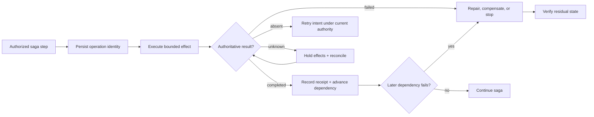

# Production reliability and incident operations playbook

Use this playbook when a factory workflow can change source, data, infrastructure,
credentials, releases, or another external system. It turns reliability from a
dashboard concern into a governed operating contract: what may fail, how far the
failure can travel, who may contain it, which facts must survive, how recovery is
chosen, and what proves the system is safe again.

The governing sequence is:

> **Detect → establish impact → contain → preserve → isolate → reconcile → restore → verify → learn**

The steps may overlap during an urgent incident, but none may disappear. Fast
containment without preserved facts makes recovery unsafe. A successful restart
without reconciliation can repeat effects. Restored service without independent
verification is an assertion, not closure.

## 1. Keep five operational invariants

1. **The control plane remains authoritative when execution is unhealthy.** A
   worker, model, tool, or retrieved document cannot expand its own authority or
   declare itself recovered.
2. **Unknown stays unknown.** A timeout, missing trace, stale index, or ambiguous
   provider response cannot be rounded into success or failure.
3. **Containment is scoped and observable.** Stop the smallest subject that stops
   the harm, then verify that the control took effect.
4. **Recovery does not erase history.** New Attempts, compensations, restores,
   and emergency decisions append records; they do not rewrite the failed run.
5. **Autonomy contracts when assurance weakens.** If policy, identity, evidence,
   verification, or current configuration cannot be established, consequential
   transitions stop or require stronger human authority.

## 2. Model partial work as a saga

A multi-step WorkOrder that changes several systems is a **saga** when it cannot
use one atomic transaction. Each step needs a forward action, durable receipt,
verification, and an explicitly designed response when later work fails.

| Step field | Required decision |
| --- | --- |
| Logical operation | Stable identity independent of the worker or Attempt |
| Forward action | Exact intended external effect and authority required |
| Completion evidence | Provider identity, artifact digest, state version, or other authoritative receipt |
| Idempotency boundary | How a repeated intent finds the existing result |
| Reconciliation | How to classify the effect as absent, completed, failed, or unknown |
| Compensation | A new authorized action that mitigates or reverses the effect where possible |
| Irreversibility | Data loss, exposure, external notification, migration, or other effect that cannot be undone |
| Recovery owner | Role authorized to accept, retry, compensate, repair, restore, or stop |

Compensation does not make a distributed workflow atomic. Sending a correction
does not unsend the original message. Reverting a schema may not restore lost
data. Rotating a leaked credential limits future use but does not erase exposure.
Record the residual effect and require the authority appropriate to it.



For a dependency graph, success is recorded per Task and per effect. If three of
five Tasks complete, the WorkOrder is not simply 60% successful. The control
plane marks which outputs remain valid, which dependent work is invalidated,
which effects require reconciliation or compensation, and which independent
branches may continue. Orphan detection finds work whose parent, lease, grant,
Factory Version, or required dependency is no longer current.

## 3. Declare degraded modes before failure

Every critical dependency needs a predeclared mode. A fallback is eligible only
if it preserves the required workload, authority, data, quality, evidence, and
recovery contracts.

| Failure | Default mode | Work that may continue | Work that stops |
| --- | --- | --- | --- |
| Model route unavailable | Queue or use a prequalified route | Work within the fallback's proven scope | Work with no qualified route |
| Context source stale or unavailable | Read-only, direct-current retrieval, or block | Tasks whose required facts remain current | Tasks whose decisions depend on missing or stale context |
| Tool unavailable | Pause at the effect boundary | Planning and other side-effect-free work | Calls requiring the unavailable tool |
| Evidence or verification unavailable | Preserve candidates and wait | Execution explicitly allowed without publication | Acceptance, publication, and release |
| Policy or identity unavailable | Fail closed | Status and safe cancellation from retained authority | New admission, grants, and consequential effects |
| Telemetry degraded | Reduce autonomy and mark the gap | Low-risk work with authoritative control records | Work whose policy requires complete observability |
| Capacity exhausted | Admit by priority and shed load | Containment, cancellation, reconciliation, and critical work | Speculative and low-priority work |
| Control state unavailable or inconsistent | Enter recovery mode | Read-only inspection from verified records | New work and state-changing commands |

Protect capacity for cancellation, containment, reconciliation, verification,
and incident response. A saturated worker fleet that cannot stop unsafe work is
not merely slow; it has lost an operational safety control.

## 4. Open one incident record

Create one durable incident subject instead of coordinating through chat. It
should contain:

| Record | Minimum fields |
| --- | --- |
| Impact | Users, repositories, Factory Versions, Execution Profiles, WorkOrders, Attempts, routes, tools, regions, environments, data, and releases affected or possibly affected |
| Severity | Customer and business impact, security or privacy exposure, production consequence, irreversibility, scope, and whether impact is expanding |
| Command | Incident owner, technical owners, communications owner, decision owners, escalation path, and handoff state |
| Timeline | Observation, hypothesis, decision, command, acknowledgement, observed effect, evidence reference, and actor identity |
| Current controls | Paused admissions, quarantined capabilities, revoked grants, frozen releases, traffic changes, and degraded modes |
| Unknowns | Missing facts, owner, next query, deadline, and the decision each fact affects |
| Recovery | Candidate known-good state, compatibility constraints, reconciliation status, residual risk, and verification plan |

Severity follows consequence. A small cross-scope data exposure can outrank a
large low-priority queue delay. Use volume as one input, not the definition.

### Run the blast-radius query

Before repairing, establish how far the failure can travel. Start from the
suspected subject and traverse both dependencies and lineage:

**Factory Version → Execution Profile → capability and tool versions → WorkOrders
→ Tasks → Attempts → effects → candidates → verification → approvals → releases
→ environments → observed outcomes**

For each subject, return `confirmed affected`, `possibly affected`, `not
affected`, or `unknown`, with the evidence and freshness behind the label. Cover
active exposure and historical exposure separately. This graph determines
whether to pause one Attempt, quarantine one capability version, stop a workflow
class, freeze publication, or enter a broader safe mode.

## 5. Choose the response from facts

Use a small response vocabulary whose actions all go through authorized control
APIs.

| Response | Use when | Required proof afterward |
| --- | --- | --- |
| Pause admission | New work could repeat harm | No new eligible WorkOrder was dispatched after the control became effective |
| Cancel | Active work must stop | Executor acknowledgement or timeout, revoked future authority, and reconciled late effects |
| Quarantine | One capability, route, context source, image, or version is suspect | Dependency graph shows it is no longer selectable |
| Revoke | A grant, credential, or capability must lose authority | Enforcement observed at every issuing and consuming boundary |
| Queue | The work remains valid but cannot run safely now | Intent, freshness, deadline, budget, and authority revalidated before dispatch |
| Retry | Failure is transient and the effect is safe to repeat | Same logical operation, current authority, bounded budget, and no duplicate effect |
| Compensate | A completed effect must be mitigated or reversed | Compensation result plus remaining irreversible consequences |
| Restore | A tested prior state remains compatible and authorized | Exact artifact and configuration identity plus post-restore verification |
| Roll forward | Restoration is unsafe or a bounded correction is safer | Independently verified correction and explicit residual risk |

Command acknowledgement and enforcement are different records. A control API
returning `accepted` does not prove that workers stopped, a credential was
rejected, or a route disappeared. Observe the effect by a separately defined
deadline and escalate when acknowledgement is not followed by enforcement.

## 6. Define known-good precisely

A known-good state is not “the previous version.” It is an exact, currently
eligible recovery candidate:

- immutable artifact and source identity;
- runtime configuration, policies, schemas, and dependencies;
- qualification scope and evidence currentness;
- data and migration compatibility;
- required credentials and external services;
- restoration authority and owner;
- a tested procedure and observation window; and
- known limitations and residual risk.

Rollback changes software or factory state. Compensation addresses completed
effects. Reconciliation establishes what happened. These operations often occur
together, but none substitutes for another. If rollback fails or creates a new
regression, return to a safe unavailable state, preserve the attempt, and choose
another independently reviewed recovery plan.

## 7. Close only after verified recovery

Service restoration is one milestone. Close the incident only when:

- impact has stopped expanding and affected subjects are classified;
- authoritative state and external effects are reconciled;
- no material unknown is hidden inside a success status;
- the recovered version and configuration are identified exactly;
- independent checks prove the required health, quality, security, and outcome
  conditions over the agreed observation window;
- backlog and stale queued work have been reviewed before release;
- the forensic bundle and decision timeline are retained;
- communications and required notifications are complete; and
- corrective actions have owners, verification methods, priority, and due dates.

The incident produces learning input, not an automatic production edit. Escaped
defects become protected evaluation cases. Routing, context, verifier, policy,
and autonomy changes become Improvement Candidates and follow normal evaluation,
qualification, approval, promotion, and restoration controls.

## 8. Exercise representative failures

Do not write one drill per possible symptom. Build a compact scenario set that
crosses failure domains and control boundaries.

| Drill family | Inject | Prove |
| --- | --- | --- |
| Runaway execution | Repeated loop, tool calls, or cost growth | External stop conditions, budget enforcement, safe checkpoint, and changed recovery strategy |
| Capability degradation | Model, verifier, tool, image, or context source regresses | Scoped quarantine, dependency impact, qualified fallback, and reduced autonomy |
| Uncertain effect | Provider completes an action but the response is lost | Stable operation identity, no duplicate effect, reconciliation, and truthful unknown state |
| State and ownership | Worker loss, stale lease, duplicate event, or split ownership | Fence rejects stale authority and orphan reconciliation restores one owner |
| Queue and capacity | Backlog, retry storm, or dependency recovery surge | Backpressure, jitter, fair admission, reserved control capacity, and stale-work review |
| Security boundary | Cross-scope context, exposed credential, malicious tool output, or sandbox concern | Revocation, isolation, provenance, negative authorization tests, and notification path |
| Evidence and approval | Corrupt evidence, mismatched artifact, stale approval, or unavailable verifier | Promotion stops and exact-subject proof is re-established |
| Delivery and data | Partial rollout, failed rollback, migration, or backfill incident | Customer safety, exact deployment identity, data repair, compatibility, and outcome checks |
| Control-plane continuity | State-store, identity, policy, region, or telemetry loss | Declared degraded mode, RTO/RPO evidence, single authority, and verified restoration |
| Incident coordination | Conflicting hypotheses, handoff, parallel incident, or incomplete facts | One command record, decision deadlines, evidence-based actions, and clear communication |

Measure detection, decision, containment, preservation, reconciliation,
restoration, verification, communication, and return-to-service time separately.
An exercise passes only when the declared invariants hold, not because service
eventually returns.

## 9. Mission Control implementation requirements

Mission Control should extend its existing records and controls rather than
create an unrelated incident subsystem.

1. **Impact graph and blast-radius query.** Traverse current Factory Versions,
   Execution Profiles, capabilities, WorkOrders, Attempts, evidence, approvals,
   releases, and outcomes. Preserve `unknown` and evidence freshness.
2. **Incident record and decision timeline.** Bind severity, roles, hypotheses,
   decisions, commands, acknowledgements, observed enforcement, communications,
   and handoffs to one durable incident identity.
3. **Scoped containment and degraded-mode controls.** Expand the qualified pause
   path one control and subject at a time: admission, capability version, route,
   tool grant, publication, and release. Require step-up authority and an explicit
   restoration target.
4. **Effect reconciliation and saga recovery.** Show partial DAG state, operation
   receipts, unknown effects, orphaned work, compensation options, and the exact
   boundary from which a replacement Attempt may resume.
5. **Known-good and restoration records.** Bind recovery candidates to exact
   artifact, configuration, policy, schema, dependencies, evidence, owner, and
   observation gates.
6. **Reliability budgets and guarded automation.** Track quality, reliability,
   cost, and assurance health by workload. Automated action may contain within a
   preauthorized scope; it may not diagnose itself into broader authority.
7. **Verified closure and corrective-action flow.** Require independent recovery
   evidence, downstream reconciliation, residual risk, and change-controlled
   Improvement Candidates before closure.

The operator should be able to answer five questions from one incident view:
what is happening, what is affected, what is stopped, what remains unknown, and
what exact evidence permits the next decision. Activity feeds and model-written
summaries can support that view; they cannot replace the underlying records.

These are implementation requirements. They do not claim broad automated
incident response, disaster recovery, cross-repository containment, or autonomous
restoration is currently available.

## 10. Copy the operating packet

```text
Incident ID:
Detected at / source:
Incident owner:
Severity and consequence:

Affected or possibly affected:
- Factory Versions / Execution Profiles:
- WorkOrders / Attempts:
- capabilities / models / tools / context sources:
- repositories / environments / regions:
- candidates / releases / data / users:

Active containment:
- command and authority:
- acknowledgement:
- observed enforcement:

Preserved evidence:
- state and event range:
- effect receipts and provider identities:
- artifacts, verification, approvals, and releases:
- telemetry coverage and gaps:

Unknowns:
- fact / owner / next query / deadline / blocked decision:

Recovery candidate:
- exact artifact and configuration:
- compatibility and residual risk:
- reconciliation and compensation status:
- verification and observation window:

Closure:
- impact stable:
- downstream effects reconciled:
- recovery independently verified:
- backlog and stale work dispositioned:
- communications complete:
- corrective actions and Improvement Candidates recorded:
```

## Go deeper

- [Chapter 14 — Durable execution](../03-build/14-durable-execution.md) for
  Attempts, leases, fencing, idempotency, cancellation, and reconciliation.
- [Chapter 32 — CI/CD, progressive delivery, and production verification](../04-prove/32-cicd-progressive-delivery-and-production-verification.md)
  for application release and production validation.
- [Chapter 35 — Observability, telemetry, and forensics](../05-operate/35-observability-telemetry-and-forensics.md)
  for execution lineage and forensic bundles.
- [Chapter 36 — Resilience, incidents, and the control tower](../05-operate/36-resilience-incidents-and-the-control-tower.md)
  for SLOs, recovery objectives, incident command, and the control tower.
- [Factory system design playbook](./factory-system-design-playbook.md) for the
  pre-launch workload and failure-design review.
