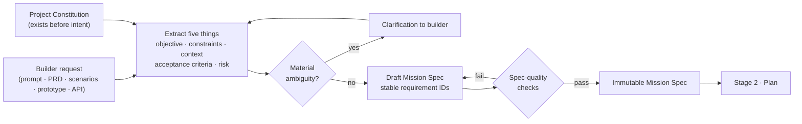
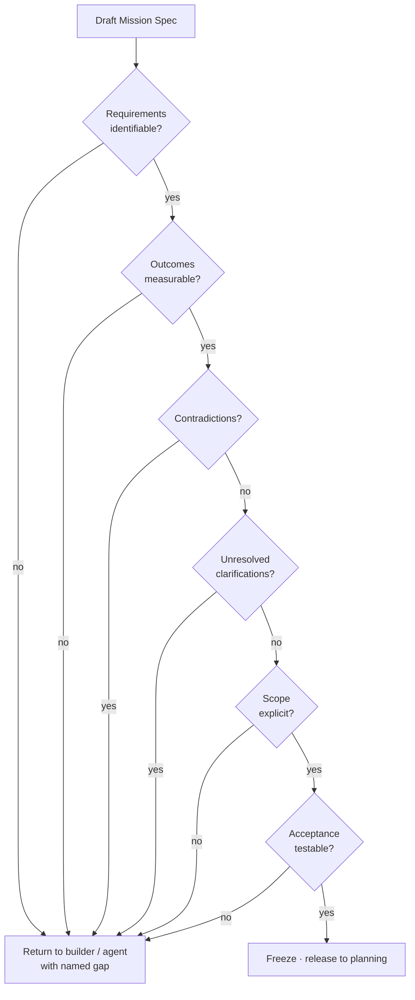

# Stage 1 · Builder Intent

This is the first of eight stage pages that walk the one-line factory: **Builder Intent → Plan → Define Agent → Execute through Harness → Apply Skills → Evaluate → Improve → Deliver Software**. Each page is a deep dive into one stage: what enters it, what leaves it, the records it writes, the mechanism that does the work, who owns each decision, and where it fails. [Chapter 2](../01-understand/02-the-factory-in-one-view.md) gives the stage contract in one table; this page opens the first box. The next stage is [Stage 2 · Plan](./02-plan.md).

The factory starts with intent, not with a model. Before any planner reasons, any agent runs, or any tool is invoked, the system has to know what outcome the builder wants, what may not change, which parts of the estate are involved, how success will be recognized, and how much damage a mistake could do. Stage 1 is where that knowledge is captured, tested for quality, and frozen into a record that everything downstream can cite.

## The problem

The most expensive failure in an agentic system is not a wrong line of code. It is a fast, competent, well-evidenced solution to the wrong problem. A coding agent handed "improve checkout performance" will pick a path, pick a metric, pick a target, and ship something plausible. It may even pass its own tests. The builder then discovers that the agent optimized the cart page when the pain was in payment confirmation, tuned the median when the complaint was the 99th percentile, and accepted a memory regression nobody would have signed off on. *I don't want an agent efficiently solving the wrong problem.* Everything the factory does later, planning, routing, execution, verification, is leverage applied to whatever this stage produced. Leverage applied to a misunderstanding produces a well-engineered misunderstanding.

The second problem is that intent has no natural home. In a conversation with an assistant it lives in chat history, mutates with every turn, and disappears when the session ends. The agent that "understood" the request cannot be asked six weeks later what it understood, and the reviewer who approved the result cannot see what was asked. Downstream records then point at nothing, and the factory loses its ability to say whether the thing that shipped is the thing that was wanted.

The third problem appears the moment the factory serves anyone other than developers. A product manager writes a PRD, a quality engineer writes acceptance scenarios, a designer hands over a prototype, another agent posts a structured request through an API. Each of them has product intent. Most of them do not know the repository boundaries, deployment risk, testing expectations, or architectural constraints that a developer would supply without being asked. If the factory takes their words at face value, it inherits every unstated assumption as a silent decision.

## How it works

### Inputs and outputs

| | Stage 1 · Builder Intent |
| --- | --- |
| **Enters** | A builder's request in whatever form the builder works in: a prompt from an IDE or CLI, a PRD, acceptance scenarios, a prototype, an incident, a security finding, a structured request from another agent. Plus the standing context that exists before the request: the Project Constitution, repository facts, prior decisions. |
| **Leaves** | A **Mission** naming the governed outcome and scope, and an immutable **Mission Spec** that has passed deterministic spec-quality checks and is ready for planning. Or, when material ambiguity remains, an explicit clarification request back to the builder. |
| **Records created** | Mission; Mission Spec (immutable, with stable requirement IDs); clarification log; risk classification; the spec-quality check result. The Project Constitution is read, not written, here. |
| **Decision owner** | Human: what the outcome is, what the non-goals are, which clarifications resolve how, and the risk they are willing to accept. Agent: drafting, restructuring, proposing acceptance criteria, detecting ambiguity. Deterministic system: the spec-quality checks and the freeze. |

### Builders, plural

The factory's first persona is the developer, because developers arrive with the most complete intent: they know the repository, the tests, the deployment path, and the parts of the system that bite. The word **builder** is deliberately wider. A builder is anyone who can express intent clearly enough for the system to translate it into executable work. Five kinds enter through five doors.

| Builder | Enters through | Brings | Usually lacks |
| --- | --- | --- | --- |
| Developer | IDE, CLI, API | Objective, repo scope, tests, deployment awareness | Time; sometimes product context |
| Product manager | A PRD or outcome statement | Objective, customer reason, constraints, success measures | Repo boundaries, deployment risk, testing expectations |
| Quality engineer | Acceptance scenarios | Testable criteria, failure cases, regression concerns | Implementation scope and architecture constraints |
| Designer | A prototype or interaction spec | Desired experience, states, fidelity expectations | Repo, accessibility enforcement, deployment path |
| Another agent | A structured API request | Machine-readable objective and context | Authority; may carry an upstream misunderstanding |

Every door opens onto the same room. Whatever the surface, CLI, SDK, IDE, web UI, API, or agent-to-agent call, the result is the same set of durable concepts: an identity, an intent, and the risk and criteria that make that intent governable. *Multiple experiences should converge on one execution contract.* The factory is opinionated about that contract and flexible about the interface. This is the same principle that lets a bank accept a deposit at a branch, an ATM, or a phone app and record all three as the identical ledger entry; the teller and the app differ, the entry does not.

For the non-developer builders, the factory compensates for what they lack rather than rejecting them for it. It clarifies intent, generates candidate acceptance criteria, surfaces the risk the builder could not see, applies the repository and architecture context automatically, and enforces the guardrails without asking the builder to know them. That is the **paved road**: the path where the safe way is also the fast way. *The safest paved road also needs to be the fastest paved road*, because if the governed entry takes longer than pasting a prompt into a chat window, builders will paste the prompt.

### Five things to extract

Intent understanding and planning are separate steps with separate records. Stage 1 answers *what outcome*; [Stage 2](./02-plan.md) answers *how*. Conflating them lets the planner quietly resolve ambiguities that should have gone back to the builder. Intent understanding extracts five things from whatever the builder supplied.

1. **Objective.** What should be different when this is done? Stated as an outcome, not an activity: "no request to the payment-confirmation endpoint exceeds 800 ms at p99 under the current load profile," not "make checkout faster" and not "run the performance agent."
2. **Constraints.** What may not change? Public API contracts, data formats, dependency versions, budget, deadline, regulatory boundaries, the architectural rules in the Project Constitution.
3. **Context.** Which repositories, services, environments, standards, and prior decisions are involved? Context here is the *scope* of relevant material, not the material itself; retrieval happens later under [Stage 4](./04-execute-through-harness.md)'s governed context rules.
4. **Acceptance criteria.** How will everyone objectively know the objective was met? Each criterion must be checkable by someone or something other than the agent that did the work.
5. **Risk.** What is the blast radius if this is wrong? Reversibility, data sensitivity, security surface, production criticality, dependency impact, novelty. Risk set here drives the review depth and autonomy ceiling at every later stage.

<!-- infographic: stage-1-intent -->
> **Infographic — From builder request to immutable Mission Spec.** *(Jay's graphic goes here.)* Until then, the diagram below carries the same concept.

### Surfacing material ambiguity

Take the example seriously, because it is the whole stage in miniature. A builder writes: *improve checkout performance*. An agent doing intent understanding does not start optimizing. It asks what the phrase leaves open:

- Which path? Cart, address, payment authorization, confirmation, order-history refresh?
- Which percentile? Median, p95, p99, worst observed?
- What target? A number, a relative improvement, "faster than the competitor"?
- What regression tolerance? May memory rise? May cold-start latency rise? May a caching layer be introduced that changes consistency semantics?

Not every ambiguity is worth a question. The test is whether the ambiguity **materially affects implementation or risk**. If two reasonable readings lead to the same change with the same blast radius, pick the conservative reading, record the assumption in the spec, and move on. If two readings lead to different code paths, different tests, or different risk classes, the factory asks. An agent that asks about everything is as useless as one that asks about nothing; the skill is in ranking the questions by the cost of guessing wrong.

The line that governs this behavior is the one to retain: *An agent can help clarify intent. It cannot silently redefine intent.* The agent may propose "I read p99 and payment authorization; confirm?" It may not decide that and proceed. A clarification that the builder answers becomes part of the Mission Spec with its own identifier; a clarification the agent answered for itself is an assumption and must be labeled as one so the planner and the reviewer see it.

### The Project Constitution: rules before intelligence

Some rules should not be rediscovered per request. The **Project Constitution** is the set of durable architecture principles, governance expectations, repository rules, quality expectations, and constraints that agents may not reinterpret. "Services do not share databases." "Every public endpoint has a contract test." "Nothing under `payments/` changes without a security reviewer." "Data classified RESTRICTED never leaves the region." These exist before any planner or agent reasons, and the Mission Spec is written *inside* them rather than restating them.

The Constitution is what makes a Mission Spec short. Without it, every spec would have to re-derive the same twenty constraints, and every planner would have the chance to forget one. *Intent and policy exist before intelligence is applied.* And *important system rules should not depend on model memory*: a rule that lives only in a system prompt is a rule the model may summarize away when the context window fills. A Constitution is a record with a version, an owner, and a place in the lineage of every Attempt that ran under it.

Think of a building code. An architect does not negotiate the fire-egress rules with each client; the rules precede the commission, the drawings are checked against them, and the drawings that violate them are not built. The Constitution is the factory's building code, and the spec-quality checks are the plan-check desk.

### Mission and Mission Spec

The **Mission** is the desired outcome and its governed scope: "eliminate this deprecated API safely," not "run agent X." The agent is replaceable; the Mission is the durable outcome, and it survives the retirement of every model and harness that worked on it. The Mission carries the outcome, the business reason, the accountable owner, the repository scope, the budget, and the risk classification.

The **Mission Spec** is the immutable, structured statement of what the Mission requires. Its contents:

- **Requirements with stable IDs.** `REQ-7` means the same thing in the Plan, in the WorkOrder, in the acceptance criterion, and in the verification receipt. Renumbering is a new spec.
- **Measurable outcomes.** Each requirement has a way to be observed as met or not met.
- **Explicit non-goals.** What this Mission deliberately does not do, so the planner cannot expand scope to be helpful.
- **Clarifications.** Each question asked, who answered it, and the answer, with an ID.
- **Acceptance expectations.** The criteria, and for each the kind of evidence that will satisfy it (a test result, a measured metric, a policy decision, a human sign-off).
- **Repository and system scope.** Which repositories, paths, services, and environments are in bounds.
- **Assumptions.** Ambiguities the factory resolved on its own, labeled so that a reviewer can overrule them.

Immutable means exactly that. A Mission Spec is never edited in place. If the builder changes their mind, or a clarification during planning reveals that the spec was wrong, a new spec revision is created and the old one stays in the record with its ID. Every downstream artifact names the revision it was built against, so "which spec did this Plan implement?" always has a single answer.

### Deterministic spec-quality checks

Before a spec can move to planning, a deterministic checker, not a model, decides whether it is fit to plan against. The six checks:

<!-- infographic: stage-1-spec-checks -->
> **Infographic — The six spec-quality gates.** *(Jay's graphic goes here.)* Until then, the diagram below carries the same concept.

| Check | Question it asks | Typical failure |
| --- | --- | --- |
| Requirements identifiable | Does every requirement have a stable ID and one sentence of substance? | A paragraph of prose with three requirements hidden in it |
| Outcomes measurable | Does each requirement name a way to observe it met? | "Faster," "cleaner," "more robust" |
| Contradictions | Do any two requirements, or a requirement and the Constitution, conflict? | "Zero downtime" alongside "drop and recreate the table" |
| Unresolved clarifications | Is any open question still marked open? | A question the agent asked and nobody answered |
| Scope explicit | Are repositories, paths, services, and environments named? | "The checkout service" in a company with four of them |
| Acceptance testable | Can each criterion be checked by a system or person other than the producing agent? | "The agent confirms it works" |

The checker is deterministic because these are not judgment calls; a spec either has IDs or it does not. Where a check requires semantic judgment (does "no regression in memory" contradict "introduce a cache"?), a model may flag candidates, but the gate is the human confirming the flag, not the model's opinion. The checks are cheap and run on every revision, and a spec that fails does not fail silently: it returns to the builder or the drafting agent with the named gap.

### Spec-driven and test-driven development as inputs

Two developer practices feed this stage directly. **Spec-driven development** treats the specification as the primary artifact, with code as its derivation; the Mission Spec is that specification made governable, with IDs and immutability. **Test-driven development** writes the check before the change; an acceptance criterion with a named verification method is a test written at the level of intent. A quality engineer who arrives with acceptance scenarios has done half of Stage 1 already, and a Mission Spec whose criteria are already executable tests is the strongest input the planner can receive. Practitioners who prototype first and then treat the prototype as the spec are doing the same thing in a different order: the prototype is the ambiguity-resolution tool, and the spec is extracted from it.

### Who decides what

| Decision | Owner | Why |
| --- | --- | --- |
| What outcome is wanted, what is out of scope | Human builder | Intent is the human's; the factory serves it |
| Which ambiguities are material | Agent proposes, human confirms on the material ones | Ranking questions is judgment; answering them is authority |
| How a clarification resolves | Human | An agent must not silently redefine intent |
| Draft criteria, restructured requirements | Agent | Drafting is cheap and reviewable |
| Whether the spec is fit to plan | Deterministic checker | The six checks are mechanical |
| Risk classification | Deterministic rules from scope and Constitution, human may raise but not lower below policy | Risk is policy, not confidence |
| Freeze and release to planning | Deterministic system on check pass | The freeze is a state transition, not an opinion |

## How to build it

**Start with the record, not the interface.** Define the Mission and Mission Spec schemas first: requirement IDs, measurable outcome per requirement, non-goals, clarifications with answerer, acceptance expectations with evidence kind, scope, assumptions, revision number, digest. Every builder surface then writes to that schema. If the schema is right, adding a PRD importer or an API entry point is an adapter; if the schema is wrong, every surface is wrong.

**Write the Constitution before the first Mission.** Even a one-page Constitution (repository rules, which paths are sensitive, which classes of change need which reviewer, data classifications and where each may flow) changes what the spec has to say and what the checker can catch. Version it. Give it an owner. Reference its version from every spec.

**Implement the six checks as code.** They are the cheapest gate in the factory and the one with the highest downstream leverage. Return named failures ("REQ-3 has no measurable outcome"), never a boolean. Run them on save, not on submit, so builders see gaps while they still have the context in their head.

**Build the clarification loop as a first-class record.** A question has an ID, a materiality rationale, an asked-at, an answered-by, and an answer. Questions the agent answered itself are assumptions with a different type. The spec cannot freeze while a material question is open. Show the builder the questions ranked by cost of guessing wrong, and cap the count; a builder who receives thirty questions stops reading at five.

**Give each persona a surface that speaks its language and hides the rest.** The developer sees repository scope and test hooks; the product manager sees outcome, success measures, and tradeoffs; the quality engineer sees criteria and evidence kinds; the designer sees states and fidelity. All of them see lifecycle state, open questions, risk, and what will be asked of them later. None of them see the agent topology.

**Classify risk deterministically from facts you already have.** Paths touched, data classification of the scope, whether public contracts change, whether the change is reversible, whether the Constitution marks the area sensitive. Let a human raise the class; never let anyone, human or agent, lower it below what policy computes.

**Measure the stage.** Clarification rate (how often a spec needed a question), criterion completeness at first submission, time from request to frozen spec, and the failure signal that matters most: downstream rework attributable to misunderstood intent. A high clarification rate with low rework is healthy; a low clarification rate with high rework means the checker is too lenient or the agent is guessing.

**Make the paved road fast.** Time the governed path against the ungoverned alternative. If a developer can paste a prompt into a chat window and get a diff in ninety seconds, and the factory takes ten minutes to reach a frozen spec for a trivial change, the factory loses. Tier the ceremony by risk: a low-risk, single-repository, reversible change with a testable criterion can pass the checks in seconds.

## Failure modes

**Efficient solution to the wrong problem.** The signature failure: the agent optimizes a plausible reading of an ambiguous request. Detect it as rework or rejection whose root cause is "that's not what I meant." Fix it by treating material ambiguity as a blocking check and by measuring clarification rate against rework.

**Silent redefinition.** The agent narrows or widens the objective to something it can do well, and reports success. Detect it by diffing the spec's requirements against the Plan's assertions ([Stage 2](./02-plan.md) traceability): a requirement with no assertion, or an assertion with no requirement, is a redefinition. Fix it with immutability and stable IDs; redefinition then requires a visible new revision.

**Intent that lives in a transcript.** No Mission record, only a chat log. Detect it when nobody can answer "what was asked?" without scrolling. Fix it by refusing to plan against anything that is not a frozen spec.

**Constitution in the prompt.** The organization's rules exist only as system-prompt text, get compacted away, and are "forgotten" mid-run. Detect it as policy violations the agent could not have known about at the moment it acted. Fix it by making the Constitution a versioned record that the checker and the policy engine consult, not just the model.

**Question flood.** The agent asks about every ambiguity, the builder stops answering, and the factory becomes slower than the workaround. Detect it as abandonment between request and frozen spec. Fix it with materiality ranking, a question cap, and conservative default assumptions that are labeled and reversible.

**Untestable acceptance.** Criteria like "works correctly" pass through because nobody enforced testability. Detect it at [Stage 6](./06-evaluate.md) when the verifier has nothing to check. Fix it upstream: the sixth check exists for this.

**Non-developer intent taken at face value.** A PRD becomes a spec with no repository scope, no risk class, and no regression tolerance, and the planner fills the gaps with guesses. Detect it as high-risk changes entering with a low-risk label. Fix it by having the factory generate the missing fields and present them for confirmation rather than defaulting them silently.

**Risk lowered by confidence.** A builder or agent argues the change is "obviously safe" and the classification drops. Fix it structurally: risk is computed from scope and Constitution; humans may raise it; nobody lowers it below policy.

## In Mission Control

Assessed at local HEAD [`a490648`](https://github.com/jaydubya818/MissionControl/tree/a49064875d0711253d74029e3066cc74c7c1c2a5) against the `main` evidence boundary [`b31e275`](https://github.com/jaydubya818/MissionControl/tree/b31e27564deb1c03c167e61b5ee094567c2ba7b1), with the capability study at [`d902fae`](https://github.com/jaydubya818/MissionControl/tree/d902fae7032c0696b531c44ae88829c652516fc6).

**Implemented.** Missions exist as durable records in `convex/missions.ts` with lifecycle, serial mutation policy, budget, corrective limits, stop condition, plan linkage, and human-attention fields; the record hierarchy above them (`tenants`, `projects`, `workspaceRepositories`, versioned `factoryDefinitions`) is in place, so a Mission is created inside a Company, Workspace, and Repository scope rather than free-floating. The first golden-path demonstration was deliberately small: adding a required Business Justification field to Mission creation, so that the outcome and reason are captured at intake. Missions carry acceptance criteria that later connect to `verificationReceipts`. The context router combines deterministic rules, classification, confidence, capacity, and budget to choose clarification, deferral, a single Task, or coordinator decomposition, which is a working version of "surface material ambiguity or proceed."

**Partial.** The Mission Spec as a separately frozen, ID-bearing record with the six deterministic quality checks is the design described in this page; on `main` the Mission carries the outcome and criteria, and quality is enforced primarily at the Plan level through validation assertions and WorkOrder blueprints. The Project Constitution appears as policy defaults at the Workspace level and constraints in the Factory Configuration, not as one named Constitution record.

**Not implemented on `main`.** A general-purpose contradiction engine, a formal non-functional-requirement schema, and an independently enforced spec-assurance gate. This is a meaningful specification skeleton, not a specification compiler. The future direction is to compile the approved spec and the active Factory Configuration into a deterministic projection that emits coverage gaps, ambiguity findings, applicable controls, required evidence, and approval owners, beginning in observe-only mode and comparing its findings with human review before enforcing one narrow gate. The prototype-as-spec workflow is a practitioner pattern from outside Mission Control, not a Mission Control feature.

## Retain this

- Stage 1 answers *what outcome*, never *how*. Intent and planning are separate steps with separate records.
- Five things leave this stage: objective, constraints, context scope, acceptance criteria, risk. If one is missing the planner will invent it.
- *I don't want an agent efficiently solving the wrong problem.* Surface ambiguity that materially affects implementation or risk; guess conservatively and label the guess otherwise.
- *An agent can help clarify intent. It cannot silently redefine intent.* Clarifications are answered by humans and recorded with IDs.
- The Project Constitution exists before intelligence is applied; *important system rules should not depend on model memory.*
- The Mission is the durable outcome; the Mission Spec is immutable, ID-bearing, and revised by creating a new revision, never by editing.
- Six deterministic checks gate the freeze: requirements identifiable, outcomes measurable, no contradictions, no unresolved clarifications, scope explicit, acceptance testable.
- Builders are developers, product managers, quality engineers, designers, and agents; every surface converges on one execution contract, and *the safest paved road also needs to be the fastest paved road.*
- Risk is computed from scope and policy. Humans may raise it. Confidence never lowers it.

## Go deeper

- Next: [Stage 2 · Plan](./02-plan.md). Overview: [Chapter 2, The factory in one view](../01-understand/02-the-factory-in-one-view.md).
- [Chapter 6, Intent and specification engineering](../02-design/06-intent-and-specification-engineering.md) for the full specification discipline, non-functional requirements, and the prototype-as-spec pattern; [Chapter 5, Authoritative records](../02-design/05-authoritative-records.md) for the Mission record and its place in the hierarchy; [Chapter 4, The human–agent operating model](../02-design/04-the-human-agent-operating-model.md) for the builder personas and decision points; [Chapter 7, Governance, policy, and risk-proportional approval](../02-design/07-governance-policy-and-risk-proportional-approval.md) for how risk set here drives review depth later.
- [Chapter 27, The factory as a platform](../05-operate/27-the-factory-as-a-platform.md) and [Chapter 31, Enterprise adoption](../05-operate/31-enterprise-adoption-and-the-infrastructure-landscape.md) for the paved road, builder surfaces, and prototype-to-production continuity.
- [Glossary](../appendix/glossary.md): Builder Intent, Mission, Mission Spec, Project Constitution, Acceptance Criteria, Risk Classification.
- Sources: Jay West, factory architecture notes (builder intent, the five things to extract, the checkout example, builders beyond developers, the Constitution and immutable Mission Spec); Jay West, Mission Control walkthrough (Mission, Mission Spec, spec-quality checks).
