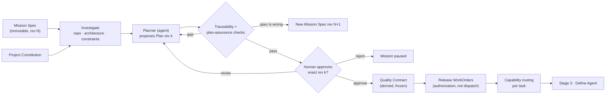
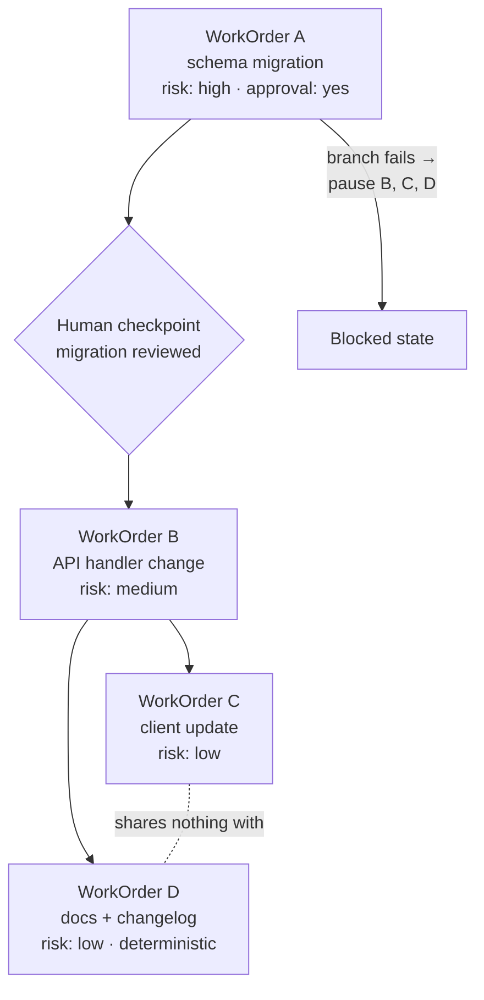
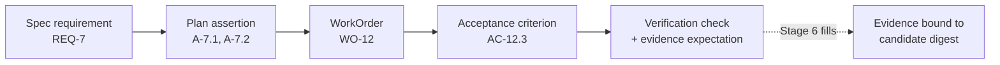
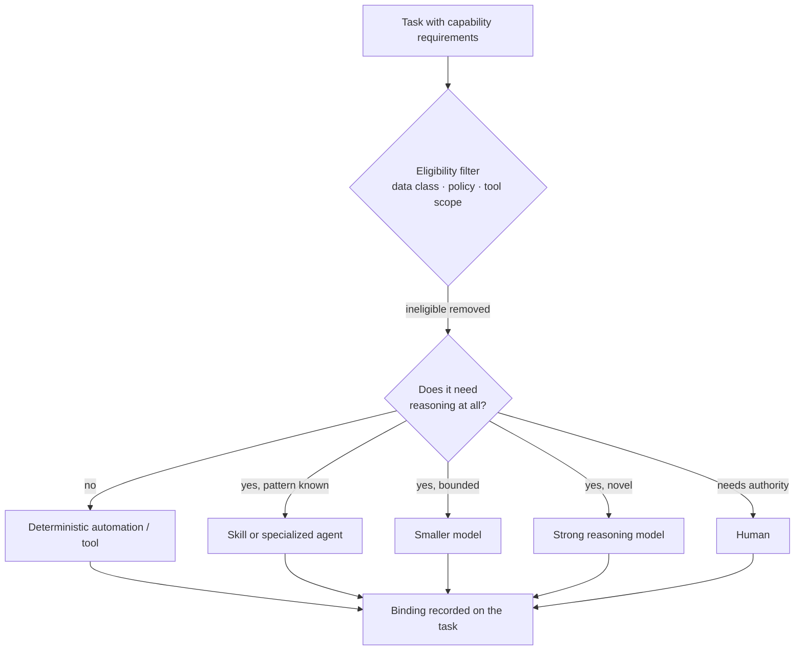

# Stage 2 · Plan

[Stage 1](./01-builder-intent.md) ended with an immutable Mission Spec: what outcome is wanted, under what constraints, in what scope, with what acceptance and risk. Stage 2 answers *how*. It converts that spec into an executable contract: a versioned Plan a human approves, a Quality Contract that freezes how success will be judged, a graph of governed WorkOrders with their dependencies, and, as the last decision before anything runs, the choice of which capability should perform each piece. The next stage is [Stage 3 · Define Agent](./03-define-agent.md).

*Planning converts ambiguous human intent into an executable contract.* The word to hold on to is contract. A plan in a chat window is a suggestion; a Plan in the factory is a record that a specific human approved at a specific revision, that downstream WorkOrders cite, and that verification later checks the result against.

## The problem

A model asked to "plan" will produce a plausible sequence of steps in seconds. The trouble is everything around that sequence. It lives in the model's context and evaporates with it. Nobody approved it, so nothing downstream can say it was authorized. It does not say which repositories change, what runs in parallel, what happens when the third step fails, or what evidence will prove the whole thing worked. It mixes decisions a human should own (is this risk acceptable? may this touch the payments path?) with decisions a machine should own (which task depends on which). And when the model's context is compacted or the run restarts, the plan is regenerated, slightly differently, and the work that was already done no longer matches it.

The second problem is that a plan is where scope quietly grows or shrinks. A planner that wants to be helpful adds a refactor the spec never asked for; a planner under budget pressure drops a requirement that looked hard. Without a line from every spec requirement to a plan assertion and back, neither move is visible until a reviewer notices, if a reviewer notices.

The third problem is decomposition done for the wrong reason. Teams split work into many agents because multi-agent looks powerful, and then discover that two agents editing the same repository is a distributed-systems coordination problem wearing an AI costume. Decomposition exists to expose work so the factory can pick the cheapest reliable capability for each piece and govern each piece separately, not to maximize the number of things reasoning at once.

## How it works

### Inputs and outputs

| | Stage 2 · Plan |
| --- | --- |
| **Enters** | The immutable Mission Spec at an exact revision; the Project Constitution; repository and system facts gathered by investigation; the capability catalog (what agents, skills, tools, and automations exist); policy and budget from the Factory Configuration. |
| **Leaves** | One human-approved Plan revision; the Quality Contract derived from it; released WorkOrders with their task and dependency graph; a capability routing decision per task; open questions returned to the builder if planning exposed spec gaps. |
| **Records created** | Plan (versioned); Plan approval decision; Quality Contract; WorkOrders; Tasks and dependency edges; routing decision per task; investigation findings; new Mission Spec revision if intent had to change. |
| **Decision owner** | Human: approval of one exact revision, acceptance of risk and cost, resolution of questions planning surfaced. Agent (planner): investigation, decomposition, proposed sequence, proposed verification. Deterministic system: traceability check, plan-assurance checks, contract derivation, WorkOrder release, routing eligibility filter. |

### What a Plan contains

A Plan answers what will be done, why, in what sequence, what may run concurrently, which resources change, which capabilities are required, and what evidence proves success. Its contents:

| Element | What it states |
| --- | --- |
| Objective | The Mission Spec's outcome, restated at the exact spec revision this Plan binds |
| Acceptance criteria | Carried from the spec by requirement ID, refined into checkable form |
| Task breakdown | Bounded units of work, each with its own objective, inputs, and outputs |
| Dependencies | Which tasks wait on which; what may run concurrently |
| Affected systems | Repositories, paths, services, environments, data stores that change |
| Required context | What each task needs to know: which docs, which code, which prior decisions |
| Required capabilities | What each task needs to be able to do: reasoning depth, tool access, data eligibility |
| Risk | Per task and overall, with rollback expectation and blast radius |
| Verification strategy | For each criterion, what will check it and what evidence will result |
| Human checkpoints | Where a person must decide before work proceeds |
| Cost estimate | Tokens, compute, human review time, and the budget the Mission allows |

Every element traces to the spec or the Constitution. An element that traces to neither is a planner invention and must be labeled as a proposal for the human to accept or strike.

<!-- infographic: stage-2-plan -->
> **Infographic — From Mission Spec to released WorkOrders.** *(Jay's graphic goes here.)* Until then, the diagram below carries the same concept.

### The planner is replaceable; the Plan is governed

The **planner** is whatever produced the Plan: a strong reasoning model with repository access, a deterministic workflow for a known change class, or a human with a whiteboard. The factory does not care, and it should be possible to swap the planner without touching anything downstream. What downstream depends on is the **Plan**: a versioned artifact with a revision number, a digest, the exact Mission Spec revision it binds, and an approval record. *The planner is replaceable. The Plan is governed.*

Versioning is not a formality. A Plan is never edited in place. When investigation reveals that the spec was wrong, or the human asks for a change, or execution later discovers that a dependency was missed, the response is a new revision, and every prior revision stays in the record with its approval status. This is what lets the factory answer "what was approved?" with a single revision identifier rather than an archaeology exercise through chat history. Compare a construction drawing set: revision C is the one stamped and issued for construction; revisions A and B are kept, marked superseded, and nobody builds from them.

Two kinds of change produce two kinds of revision. A change to *how* (a different sequence, an extra task) is a new Plan revision against the same Mission Spec. A change to *what* (a requirement added, a non-goal removed) is a new Mission Spec revision first, and then a Plan revision that binds it. Planning is allowed to send intent back to Stage 1; it is not allowed to absorb an intent change into itself.

### Human approval of one exact revision

A human approves a Plan the way a signatory approves a contract: this document, this revision, this digest. The approval is a record naming the approver, the revision, the time, and any conditions. If the Plan changes by one character afterward, the approval no longer applies and a new one is required.

What approval means is narrower than it sounds. **Plan approval authorizes the release of governed WorkOrders. It does not dispatch execution.** Approving the Plan says "this work may be released"; it does not start an agent, allocate a sandbox, or spend budget. Dispatch is a separate transition owned by the orchestrator, gated by admission checks that happen in [Stage 3](./03-define-agent.md) and [Stage 4](./04-execute-through-harness.md). *Intelligence can recommend. Authority is granted separately.* Keeping these apart is what allows a human to approve a Plan on Friday, have policy block dispatch on Saturday because a tool was revoked, and have nothing happen that the human did not authorize.

What the approver is shown matters as much as what they sign. A Plan approval surface presents the objective at its spec revision, the traceability table, the affected systems, the risk per task with rollback, the verification strategy, the cost estimate against budget, the human checkpoints, and every planner assumption flagged for acceptance. It is not an approve button with a summary; it is the document itself with the risk made visible.

### The Quality Contract

Once a Plan revision is approved, the factory derives a **Quality Contract**: a machine-readable projection of the approved Plan that freezes how success will be determined before any execution begins. Its contents:

| Field | Meaning |
| --- | --- |
| Requirements | The spec requirements this Plan satisfies, by ID |
| Assertions | The Plan's claims about what will be true when each requirement is met |
| Invariants | What must remain true throughout: contracts unchanged, data classifications respected, Constitution rules held |
| Assurance expectations | For each assertion, the kind and strength of check expected: deterministic test, measured metric, static analysis, policy decision, calibrated grader, human sign-off |
| Evidence requirements | What artifact will count as proof, from which system, bound to which candidate digest |
| Approval policy | Who may accept which outcomes at which risk tier, and what evidence is required before they may |

*Quality isn't inferred after generation. It's part of the execution contract.* An agent cannot argue at the end that its tests were good enough, because "good enough" was decided before it started. When [Stage 6](./06-evaluate.md) runs, it reads the Quality Contract, not the agent's summary. The contract is the plan-check desk's marked-up drawing: what the inspector will look at was written before the concrete was poured.

### The task and dependency graph

Decomposition produces a **task graph**, not a collection of prompts. Each task carries:

- **Bounded objective**: one outcome, stated so completion is recognizable.
- **Inputs and expected outputs**: what it consumes, what it must produce.
- **Dependencies**: which tasks must complete first, and what it hands to which.
- **Context requirements**: what it needs to know.
- **Capability requirements**: what it needs to be able to do.
- **Risk**: its own blast radius, which may differ from the Mission's.
- **Verification**: what checks it and what evidence it must yield.
- **Retry and timeout semantics**: how many attempts, how long, what counts as stuck.

The graph then has to answer the questions that decide whether it can run safely:

| Question | Why it matters |
| --- | --- |
| Sequential or concurrent? | Concurrency is only free when tasks share nothing mutable |
| What modifies shared state? | Two agents modifying the same repository is a distributed-systems coordination problem, not a reasoning problem |
| What is reversible? | Reversibility sets the autonomy ceiling for the task |
| What requires approval? | Human checkpoints are graph nodes, not afterthoughts |
| What happens when one branch fails? | Sibling tasks may need to pause, roll back, or continue; the graph says which |
| What evidence does each task produce? | Every task feeds the Quality Contract or it is not needed |

Decomposition should not maximize agents. It exposes work so the platform can choose the cheapest reliable capability per piece and govern each piece on its own risk. A Plan with one task performed by one agent under one WorkOrder is a perfectly good Plan when the work is bounded and the risk is low.

### Traceability

The line that runs through the whole stage, and on into the rest of the factory, is the traceability chain:

<!-- infographic: stage-2-traceability -->
> **Infographic — The traceability chain.** *(Jay's graphic goes here.)* Until then, the diagram below carries the same concept.

**Spec requirement → Plan assertion → WorkOrder → acceptance criterion → verification check.** A deterministic check walks this chain in both directions before approval. A requirement with no assertion means the Plan dropped scope. An assertion with no requirement means the Plan added scope. A WorkOrder with no criterion cannot be accepted. A criterion with no verification check cannot be proven. Each gap returns to the planner with the ID named. The human approves a Plan whose chain is complete, which is why the approval means something.

### The WorkOrder as the unit of governance

An "agent run" is not the unit of governance. It is too small (a run may fail and be retried), too model-shaped (it names the worker, not the work), and too ephemeral. The **WorkOrder** is the governed delivery contract for one bounded piece of work. It carries:

- objective;
- repository and scope (which paths may change);
- acceptance criteria, by ID, from the Quality Contract;
- risk classification;
- budget (tokens, compute, time, money);
- rollback expectation;
- verification requirement (what evidence, from which verifier, at what independence);
- approval policy (who may accept, what they need to see).

Beneath the WorkOrder, a **Task** is the bounded operational unit, and beneath a Task an **Attempt** is one immutable execution try ([Stage 4](./04-execute-through-harness.md)). A WorkOrder may see many Attempts; its identity and its acceptance criteria do not change because a worker failed. Approval releases WorkOrders; admission dispatches Attempts; acceptance closes WorkOrders. Three transitions, three owners, three records.

### Capability routing: the last planning decision

The last thing planning decides, per task, is *what kind of thing should do this*. Routing is not "which model." The candidates:

| Capability | Use when |
| --- | --- |
| Strong reasoning model | Novel problem, ambiguous structure, cross-cutting design judgment |
| Smaller, cheaper model | Bounded, well-patterned work with a clear check |
| Specialized agent | A versioned Agent Definition already exists for this task class and has evaluation history |
| Reusable skill | A stable, evaluated behavior packages exactly this pattern ([Stage 5](./05-apply-skills.md)) |
| Tool | The task is one action or one retrieval |
| Deterministic automation | The behavior is fully specified; no reasoning adds value |
| Human | Judgment, authority, or accountability the factory should not delegate |

<!-- infographic: stage-2-routing -->
> **Infographic — Cheapest reliable capability.** *(Jay's graphic goes here.)* Until then, the diagram below carries the same concept.

The rule is **cheapest reliable capability**: the lowest-cost option that reliably meets the task's quality, security, and latency requirements, where "reliably" is a claim backed by evaluation history, not by hope. Eligibility comes first (may this capability see this data, touch this repository, call this tool?), then reliability, then cost. One legitimate answer is no model at all. *The best model for some tasks is no model at all*: a documentation regeneration, a dependency bump with a known recipe, a format conversion, are deterministic automations that happen to sit in a Plan next to work that needs reasoning.

Routing at this stage picks the *class* of capability and records the requirement. Binding the exact versioned Agent Definition, model route, skills, and tools is [Stage 3](./03-define-agent.md)'s job; it consumes the routing decision as input.

### Who decides what

| Decision | Owner |
| --- | --- |
| Investigation findings, proposed sequence, proposed verification | Planner (agent, or deterministic for known change classes) |
| Traceability complete? Assertions consistent with Constitution? | Deterministic checks |
| Is the risk, cost, and scope acceptable? | Human approver |
| Approve this exact revision | Human approver |
| Derive the Quality Contract | Deterministic system from the approved revision |
| Release WorkOrders | Deterministic system on approval |
| Which capability class per task | Planner proposes; eligibility filter is deterministic; human confirms for high-risk tasks |
| Send intent back for revision | Planner or human; the new spec revision is the human's |

## How to build it

**Make the Plan a record before making the planner clever.** Schema first: revision, digest, bound spec revision, elements above, approval record, supersession. A weak planner writing into a strong record beats a brilliant planner writing into a chat log.

**Implement traceability as a bidirectional check.** Every requirement ID must appear in at least one assertion; every assertion must name a requirement; every WorkOrder must name assertions and criteria; every criterion must name a verification method. Emit named gaps. Run it before the approval surface renders, and show the table on that surface.

**Derive the Quality Contract, do not author it.** It is a projection of the approved Plan, computed deterministically, with its own digest. If a human has to write it separately, it will drift from the Plan.

**Separate approval from release from dispatch.** Three mutations, three audit entries. Approval writes the approval record. Release creates WorkOrders in a released-but-not-dispatched state, atomically, with an idempotency key so a double-click does not create duplicates. Dispatch is the orchestrator's decision under admission checks and never happens inside the approval mutation.

**Build the task graph as data with explicit edges.** Store dependencies, shared-state declarations, reversibility, approval requirement, and branch-failure policy on the edges and nodes. The orchestrator reads the graph; it does not ask a model what should run next.

**Encode routing as eligibility first.** Write the eligibility filter (data classification, policy, tool scope, repository scope) as deterministic rules that remove candidates before any quality or cost comparison. Start with transparent, rule-based routing tables per task class; move to adaptive routing only when evaluation history per task class exists to justify it.

**Give the approver a decision surface, not a summary.** Objective, traceability table, affected systems, per-task risk with rollback, verification strategy, cost against budget, checkpoints, and flagged planner assumptions. Every element links to its record.

**Prefer deterministic workflows for known change classes.** A dependency update, a documented migration, a scaffolded service: if the plan is always the same, it is a template, not a planning problem. Reserve agentic planning for uncertainty.

**Measure the stage.** Plan-assurance pass rate at first submission, dependency accuracy (did execution discover a dependency the Plan missed?), estimate calibration, and the failure signal that matters: material replan after execution began.

## Failure modes

**Transient plan.** The Plan exists only in the model's context; on restart it is regenerated differently and half-finished work no longer matches it. Detect it when no revision identifier exists. Fix it with the versioned record.

**Approval as dispatch.** Clicking approve starts agents. A revoked tool or a Saturday policy change cannot stop what was authorized on Friday. Fix it by splitting approval, release, and dispatch.

**Scope creep or scope loss inside the Plan.** The planner adds a refactor or drops a hard requirement. Detect it with the bidirectional traceability check: orphan assertions or orphan requirements. Fix it by refusing approval while gaps exist.

**Intent change absorbed by planning.** The planner "fixes" the spec silently. Fix it by routing what-changes back to a new Mission Spec revision.

**Quality decided after the fact.** No Quality Contract; the agent's own summary of its tests is the evidence. Fix it by deriving the contract at approval and making [Stage 6](./06-evaluate.md) read it.

**Shared-state concurrency.** Two tasks marked concurrent both edit the same module; merges conflict, or worse, silently overwrite. Detect it as merge conflicts and lost changes between sibling tasks. Fix it by declaring shared state on the graph and serializing anything that touches it.

**Virtual org chart.** Planner, architect, coder, critic, reviewer, manager agents, each a task, each a hop. Detect it as cost per accepted outcome rising faster than acceptance. Fix it by decomposing to expose work, not to create roles, and by defaulting to one agent per WorkOrder until specialization shows measurable value ([Stage 3](./03-define-agent.md)).

**Routing by popularity.** Every task gets the strongest model because it is the strongest model. Detect it as cost with no quality lift on bounded tasks. Fix it with eligibility-first, cheapest-reliable routing and per-task-class evaluation history.

**Rubber-stamp approval.** The approver sees a summary and a button. Detect it as approvals faster than a person could read the Plan. Fix it with the decision surface and, for high-risk Plans, required acknowledgement of each flagged assumption.

## In Mission Control

Assessed at local HEAD [`a490648`](https://github.com/jaydubya818/MissionControl/tree/a49064875d0711253d74029e3066cc74c7c1c2a5) against the `main` evidence boundary [`b31e275`](https://github.com/jaydubya818/MissionControl/tree/b31e27564deb1c03c167e61b5ee094567c2ba7b1), with the capability study at [`d902fae`](https://github.com/jaydubya818/MissionControl/tree/d902fae7032c0696b531c44ae88829c652516fc6).

**Implemented.** Versioned `missionPlans` as revisions with validation assertions and WorkOrder blueprints; plan submission, approval, and rejection; revision forking; and atomic, idempotent WorkOrder release, all in `convex/missions.ts`, with the operator path in `apps/mission-control-ui/src/eos/views/MissionPlanWorkspace.tsx`. WorkOrders exist in `workOrders` and governance tables with outcome, risk, scope, acceptance, approval, revision, reopen, supersession, and audit. Approval and release are separate mutations, and release does not dispatch; dispatch is the governed scheduler's decision under its own admission rules ([Stage 4](./04-execute-through-harness.md)). The context router chooses clarification, deferral, a single Task, or coordinator decomposition using deterministic rules plus classification, which is a working form of "decompose only when the work needs it." Model routes exist as versioned records with a lifecycle.

**Partial.** Traceability from spec requirement to assertion to WorkOrder to criterion to verification receipt exists as linkage between records (assertions reference criteria; WorkOrders reference acceptance criteria that later connect to `verificationReceipts`), but the bidirectional completeness check described here is not an enforced gate on `main`. The task graph is represented through Task linkage and parent relationships rather than a first-class dependency graph with edge-level shared-state, reversibility, and branch-failure policy. Capability routing is present as model-route selection and the context router; routing to skills, deterministic automation, or a human as first-class alternatives is design direction.

**Design input only.** A staged, uncommitted continuous-quality plan (SHA-256 `31e3f6fc44824b643ef5bfa3389ba3da1e0e6b1f6827f66fdb63efcbb4c9313b`) proposes treating the approved Plan revision as the top-level Quality Contract with WorkOrder criteria as scoped projections. That matches this page's description of the Quality Contract as a derived projection. It is a proposal, not capability.

**Not implemented on `main`.** An independently enforced plan-assurance gate, automated invariant analysis, or a formal non-functional-requirement schema. The intended direction is to compile an approved Plan and the active Factory Configuration into a deterministic contract projection that emits coverage gaps, applicable controls, required evidence, approval owners, invalidation dependencies, and a canonical digest, starting observe-only and then enforcing one narrow WorkOrder-acceptance gate.

## Retain this

- *Planning converts ambiguous human intent into an executable contract.* The Plan is the contract; the planner is whoever drafted it.
- *The planner is replaceable. The Plan is governed.* A Plan is a versioned, digested record; it is revised by creating a new revision, never edited.
- A human approves one exact revision. *Plan approval authorizes the release of governed WorkOrders. It does not dispatch execution.* *Intelligence can recommend. Authority is granted separately.*
- The Quality Contract is derived from the approved Plan and freezes requirements, assertions, invariants, assurance expectations, evidence requirements, and approval policy before execution. *Quality isn't inferred after generation. It's part of the execution contract.*
- Traceability runs spec requirement → Plan assertion → WorkOrder → acceptance criterion → verification check, and is checked in both directions.
- The WorkOrder is the unit of governance; an agent run is not.
- Decomposition exposes work for the cheapest reliable capability per piece; it does not maximize agents. Two agents on one repository is a coordination problem, not a reasoning problem.
- Routing is eligibility first, then reliability, then cost. *The best model for some tasks is no model at all.*

## Go deeper

- Previous: [Stage 1 · Builder Intent](./01-builder-intent.md). Next: [Stage 3 · Define Agent](./03-define-agent.md). Overview: [Chapter 2](../01-understand/02-the-factory-in-one-view.md).
- [Chapter 6, Intent and specification engineering](../02-design/06-intent-and-specification-engineering.md) for plan assurance and specification compilation; [Chapter 5, Authoritative records](../02-design/05-authoritative-records.md) for Plan, WorkOrder, Task, and Attempt records; [Chapter 24, Quality contracts, proof packages, and certificates](../04-prove/24-quality-contracts-proof-packages-and-certificates.md) for the Quality Contract in full; [Chapter 7, Governance, policy, and risk-proportional approval](../02-design/07-governance-policy-and-risk-proportional-approval.md) for approval policy and risk tiers.
- [Chapter 11, Control plane, orchestrator, and execution plane](../03-build/11-control-plane-orchestrator-and-execution-plane.md) for the approval → release → dispatch separation; [Chapter 9, Multi-repository design](../02-design/09-multi-repository-design.md) for task graphs that span repositories; [Chapter 17, Models: routing, profiles, and capability selection](../03-build/17-models-routing-and-capability-selection.md) for routing beyond the eligibility filter; [Chapter 8, Economics, metrics, and human attention](../02-design/08-economics-metrics-and-human-attention.md) for cost per trusted outcome.
- Labs: [Governed issue to validated pull request](../appendix/labs/01-governed-issue-to-validated-pull-request.md) (steps 3 and 4: versioned Plan, human approval of the exact version); [Orchestration failure recovery and cost](../appendix/labs/11-orchestration-failure-recovery-and-cost-lab.md) for branch failure in a task graph.
- [Glossary](../appendix/glossary.md): Plan, Quality Contract, WorkOrder, Task, Task Decomposition, Capability Routing, Traceability.
- Sources: Jay West, factory architecture notes (planning, task and dependency decomposition, routing, token economics); Jay West, Mission Control walkthrough (versioned Plan, human approval, Quality Contract, WorkOrder, "intelligence can recommend, authority is granted separately").
