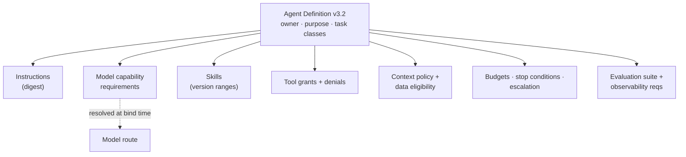
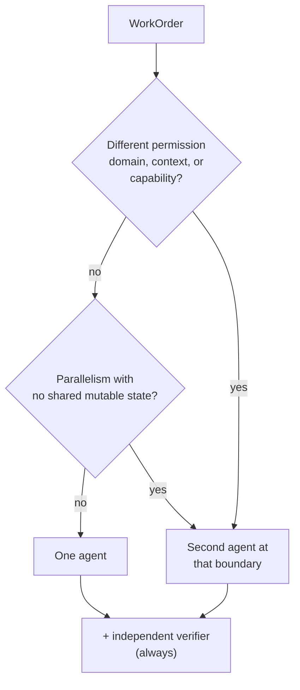
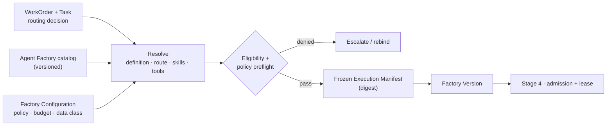

# Stage 3 · Define Agent

[Stage 2](./02-plan.md) ended with released WorkOrders, each carrying a capability routing decision: this task needs a strong reasoning model with repository tools, that one a small model with a skill, that one deterministic automation, that one a human. Stage 3 turns each routing decision into a concrete, versioned, frozen binding. It selects the **Agent Definition** that will perform the work, resolves the model route, skills, tools, context policy, budget, and policy it runs under, and compiles all of it into an immutable execution manifest that [Stage 4](./04-execute-through-harness.md) will execute without deviation.

"Define agent" does not mean inventing an agent per task. It means binding an approved, versioned definition that already exists in the Agent Factory to the work at hand, and recording exactly which versions were bound. *An enterprise agent needs a contract, not just a prompt.*

## The problem

Most teams' first agent is a system prompt and a model name. It works in a demo. Then the model is upgraded and the prompt behaves differently; nobody knows which version of the prompt produced last month's incident; two teams have copies of the prompt that have drifted; a new tool is added and the agent quietly acquires the authority to deploy; and when a security reviewer asks "what can this agent do, with whose credentials, against which data?" the answer is a shrug and a link to a text file.

The underlying mistake is treating the agent as a conversation partner instead of as a component. A component has an interface, a version, an owner, a test suite, and a documented set of things it may and may not do. A conversation partner has a personality. The factory needs components, because the factory has to answer, for every Attempt, which versioned behavior produced this action, which authenticated process performed it, and which scoped authority permitted it. Those are three different questions, and a prompt-plus-model answers none of them.

The second problem is the opposite reflex: once agents are easy to define, teams define too many. A planner agent, an architect agent, a coder agent, a critic agent, a reviewer agent, a manager agent, each with a persona, each passing messages to the next. The result mirrors an org chart, and inherits an org chart's costs: coordination overhead, latency, tokens spent on handoffs, shared-state conflicts, and failures that are hard to attribute because six things touched the work.

The third problem is vendor gravity. A workflow that says "use provider X's model Y" is a workflow that cannot move when Y is deprecated, when Y's price doubles, when a better model appears, or when policy declares Y ineligible for a data class. Model independence is easy to claim and hard to have, because it depends on evaluation infrastructure that most teams build last.

## How it works

### Inputs and outputs

| | Stage 3 · Define Agent |
| --- | --- |
| **Enters** | A released WorkOrder and its Tasks, each with a capability routing decision; the Agent Factory's catalog of versioned Agent Definitions, skills, tools, and model routes; the Factory Configuration (policy, budgets, data classification rules, verifier config); the capability registry with evaluation history. |
| **Leaves** | For each Task, an agent binding: an exact Agent Definition version, model route, skill versions, tool grants, context policy, sandbox profile, budget, and escalation contract, compiled into a **frozen execution manifest** under a named **Factory Version**. Or a deterministic-automation binding with no model. Or a human assignment. |
| **Records created** | AgentBinding; ExecutionManifest (immutable, digested); Factory Version reference; routing decision with eligibility trace; policy preflight result. |
| **Decision owner** | Deterministic system: eligibility filtering, version resolution, manifest compilation, digest, admission preflight. Agent Factory owners (humans): which definitions exist, at which versions, with what evaluation status. Human: approval of a high-risk binding or a fallback that changes security, quality, cost, or evidence. |

### The Agent Definition as a capability contract

An **Agent Definition** is a versioned capability contract. It describes what an agent is for, what it may use, what it may not touch, how much it may spend, how it is evaluated, and who owns it. The model may change underneath; the contract stays stable.

| Field | What it declares |
| --- | --- |
| Purpose and supported task classes | What this agent is for, and which routing decisions may bind it |
| Role and objective framing | How the work is framed to the model; success criteria the agent is told to pursue |
| Instructions | The versioned instruction text, by digest |
| Model capability requirements | The reasoning depth, coding ability, context size, tool-use, latency, and reliability profile required; never a vendor name |
| Available skills | Which skills, at which version ranges, this agent may load ([Stage 5](./05-apply-skills.md)) |
| Allowed tools | The tool grants, each with scope; and the tools explicitly denied |
| Context requirements and context policy | What context the agent needs, what it may retrieve, and how much |
| Data and security eligibility | Which data classifications this agent may see; which repositories and paths it may touch |
| Permissions and autonomy level | What it may do without asking, and where it must escalate |
| Budgets and stopping conditions | Tokens, tool calls, time, retries, money; objective conditions that end the run |
| Escalation contract | When and to whom it hands off, and what it must report when it does |
| Evaluation suite | The evals this definition must pass before promotion and on every change |
| Observability requirements | What it must emit: events, traces, tool receipts, cost |
| Owner and version | An accountable person or team, and a version that never mutates silently |

<!-- infographic: stage-3-agent-definition -->
> **Infographic — Anatomy of an Agent Definition.** *(Jay's graphic goes here.)* Until then, the diagram below carries the same concept.

Keep four things apart, because collapsing them is how an agent becomes a bearer of broad credentials. The **Agent Definition** is configured behavior. The **agent identity** is which versioned behavior produced a given action. The **runtime principal** is which authenticated process is calling. The **credential** is the scoped authority that permits a specific action. A definition must never be a reusable key to systems; it names the tools it may use, and the credential for each is brokered at execution time, scoped to the Attempt, and expires with it.

### Agent, skill, tool, model, harness, factory

The words get confused, so fix them.

| Thing | Provides | Does not provide |
| --- | --- | --- |
| **Model** | Reasoning and generation | Authority, memory, tools, or a workflow |
| **Agent** | Reasoning combined with an objective, instructions, context, tools, skills, policy, and evaluation | Its own authority; certification of its own work |
| **Skill** | Packaged, reusable, evaluated behavior or expertise the agent invokes | Authority; it teaches how, it does not permit |
| **Tool** | One action or one retrieval, through a governed boundary | Judgment about whether to call it |
| **Harness** | Control over execution: state, loop, tools, budget, recovery | Business intent or acceptance |
| **Factory** | Governance of how all of it composes into trusted delivery | Any single component's implementation |

*The model thinks. The tool acts. The skill packages reusable behavior. The harness controls execution.* And the factory governs. When a design conversation stalls, ask which of the six is being discussed; most confusion is two people using "agent" to mean different rows.

### One agent, or several

The default is one agent per WorkOrder until specialization creates measurable value. Multi-agent adds coordination cost, latency, tokens spent on handoffs, shared-state problems, new failure modes, and debugging difficulty; each of those is paid on every run, whether or not the second agent helped. *Agent count is an architectural cost, not a feature.* *Multi-agent is a means, not the product.*

Add an agent only at a real architectural boundary:

| Boundary | Example |
| --- | --- |
| Different permission domains | One agent may read production telemetry; the one that edits code may not |
| Different context requirements | A migration agent needs the schema history; the client-update agent needs the API contract |
| Different capabilities | One needs a strong reasoning model; the other is a small model with a skill |
| Meaningful parallelism | Two tasks that share no mutable state and would otherwise wait on each other |
| Deliberate independence | A **producer** and a **verifier** that must not share context or incentives, so the verifier's evidence is independent ([Stage 6](./06-evaluate.md)) |

The producer/verifier split is the one multi-agent pattern the factory requires rather than tolerates: the agent that produced a candidate is never its only evaluator. Everything else is optional and must earn its place.

Do not build a virtual org chart. A planner, architect, coder, critic, reviewer, and manager, each as an agent, is a hierarchy of handoffs with a hierarchy's overhead and none of its accountability. Think of a surgical team: a second surgeon joins for a different specialty or to hold an independent check, not because two surgeons per operation sounds thorough.

<!-- infographic: stage-3-composition -->
> **Infographic — When a second agent is justified.** *(Jay's graphic goes here.)* Until then, the diagram below carries the same concept.

### Model independence

Separate model **capability** from model **identity**. A workflow does not say "use vendor X's model Y." It says: I need this level of reasoning, this coding ability, this context size, this tool-use behavior, this latency, this security eligibility, this reliability, this cost profile. The Agent Definition states requirements; the binding resolves them to a route.

Two pieces of infrastructure make that possible. **Provider adapters** give every model the same invocation surface: the same way to send instructions, tools, and context, the same way to receive structured output and tool calls, the same telemetry. A **capability registry** records, per model route: workload-specific evaluation results by task class, context limits, tool capabilities, data eligibility, latency distributions, production reliability, and economics. The registry is what turns "I need this capability" into "these routes qualify."

Routing starts transparent and rule-based: a table from task class to eligible routes with an ordered preference, readable by anyone. It becomes adaptive only as production evidence accumulates per task class. Adaptive routing without evaluation data is guessing with extra steps.

Be honest about interchangeability. Models are not perfectly interchangeable: prompting conventions differ, tool-call behavior differs, reasoning strengths and failure modes differ. Switching a route is therefore a **re-evaluation**, running the Agent Definition's evaluation suite against the new route and tuning what needs tuning, not an architectural rewrite. The architecture stayed put; the component under test changed. *Models are capabilities, not architecture.* And the corollary that makes the whole claim real: *without evaluation, model independence is architecture theater.* A team with adapters but no evaluation suite cannot switch models safely; it can only switch them.

### Model routing criteria and the no-LLM option

Routing is task-aware, not model-popularity-aware. Filter first on **eligibility**: is this route approved for this data classification, this task class, this repository? Eligibility removes candidates; it does not rank them. Then evaluate the survivors on:

- capability (can it do this kind of work?);
- workload-specific quality (how did it score on the evaluation suite for this task class?);
- context requirements (does the task's context fit?);
- tool support (does it drive the tools this Agent Definition grants?);
- latency (does the workflow tolerate it?);
- production reliability (error rates, timeouts, degraded periods);
- cost.

The answer is the lowest-cost capability that reliably meets the quality, security, and latency requirements. Fallback may relax cost or latency; it may never relax capability, security, or policy, and a fallback that changes quality, security, cost, or evidence is shown to an operator rather than applied silently.

Cheapest model is not cheapest system. A cheaper model that takes three attempts and leaves thirty to forty-five minutes of senior rework costs more than one successful run on a stronger model. Optimize *cost per trusted outcome, not cost per token.*

And sometimes the right route is no route. *The best model for some tasks is no model at all.* A deterministic service, a scripted migration, a template expansion, or a skill whose behavior has matured into code is a legitimate binding for a task, and the factory should be as comfortable binding a function as binding a model. This is the maturity path from [Stage 5](./05-apply-skills.md): reason while discovering the pattern, capture it as a skill as it stabilizes, and move the deterministic part into automation. The factory does not maximize AI; it progressively removes unnecessary uncertainty.

### Freezing the binding: manifest and Factory Version

Once the definition, route, skills, tools, and policies are resolved, the factory compiles them into a **frozen execution manifest**: the exact configuration an Attempt will run under, digested, immutable, never mutated underneath the worker.

| Manifest field | Content |
| --- | --- |
| Repository and revision | The exact repository and base commit |
| Harness | Which execution backend, at which adapter version |
| Capability set | Agent Definition version, instruction digest, skill versions, tool grants with scope, MCP servers |
| Model route | The resolved route and its configuration |
| Context package reference | The frozen context the Attempt will receive ([Stage 4](./04-execute-through-harness.md)) |
| Policy | Which policy version applies; approval requirements; autonomy ceiling |
| Budget | Tokens, tool calls, time, retries, money |
| Data classification | PUBLIC, INTERNAL, CONFIDENTIAL, or RESTRICTED, frozen into the contract |
| Sandbox profile | Isolation, filesystem, network, resource limits |
| Verifier | Which independent verifier and verification plan will judge the result |
| Causation | The WorkOrder, Task, Plan revision, and Mission Spec revision this serves |

The manifest sits inside a **Factory Version**: the reproducible execution configuration of the whole factory at that moment, covering runtime config, model config, tools, policies, data classification rules, verification config, and execution constraints. A Factory Version is what lets the factory say, months later, exactly what ran. *If I can't reconstruct what ran, I can't reliably explain what failed.* And: *reproducibility requires freezing the execution environment, not saving the prompt.* A prompt is one field of a manifest; the manifest is what reproduces.

<!-- infographic: stage-3-freeze -->
> **Infographic — Compiling the frozen execution manifest.** *(Jay's graphic goes here.)* Until then, the diagram below carries the same concept.

Compilation is deterministic and happens once per Attempt. A retry is a new Attempt with its own manifest, which may be identical (same route, fresh lease) or deliberately different (a fallback route after a provider outage), but is never an edited copy of the old one.

### The Agent Factory as the source of definitions

Stage 3 does not author definitions; it consumes them. The **Agent Factory** creates, versions, evaluates, publishes, and governs the reusable capabilities: Agent Definitions, skills, tools and the tool registry, model configurations and routes, context requirements, evaluation suites, and the policies attached to each. It owns publication and discovery, deprecation, ownership, and the capability registry that routing reads. *The Agent Factory creates reusable intelligence. Mission Control governs how that intelligence becomes production work.*

That division is what makes federation possible. A central platform team owns the contracts: the Agent Definition format, the skills framework, tool contracts, evaluation interfaces, versioning rules. Product organizations contribute domain-specific definitions and skills inside those boundaries. *Centralize undifferentiated complexity. Federate differentiated expertise.* And because every capability carries a version, the three release clocks can turn at different speeds: model routes and prompts move fast under evaluation gates and are instantly reversible; skills and Agent Definitions move on a slower artifact lifecycle; runtime and durable contracts move with compatibility discipline. *Explicit versions, never silent mutation*; you cannot operate a learning system safely if you cannot reconstruct which version learned what.

### Who decides what

| Decision | Owner |
| --- | --- |
| Which definitions, skills, tools, and routes exist and at what evaluation status | Agent Factory owners (humans, with governed promotion) |
| Which definition version binds to this task class | Deterministic resolution from routing decision and catalog |
| Which routes are eligible | Deterministic filter from data classification, policy, tool scope |
| Which eligible route is chosen | Deterministic ranking on evaluation history, reliability, cost |
| Whether a second agent is justified | Plan author, at an architectural boundary; reviewed with the Plan |
| Whether a fallback that changes security, quality, cost, or evidence may apply | Human operator |
| Manifest compilation and digest | Deterministic system |
| Preflight denial | Policy engine; escalates to a human, never to the model |

## How to build it

**Define the Agent Definition schema and make everything reference it by version.** Every field in the table above, with the instruction text stored by digest. Reject definitions without an owner, an evaluation suite, or explicit tool grants. Treat a definition with no denied tools as suspicious.

**Build the registry before the router.** A capability registry with per-route, per-task-class evaluation results, eligibility, limits, latency, reliability, and cost. Populate it from the golden evaluation set. Routing without it is a preference table.

**Start with rule-based routing tables.** Task class → ordered eligible routes, with eligibility rules in front. Make the table readable and versioned. Adaptive weights come later, once production evidence per task class exists to justify them.

**Write provider adapters against one internal invocation contract.** Instructions, tools, context in; structured output, tool calls, usage, and telemetry out. Every adapter passes the same conformance suite. Never let a provider-specific feature leak into an Agent Definition.

**Make switching a route a re-evaluation, with a checklist.** Run the definition's evaluation suite on the new route; compare against the baseline; tune instructions where the suite shows drift; record the result on the registry. If the suite does not exist, the switch is not safe; build the suite first.

**Compile manifests deterministically and digest them.** Same inputs, same manifest, same digest. Store the manifest as an immutable record referenced by the Attempt. Include causation so the manifest can be traced to the Plan revision and spec revision it serves.

**Version the Factory Configuration and gate activation.** Readiness checks on workflow, executor, policy, budget, verifiers, host, recovery, repository, and integrations before a Factory Version may be used for admission.

**Default to one agent; require a written boundary for a second.** In the Plan review, a second agent must name which row of the boundary table it satisfies. Always add an independent verifier; never add a critic that shares the producer's context.

**Include the no-model path as a first-class binding.** A deterministic automation binds the same way an agent does: with a manifest, a budget, a sandbox profile, and a verifier. Its "instructions" are code at a version.

**Measure the stage.** Eligible-binding rate (how often the routing decision resolved to a valid binding first time), policy denials at preflight, configuration drift (an Attempt whose resolved versions differ from what the catalog now marks current), and the failure signal: execution with stale or unauthorized components.

## Failure modes

**Prompt-plus-model masquerading as a definition.** No version, no owner, no evaluation suite, no tool scope. Detect it when nobody can say what the agent may do. Fix it by refusing to bind anything not in the catalog.

**Definition as credential.** The agent "has" deployment access because its prompt mentions deploying. Detect it as an agent that can act beyond its task's scope. Fix it by keeping definition, identity, principal, and credential apart, and brokering credentials per Attempt.

**Silent mutation.** Someone edits the instruction text in place; last week's Attempts now reference behavior that no longer exists. Detect it as digests that do not match. Fix it with immutable versions and digested instructions.

**Vendor-named workflows.** "Use model Y" in an Agent Definition. Detect it when a deprecation notice becomes a rewrite. Fix it with capability requirements and a registry.

**Architecture theater.** Adapters exist, evaluation suites do not; a model switch produces regressions nobody measured. Fix it by treating the suite as a precondition for the switch.

**Virtual org chart.** Six agents, six handoffs, attribution impossible. Detect it as cost per accepted outcome rising faster than acceptance. Fix it with the one-agent default and the boundary table.

**Producer as its own verifier.** The one multi-agent split that must exist is missing; the agent grades its own work. Detect it as evidence that comes from the system being checked. Fix it in the manifest: the verifier field is mandatory and must name an independent verifier.

**Silent fallback.** A provider outage drops the route to a cheaper, weaker model and nobody is told; quality changes without a record. Fix it by classifying fallbacks and surfacing any that change security, quality, cost, or evidence to an operator.

**Routing by popularity or by price alone.** Strongest model everywhere, or cheapest model everywhere. Both miss cost per trusted outcome. Fix it with eligibility-first, cheapest-reliable ranking on task-class evaluation history, and by measuring human rework.

**Stale binding.** The catalog deprecated a skill version; a queued Attempt still references it. Detect it at admission ([Stage 4](./04-execute-through-harness.md)) when Factory Version and manifest are checked. Fix it by re-resolving before dispatch and never after.

## In Mission Control

At study commit [`d902fae`](https://github.com/jaydubya818/MissionControl/tree/d902fae7032c0696b531c44ae88829c652516fc6), with the records assessed at `main` [`b31e275`](https://github.com/jaydubya818/MissionControl/tree/b31e27564deb1c03c167e61b5ee094567c2ba7b1) and study commit [`9d5f8e3`](https://github.com/jaydubya818/MissionControl/tree/9d5f8e36aff45a001a8848cc0516b3dc800e29b8) on draft PR #64.

**Implemented.** Versioned agent records: agent templates, versions, instances, and identities, with the older agent model storing role, allowed task types and tools, budgets, status, and heartbeats. Model routes as versioned records with a lifecycle; harness manifests and provider-neutral harness lifecycle contracts for Codex, Claude, and Claude Code backends; sandbox profiles; context packages through a Context Registry with semantic version ranges, lock files, published content hashes, and idempotent activation that rejects unpublished or hash-mismatched content. The executor adapter freezes repository root, allowed paths, isolation, timeout, and model. Factory Configuration is versioned as `factoryDefinitions` with immutable `factoryDefinitionVersions`, digests, and readiness checks across workflow, executor, policy, budget, verifiers, host, recovery, repository, and GitHub. Admission checks exact model route, harness, sandbox, worker, and Factory Version. Skill discovery and linting exist.

**Partial.** Exact skill-version binding into the manifest is incomplete. The study branch on PR #64 freezes agent versions and code scopes into the Factory Version digest, validates workflow contracts, and compiles a per-step execution manifest (agent version, prompt hash, tools, model, harness, context hash, path authority, causation), rejects heuristic completion and agent-owned PR, review, merge, and deploy authority, and caps step context at 32 KB and run context at 128 KB across six workflows. Those are implemented and tested on the branch but not on `main` while the PR is unmerged. Routing is rule-based model-route selection; adaptive routing on production evidence is not present, which matches this page's advice for an early factory.

**Future.** No canonical Agent Factory boundary with unified publication, admission, compatibility qualification, deprecation, quarantine, and revocation across every capability type; no single package format, transitive lock, universal compatibility suite, or uniform certification object. The stated direction is to consume Agent Factory capabilities through versioned manifests, admit complete stack combinations proven by contract tests, show operators why a stack was selected, which layer failed, which substitutions remain eligible, and whether a fallback changes security, quality, cost, or evidence. That is direction, not current capability, and the production execution path at the study commit was blocked by operator configuration, so live fleet-scale binding is not demonstrated.

## Retain this

- *An enterprise agent needs a contract, not just a prompt.* An Agent Definition is a versioned capability contract: purpose, task classes, instructions by digest, model capability requirements, skills, tool grants and denials, context policy, data eligibility, budgets, stopping conditions, escalation, evaluation suite, observability, owner, version.
- Keep Agent Definition, agent identity, runtime principal, and credential apart. A definition is never a key.
- *The model thinks. The tool acts. The skill packages reusable behavior. The harness controls execution.* The factory governs the composition.
- Default to one agent. *Agent count is an architectural cost, not a feature.* Add one only at a permission, context, capability, parallelism, or independence boundary; the producer/verifier split is required, everything else is optional.
- *Models are capabilities, not architecture.* Workflows request capability; adapters and a capability registry resolve it; switching is re-evaluation, not rewrite. *Without evaluation, model independence is architecture theater.*
- Route eligibility first, then reliability, then cost. *Cost per trusted outcome, not cost per token.* *The best model for some tasks is no model at all.*
- Freeze everything into an execution manifest under a Factory Version before admission. *Reproducibility requires freezing the execution environment, not saving the prompt.*
- The Agent Factory creates and versions the capabilities; the control plane binds them. Explicit versions, never silent mutation.

## Go deeper

- Previous: [Stage 2 · Plan](./02-plan.md). Next: [Stage 4 · Execute through Harness](./04-execute-through-harness.md). Overview: [Chapter 2](../01-understand/02-the-factory-in-one-view.md).
- [Chapter 10, The Agent Factory](../03-build/10-the-agent-factory.md) for the registry, publication, certification, deprecation, and revocation of capabilities; [Chapter 17, Models: routing, profiles, and capability selection](../03-build/17-models-routing-and-capability-selection.md) for adapters, the capability registry, routing, fallback, and token economics in depth; [Chapter 5, Authoritative records](../02-design/05-authoritative-records.md) for AgentBinding, ExecutionManifest, and Factory Configuration records.
- [Chapter 13, Coding harnesses and agent protocols](../03-build/13-coding-harnesses-and-agent-protocols.md) for what a harness manifest must carry per backend; [Chapter 18, Agent and loop engineering](../03-build/18-agent-and-loop-engineering.md) for single-agent versus multi-agent design and the producer/verifier pattern; [Chapter 26, Security](../04-prove/26-security.md) for identity, credentials, and data classification; [Chapter 27, The factory as a platform](../05-operate/27-the-factory-as-a-platform.md) for the contribution model and release clocks.
- [Glossary](../appendix/glossary.md): Agent Definition, Agent Factory, Execution Manifest, Factory Version, Model-independent, Capability Registry, Provider Adapter, Skill, Tool.
- Sources: Jay West, factory architecture notes (agent definition, the six-way distinction, one agent vs multi-agent, model independence, model routing, token economics, versioning, release clocks, contribution model); Jay West, Mission Control walkthrough (Factory Version, frozen execution manifest, Agent Factory vs Mission Control).
