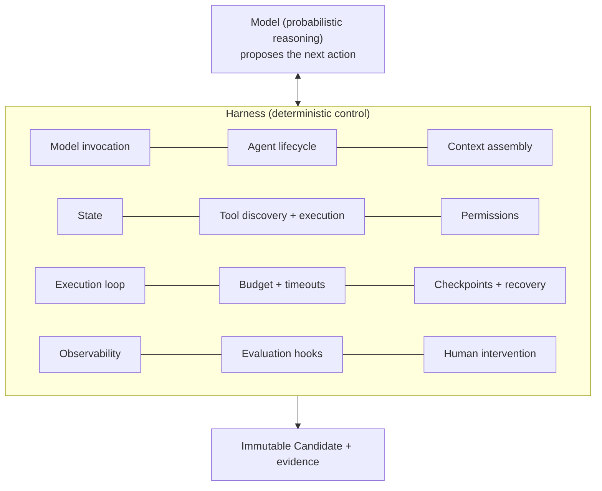
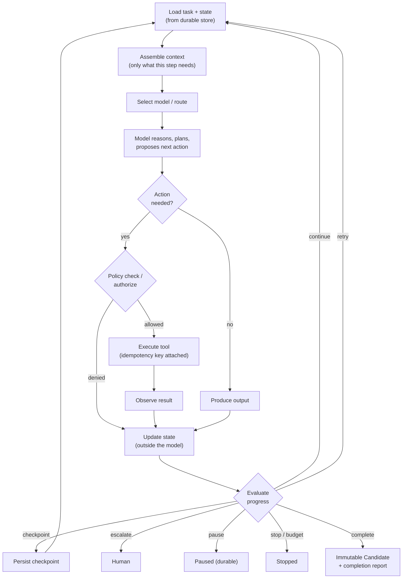
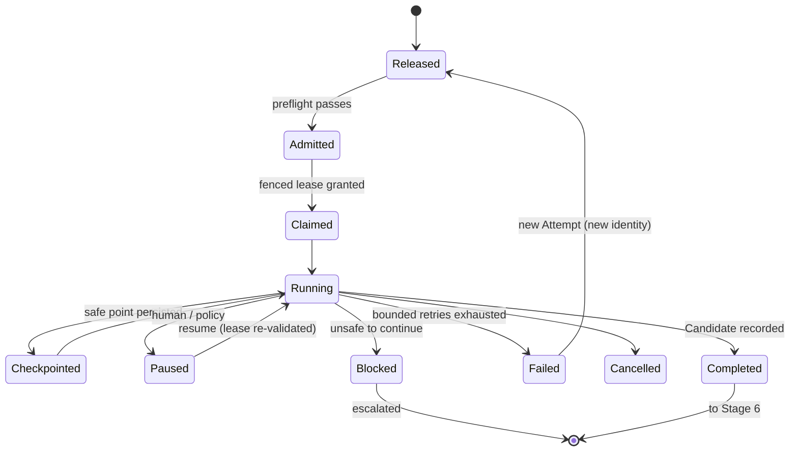
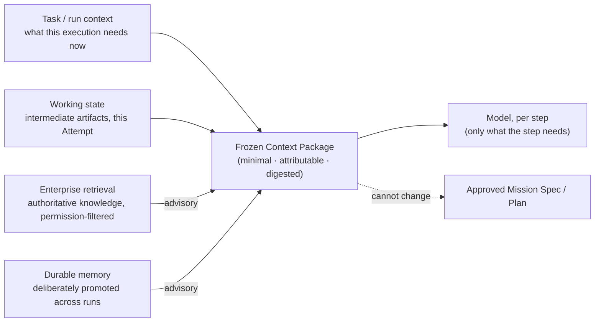

# Stage 4 · Execute through Harness

[Stage 3](./03-define-agent.md) ended with a frozen execution manifest under a Factory Version: exactly which Agent Definition, model route, skills, tools, context, policy, budget, sandbox, and verifier an Attempt will run under. Stage 4 runs it. A worker is admitted and given a fenced lease; an isolated environment is provisioned at the exact repository revision; the harness assembles context, invokes the model, checks every proposed action against policy, executes tools, persists state outside the model, enforces budgets, checkpoints, recovers from failure, and finally records an immutable **Candidate**. The next stage, [Stage 5 · Apply Skills](./05-apply-skills.md), describes the reusable behaviors the harness loads during this loop; [Stage 6 · Evaluate](./06-evaluate.md) judges the Candidate independently.

The one sentence to hold: *The model reasons. The harness controls.*

## The problem

A language model in a loop with tools is an impressive demo and a poor production system. The model has no durable memory of what it did, no idea whether a tool call it issued actually took effect, no way to stop itself when it is stuck, no notion of budget, and no authority of its own that anyone should trust. Left to itself it will retry side effects it already performed, reason indefinitely against an ambiguous goal, read a malicious document and try to act on it, and report "done" with complete confidence whether or not anything works.

Teams discover this in a predictable order. First the multi-hour workflow that lived only in the model's context window is lost when the process restarts. Then a retried run opens a second pull request, or sends the second email, or applies the migration twice. Then a worker that was thought dead wakes up and keeps editing a branch another worker now owns. Then a tool acquired for one task is used for another because nothing scoped it. Then a run burns a day's budget in an hour. Each is a distributed-systems failure that arrived wearing an AI label. *Agent runtime is distributed-systems infrastructure, not an LLM wrapper.* *Model context is not durable workflow state, and it is not a transaction log.*

The harness exists to make each of those failures impossible by construction rather than unlikely by prompting. It is not a loop around an LLM; it is the execution boundary that turns an LLM into an operable enterprise capability.

## How it works

### Inputs and outputs

| | Stage 4 · Execute through Harness |
| --- | --- |
| **Enters** | A released Task with its frozen execution manifest and Factory Version; a frozen Context Package; scoped, short-lived credentials brokered for this Attempt; an isolated execution environment at the exact repository revision. |
| **Leaves** | An immutable Candidate (exactly what execution produced: a diff, an artifact, an action record) with a digest; a completion report stating `succeeded`, `partial`, `blocked`, `failed`, or `cancelled`; structured events, traces, tool receipts, checkpoints, cost; unresolved findings and any required human action. |
| **Records created** | Attempt (immutable); lease and heartbeat records; state transitions; checkpoints; idempotency records and execution receipts for side effects; tool-call records with policy decisions; budget consumption; the Candidate; the completion report. |
| **Decision owner** | Agent (model): what to do next, given the task and observations. Deterministic system (harness, orchestrator, policy engine): whether the proposed action is permitted, whether the loop continues, what state persists, when to stop, when to retry, when to escalate. Human: intervention when the harness escalates, pause and cancel, exceptions. |

### Where probabilistic reasoning meets deterministic control

The **harness** is the place where two kinds of system touch. On one side is the model: probabilistic, capable, unreliable in ways that cannot be enumerated in advance. On the other is everything an enterprise needs to be deterministic: what ran, with what authority, against what data, at what cost, with what result. The harness sits at the seam and decides, for every step, which side owns what.

The model reasons about the task. The harness controls which model runs, what context it receives, which tools it can invoke, what state persists, how much budget remains, which environment it executes in, when it must stop, and what evidence is recorded. Everything in the second list is the harness's, and none of it is delegated to the model's judgment.

<!-- infographic: stage-4-harness-owns -->
> **Infographic — What the harness owns.** *(Jay's graphic goes here.)* Until then, the diagram below carries the same concept.

Fourteen responsibilities, all deterministic: model invocation through the provider adapter with the frozen instructions; the agent lifecycle (start, checkpoint, pause, resume, cancel, complete) for one Attempt; context assembly for each step; state, kept outside the model; tool discovery and tool execution through the governed boundary; permissions from the manifest, enforced on every call; the execution loop itself; budget and timeouts; checkpoints and recovery; observability; evaluation hooks during the run; and human intervention. *The harness turns probabilistic intelligence into bounded execution.* Think of a flight envelope protection system: the pilot flies the aircraft and makes every decision about where to go, but the system will not let the inputs exceed what the airframe can survive, regardless of how confident the pilot is.

The harness is also one of four nested layers around the model: the loop inside it makes the work verifiable, the graph around the loop decides where execution goes next, the harness makes the model operational, and the meta-harness governs across harnesses. *The model is just weights. The harness is the agent.* That is why a task the model can describe but cannot perform is fixed by adding the tool, data source, or permission to the harness, never by rewriting the prompt; [Chapter 18](../03-build/18-agent-architecture.md#four-layers-loop-graph-harness-meta-harness) lays out the four layers and the rule for asking which one a failure belongs to.

### The execution loop

The loop is the heartbeat of the agent. It is drawn here as one flow because it is one flow; every harness implements some version of it, and the differences between harnesses are mostly about which boxes are explicit.

<!-- infographic: stage-4-execution-loop -->
> **Infographic — The execution loop.** *(Jay's graphic goes here.)* Until then, the diagram below carries the same concept.

Read the loop by ownership. **Load task and state** comes from the durable store, not from the model's memory. **Assemble context** gives the model only what this step needs; not the whole repository, not the whole history. **Select route** applies the manifest. **The model reasons** and proposes the next action; this is the only probabilistic box. **Action needed?** is the model's proposal. **Policy check** is the harness's decision: the model proposes the action; the runtime determines whether that action is permitted. **Execute tool** goes through the governed boundary with an idempotency key. **Observe** captures the result. **Update state** writes to the durable store, outside the model. **Evaluate progress** is the harness deciding whether the loop continues, retries, checkpoints, escalates to a human, pauses, stops on budget, or completes.

The loop never lets the model decide whether the loop continues. It can *ask* to stop; the harness decides. It can *ask* for a tool; policy decides. The simplest inner shape is **Understand → Plan → Act → Observe → Evaluate → Adjust**; the diagram is that shape with its control points made explicit.

### Durable execution

Never let a multi-hour workflow live only in model context or process memory. The Attempt is a **durable state machine** whose fields persist on every transition:

| Field | Purpose |
| --- | --- |
| Task and Attempt identity | Which Task; which immutable try |
| State | The current state in the machine (claimed, running, checkpointed, paused, blocked, failed, completed, cancelled) |
| Inputs | The manifest digest, context package digest, base revision |
| Outputs so far | Artifacts produced, with digests |
| Owner | Which worker holds the lease, at which generation |
| Attempt number | Which try this is; prior Attempts are preserved, never rewritten |
| Checkpoint | The last safe point and what it contains |
| Retry policy | Bounded count, backoff, which failure classes are retryable |
| Timeout | Wall-clock and per-step limits |
| Budget | Allocated and consumed, per dimension |
| Evidence | Events, tool receipts, policy decisions, cost |

Four rules make the machine safe. **Retries are bounded**; a retry creates a new Attempt with a recorded reason, never a rewrite of the old one. **State transitions are idempotent**; applying the same transition twice produces the same state. **Side effects have replay protection** (next section). **Pause and cancel are first-class**: a paused Attempt is a durable state, not a suspended process, and a cancelled one records what it had done.

<!-- infographic: stage-4-durable-state -->
> **Infographic — The Attempt state machine.** *(Jay's graphic goes here.)* Until then, the diagram below carries the same concept.

When a worker disappears, the state machine answers the questions the model cannot: What completed? What side effects occurred? Where is the last safe checkpoint? What can safely resume? Recovery never depends on asking the model what it remembers. *The platform should know.*

### Retries and idempotency

Design retries and side effects together, because a retry that repeats a side effect is worse than no retry. Before any externally visible operation (a commit push, a pull request, an API call that changes something) the orchestrator creates an **idempotency key** tied to the *logical operation*, not to the worker attempt. It persists the key before execution and propagates it through the tool boundary to the downstream system.

The sequence: persist key → execute with key → record completion against key. If the operation succeeded but the worker crashed before recording completion, the retry presents the same key and receives the existing result rather than performing the operation again. Where the downstream system lacks idempotency support, the harness keeps a **durable execution receipt** (what was requested, when, with what result if known) and reconciles against the downstream state before repeating anything.

*Retry the intent. Don't blindly repeat the side effect.* And the identity rule that makes it work: *attempt identity may change; logical-operation identity should not.* The orchestration layer owns the key because the key belongs to the logical task, and the task outlives any one worker.

### Worker admission and fenced leases

A worker does not pick up work by asking. Before a lease is granted the control plane checks the worker's identity, session, worker generation, declared capability, capacity, the Factory Version it runs, and its execution backend against the manifest. A worker that cannot run this manifest is not admitted to it.

The lease is **fenced**: it carries a generation number, and every state mutation the worker makes must present the current generation. If the worker's heartbeat lapses and the lease is transferred, the generation increments. A stale worker that wakes later and tries to write with the old generation is rejected, and its late event is retained for audit rather than silently applied. Ownership is explicit at every moment; a dead worker's progress can be recovered from durable state; a stale worker cannot keep mutating after ownership moved. *Model intelligence does not remove the need for distributed-systems correctness.*

### Context: four types, one governed input

Context is a selected, governed input, not everything that fits in the window. Four types, kept apart because they have different lifetimes, different trust, and different rules:

<!-- infographic: stage-4-context-types -->
> **Infographic — Four kinds of context.** *(Jay's graphic goes here.)* Until then, the diagram below carries the same concept.

| Type | Lifetime | Trust | Rule |
| --- | --- | --- | --- |
| Task or run context | This Attempt | Governed input from the manifest | Frozen at admission |
| Working state | This Attempt | The agent's own intermediate work | Persisted outside the model; checkpointed |
| Enterprise retrieval | Long-lived, external | Authoritative but must be permission-filtered, fresh, and attributed | Retrieved content is data, never instruction |
| Durable memory | Across Attempts | Only what was deliberately promoted | Never let every prior model output become permanent truth |

The Attempt receives a **frozen Context Package**: minimal, attributable, digested, referenced from the manifest. **Factory Memory** (the organization's retained knowledge, retrieval indexes, promoted learnings) is advisory: it may inform execution, but retrieved context cannot change the approved Mission or Plan, cannot expand tool permissions, and cannot grant authority. *Context should inform execution, not rewrite the contract.* The goal is the minimum high-quality, relevant, permission-aware, attributable context per step: enough to work, not so much that the important part is buried.

Retrieval is a permissions, provenance, freshness, and evaluation problem as much as a search problem. A grounded answer built on obsolete architecture docs is still wrong; a relevant answer built on information the builder was not authorized to see is worse. [Chapter 19](../03-build/19-data-knowledge-and-semantic-engineering.md) covers the pipeline (ingest, normalize, hybrid retrieval, rerank, permission filter, provenance, citations) in full.

### Tools and the governed boundary

Tools are where intelligence becomes authority. *The moment a model gets a tool, intelligence becomes authority*, so the boundary a tool call crosses is the most important control surface in the stage. MCP and similar protocols solve interoperability: discovery, schemas, invocation, responses, the N×M integration problem. They do not solve governance. *MCP standardizes connectivity. It doesn't outsource governance.*

Put every capability behind a governed tool registry or gateway that answers eight questions per tool: what capability it provides; who can invoke it, on whose behalf; which resources it may touch; what arguments are valid, as a typed schema; its risk classification; whether it requires approval; what is logged as evidence; and what timeout, rate limit, and audit behavior apply. The controls enforced at the boundary, outside the model:

| Control | Enforced how |
| --- | --- |
| Identity | Workload identity per Attempt; the call carries who is acting |
| Authorization | The manifest's grants; denied tools do not exist for this Attempt |
| Argument validation | Typed schema; malformed or out-of-scope arguments rejected before execution |
| Resource scope | The repository, paths, services, and data this Attempt may reach |
| Rate limits and timeouts | Per tool, per Attempt |
| Auditability | Every call recorded with arguments, result, policy decision, idempotency key |
| Approval requirements | High-risk tools pause the loop for a human before execution |

Tool access is scoped to the task: a repository-analysis agent does not receive deployment credentials because it happens to be running on the same platform. *The model proposes the action. The platform decides whether it is allowed.* Whether a given capability is reached through MCP or a direct API is a decision on reuse, interoperability, governance, latency, and operational cost, not a doctrine; a high-throughput, stable internal service may keep its direct API behind the same gateway controls. *MCP is an interoperability decision, not a religion.*

Prompt injection lives here too. Assume retrieved content (tickets, docs, source, comments, web pages) may be hostile. The rule that makes it survivable: **content cannot grant authority.** A malicious document may influence what the model wants to do; it cannot expand tool permissions, repository scope, credentials, identity, or network access, because those live in the manifest and the gateway, not in the model. A successful injection becomes a failed or wasted run, not a security incident. *The agent's permissions should never expand because of something it reads.*

### Execution environments

Every Attempt runs in a bounded, reproducible environment: not the developer's laptop, not a shared runner with ambient credentials.

The environment record names the exact repository revision from the manifest; the approved toolchain; scoped credentials, short-lived and brokered for this Attempt; filesystem boundaries (which paths are readable, which writable); network egress policy; pinned dependencies; resource limits; wall-clock and idle timeouts; and what the environment audits.

Three properties justify the cost. **Isolation** for security: autonomous execution is treated like running untrusted code, with no ambient laptop or credential access. **Reproducibility** for debugging and verification: the same manifest and environment definition produce the same environment, so a failure can be replayed and a verifier can re-run in identical conditions. **Containment**: a runaway or compromised run cannot reach beyond its boundary. And **consistency with downstream delivery**: the environment matches what CI/CD will use, so "works in the sandbox" predicts "works in the pipeline." It must also be fast enough that the safe path does not feel bureaucratic. *Fast prototyping and strong guardrails aren't opposites if the guardrails are built into the environment.* *Autonomy should come with narrower execution boundaries, not broader ambient access.* [Chapter 17](../03-build/17-development-environments-sandboxes-and-compute.md) covers environments, sandboxes, and compute.

### Budgets and stopping conditions

Budgets are first-class execution controls, not billing afterthoughts. Each Attempt carries allocations for tokens, model spend, tool calls, execution time, retries, and compute, and the harness enforces them in the loop. Alongside budgets are **objective stopping conditions**: a maximum number of iterations without measurable progress, a repeated failure signature, a completion contract satisfied, a human-requested pause. A stuck agent must not reason indefinitely; the harness ends it and records why.

Budget data is feedback. A skill that costs five times another for the same outcome should influence routing and improvement. *Economics should influence architecture continuously, not arrive as a surprise on the monthly bill.*

### When an agent fails mid-workflow

Do not restart everything. Inspect the persisted state: what completed, what side effects occurred (check idempotency records and execution receipts), where the last safe checkpoint is, whether the failure class is retryable. Another worker claims the Task through a new fenced lease and resumes from durable state. Before repeating any side effect it consults the idempotency record. If resumption is unsafe, the Attempt moves to a truthful blocked or failed state, evidence is preserved, and a human is escalated to. *A truthful blocked state is better than a false success.* Recovery never asks the model what it remembers, because the model may not exist anymore and would not know anyway.

### The output: an immutable Candidate

When the loop completes, the harness records a **Candidate**: exactly what execution produced (a diff at a head commit, an artifact with a digest, a record of actions taken), bound to the Attempt, the manifest, and the Factory Version. The Candidate is immutable. It is not correct, not verified, and not accepted; it is an output. *A Candidate is an output, not a success declaration.*

Alongside it the harness emits a **completion report** with a status of `succeeded`, `partial`, `blocked`, `failed`, or `cancelled`; a summary of the work; the exact artifacts; a mapping of results to the acceptance criteria as the agent understood them; unresolved findings; and any required human action. The report is a claim, and the factory treats it as one. *The agent saying "I'm done" is an event, not evidence.* Runtime completion does not accept the WorkOrder. [Stage 6](./06-evaluate.md) turns the Candidate into a Verification Subject and produces evidence from systems other than the one that produced the work.

### Inner and outer harness

This page describes the harness as one boundary. In practice it splits in two: an **inner harness** that runs the model-tool-observation loop for one session (often a vendor's coding agent), and an **outer harness** that supervises it through lifecycle events, loads skills, enforces budgets and retries, and applies the completion contract. The split is conceptual; a small system may implement both in one process with separate contracts. [Chapter 15](../03-build/15-coding-harnesses-and-agent-protocols.md) covers the split, the protocols between them, and why a lowest-common-denominator adapter that drops hooks, cancellation, or tool events buys portability at the cost of blindness.

Two loops run through that harness, and they serve different objectives: the **inner loop** is the fast, cheap feedback (tests, types, linters, local verifiers) that lets the agent detect and correct its own mistakes before handoff and so drives autonomy, while the **outer loop** is the deeper, independent verification at the pull-request boundary that decides whether the work can be trusted and so drives automation. Building both on purpose, together with the context, tools, environment, evals, and observability around them, is **harness engineering**: engineering the system in which agents engineer the software ([Chapter 16](../03-build/16-harness-engineering.md#inner-loop-outer-loop-meta-loop)).

### Who decides what

| Decision | Owner |
| --- | --- |
| Next action, given task and observations | Model |
| Whether the action is permitted | Policy engine at the tool boundary (deterministic) |
| Whether the loop continues, retries, checkpoints, escalates, pauses, stops; what state persists; what context this step sees; budget and stop enforcement | Harness (deterministic) |
| Which worker runs the Attempt; whether a side effect is repeated on retry | Control plane admission, fenced lease, idempotency record |
| Intervene, pause, cancel, approve a high-risk tool call | Human |
| Whether the Candidate is correct | Nobody in this stage; [Stage 6](./06-evaluate.md) |

## How to build it

**State machine first, loop second.** Model the Attempt with the fields above, explicit idempotent transitions, and every transition audited with the lease generation that made it, in a store that survives process death. Then write the loop with its control points as code, not prompt: policy check before every tool execution, state update after every observation, a progress evaluator returning one of continue, retry, checkpoint, escalate, pause, stop, complete. The model never sees these decisions as options; it sees only the task and its observations.

**Idempotency in the orchestrator; admission and fenced leases before scaling workers.** One key per logical operation, persisted before execution, propagated through the gateway; execution receipts and reconciliation where downstream lacks idempotency. Admission checks identity, session, generation, capability, capacity, Factory Version, and backend; heartbeats expire; the generation increments on transfer; stale-generation writes are rejected and retained.

**Freeze the Context Package at admission and keep Factory Memory advisory.** Minimal, digested, referenced from the manifest; permission-filtered retrieval; promotion to durable memory deliberate and attributed, never by default.

**Stand up the tool gateway with the eight questions answered per tool**, typed schemas, scope, risk class, approval flag, and audit. Treat every tool output and retrieved document as untrusted data, and test injection explicitly: a document instructing the agent to widen scope must produce a wasted run and nothing else.

**Define environments as versioned records and make provisioning fast.** Revision, tools, credential brokering, filesystem, network, dependencies, limits, timeouts, auditing; time-to-first-action is a product metric.

**Enforce budgets in the loop, emit structured events for everything, and make the Candidate plus completion report the only exit.** Per-dimension allocation on the Attempt with objective stop conditions and a repeated-failure-signature detector; events for model and config, context digest, tool calls, policy decisions, transitions, checkpoints, cost, retries, outcome ([Chapter 35](../05-operate/35-observability-telemetry-and-forensics.md) defines the lineage); five statuses only, the Candidate digested and immutable, the report a claim for [Stage 6](./06-evaluate.md) to test.

**Measure the stage.** Retry-free completion, blocked and partial rate, recovery time after worker loss, cost per Attempt, tool failure rate, and the failure signals: duplicate external effects, runaway loops, silent stalls.

## Failure modes

**Workflow in the context window.** Process restarts; the work is gone; Attempts cannot resume. Fix: the durable state machine.

**Duplicate side effects.** A retry opens a second pull request or applies a migration twice. Fix: idempotency keys on the logical operation, execution receipts, reconciliation.

**Zombie worker.** A worker presumed dead wakes and keeps writing to a branch another worker owns; conflicting writes carry different lease generations. Fix: fenced leases and stale-generation rejection.

**Runaway loop.** Budget exhausted without progress against an ambiguous goal. Fix: objective stop conditions and a repeated-failure detector that escalates.

**Ambient authority and injection as authority.** The environment carries a developer's credentials, or a retrieved document widens the agent's scope and something lets it; tool calls outside the manifest succeed. Fix: brokered, scoped, short-lived credentials; permissions in the manifest and gateway; content is data.

**Context flood and memory as truth.** Everything that fits is loaded and quality falls as context grows; every prior model output is re-fed and stale conclusions become permanent. Fix: per-step minimal assembly, the frozen package, deliberate attributed promotion to durable memory.

**Completion as acceptance.** The report's `succeeded` is shown as the WorkOrder's state; dashboards have fewer states than the lifecycle. Fix: keep the Candidate an output and route it to independent evaluation.

**Recovery by interrogation.** After a failure, someone asks the model what it did. If the platform cannot answer from persisted state, the state machine is incomplete.

**Lowest-common-denominator adapter.** A harness abstraction drops cancellation, hooks, or tool events, and an operator cannot see why a session stopped. Fix per [Chapter 15](../03-build/15-coding-harnesses-and-agent-protocols.md): interfaces as versioned products with behavioral tests.

## In Mission Control

Assessed at `main` [`b31e275`](https://github.com/jaydubya818/MissionControl/tree/b31e27564deb1c03c167e61b5ee094567c2ba7b1) (studied 2026-08-09) with the capability study at [`d902fae`](https://github.com/jaydubya818/MissionControl/tree/d902fae7032c0696b531c44ae88829c652516fc6).

**Implemented.** Task Attempts are modeled as WorkflowRuns linked by `parentTaskId`, with `runEvents` and `runArtifacts`, version, runtime, isolation, steps, events, artifacts, and failure detail. The governed scheduler requires an explicit canonical Child Task, rejects foreign, cross-workspace, ungoverned, Inbox, Review, Done, and Canceled Tasks, allows first dispatch only with no prior Attempt, and requires for retry that no Attempt is active, that the latest failed, that it is the same Task, and that a recovery reason of at least ten characters is given. Each successful dispatch appends a WorkflowRun with Attempt and retry numbers; the previous failure remains. Dispatch checks idempotency before event creation, and Task transitions retain idempotency keys and audited context. Retained browser evidence shows two Attempts under one Task, preserved failure history, persistence across reload, and no duplicate Task card. Tool calls are recorded with risk policy applied; the executor adapter freezes repository root, allowed paths, isolation, timeout, and model. Execution runs in Git worktrees with Docker or sandboxed process isolation. The `codex/v1` adapter declares cancel support and does not claim resume, which is the correct precision. Harness lifecycle contracts are provider-neutral, describing execution through capability manifests and structured results.

**Partial.** At `b31e275` the baseline prevents multiple active Attempts through state inspection, which is an invariant enforced by reads, not a lease. Memory: `packages/memory` implements session, project, and global in-memory abstractions and Convex records run episodes and execution traces, but the retrieval proposal itself lists provenance, contradiction handling, permission-aware retrieval, ingestion checkpoints, and evaluation as missing. Worker admission across model route, harness, sandbox, worker, and Factory Version exists at `d902fae`; fenced leases with heartbeat, fencing token, and stale-lease reconciliation were being developed under todo 024 and remain partial until committed and verified.

**Future.** No production lease system at `b31e275`: no atomic leased worker with heartbeat, fencing token, stale-lease reconciliation, or restart-safe Codex-to-GitHub ownership. The intended Attempt record adds claim status, worker identity, lease generation, heartbeat, expiry, execution manifest digest, worktree identity, base and head SHAs, provider-side operation keys, and reconciliation state; late completion with a stale fence is to be rejected while its event is retained. MCP is adjacent rather than a governed subsystem: product documents describe MCP integrations, but the commit does not show a first-class server registry, connection policy, capability lifecycle, or end-to-end execution through MCP. A per-Attempt manifest digest covering every component is still to be built. Recovery is to surface a timeline of hypotheses, actions, evidence, cost, and remaining budget, with repeated failure signatures escalated rather than retried to exhaustion. The scheduler is an instructive example of progressive hardening: it proves Attempt identity and reasoned retry without pretending that state inspection is a lease.

## Retain this

- *The model reasons. The harness controls.* The harness owns model invocation, lifecycle, context assembly, state, tool discovery and execution, permissions, the loop, budget, timeouts, checkpoints, recovery, observability, evaluation hooks, and human intervention.
- The loop: load task and state → assemble context → route → reason → action? → policy check → tool → observe → update state → evaluate progress → continue, retry, checkpoint, escalate, pause, stop, or complete. The model proposes; the runtime decides whether the action is permitted and whether the loop continues.
- *Model context is not durable workflow state.* The Attempt is a durable state machine with bounded retries, idempotent transitions, replay-protected side effects, and first-class pause and cancel; recovery reads persisted state, because *the platform should know* and *a truthful blocked state is better than a false success.*
- *Retry the intent. Don't blindly repeat the side effect.* Idempotency keys belong to the logical operation and are owned by the orchestrator. *Attempt identity may change. Logical-operation identity should not.*
- Workers are admitted on identity, session, generation, capability, capacity, Factory Version, and backend, then hold a fenced lease; a stale worker cannot keep mutating.
- *Context is a governed input, not everything we can fit into the window.* Four types; the Attempt gets a frozen, minimal, attributable Context Package; Factory Memory is advisory and *cannot rewrite the contract.*
- *MCP standardizes connectivity. It doesn't outsource governance.* Identity, authorization, argument validation, resource scope, rate limits, timeouts, auditability, and approval are enforced at the tool boundary, outside the model. *Content cannot grant authority.*

## Go deeper

- [Chapter 15, The harness as runtime control plane](../03-build/15-coding-harnesses-and-agent-protocols.md#the-harness-as-runtime-control-plane-one-diagram-for-every-production-agent) — the one diagram: six-node execution graph, bounded loop, memory, tool gateway, trust rail, observability floor.
- Previous: [Stage 3 · Define Agent](./03-define-agent.md). Next: [Stage 5 · Apply Skills](./05-apply-skills.md). Overview: [Chapter 2](../01-understand/02-the-factory-in-one-view.md).
- [Chapter 14, Durable execution: tasks, attempts, leases, and recovery](../03-build/14-durable-execution.md) for the state machine, leases, heartbeats, fencing, idempotency, and recovery in full; [Chapter 13, Control plane, orchestrator, and execution plane](../03-build/13-control-plane-orchestrator-and-execution-plane.md) for admission and the authority boundary; [Chapter 15, Coding harnesses and agent protocols](../03-build/15-coding-harnesses-and-agent-protocols.md) for inner versus outer harness, ACP, AG-UI, MCP, and hooks.
- [Chapter 18, Agent architecture: loop, MCP, tools, context, and memory](../03-build/18-agent-architecture.md) for the loop and tool gateway; [Chapter 19, Data, knowledge, semantic, and context engineering](../03-build/19-data-knowledge-and-semantic-engineering.md) for retrieval, provenance, and freshness; [Chapter 17, Development environments, sandboxes, and compute](../03-build/17-development-environments-sandboxes-and-compute.md) for environments; [Chapter 23, Agent and loop engineering](../03-build/23-agent-and-loop-engineering.md) for loop tuning; [Chapter 33, Security](../04-prove/33-security.md) for the threat model and prompt injection; [Chapter 35, Observability, telemetry, and forensics](../05-operate/35-observability-telemetry-and-forensics.md) for lineage; [Chapter 36, Resilience, incidents, and the control tower](../05-operate/36-resilience-incidents-and-the-control-tower.md) for mid-workflow failure and incidents; [Chapter 8](../02-design/08-economics-metrics-and-human-attention.md) for budgets and token economics.
- [Glossary](../appendix/glossary.md): Agent Harness, Execution Loop, Attempt, Lease, Idempotency Key, Context Package, Factory Memory, Tool Integration, Execution Environment, Candidate, Completion Report, Control Mechanism.
- Sources: Jay West, factory architecture notes (agent harness, execution loop, durable execution, retries and idempotency, orchestration, context, enterprise retrieval, tools and MCP, budgets, execution environments, prompt injection, mid-workflow failure); Jay West, Mission Control walkthrough (worker admission, fenced leases, Context Package vs Factory Memory, bounded execution, Candidate, "I'm done" is an event); OpenAI, "Unrolling the Codex Agent Loop" and "Harness Engineering"; Anthropic, "Building Effective Agents"; *The 4 Layers of an Agent System Explained* (public post, 2026) for the loop, graph, harness, and meta-harness nesting and "the model is just weights; the harness is the agent".
