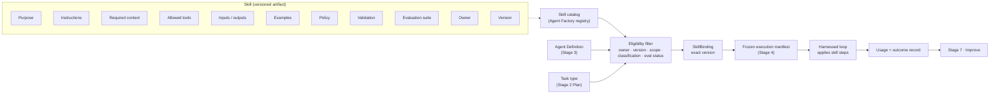
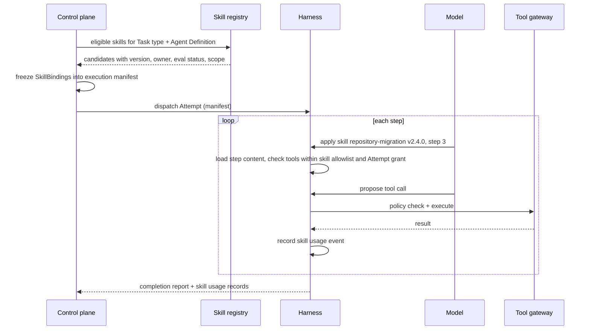
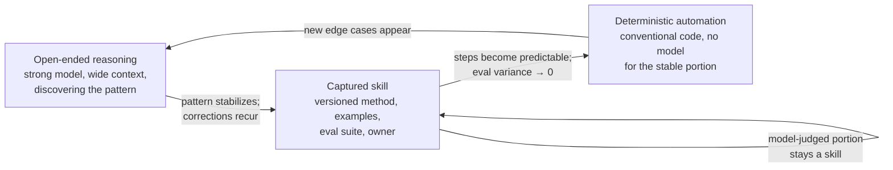

# Stage 5 · Apply Skills

The first four stages turned a builder's intent into a governed Plan, bound a versioned Agent Definition to each Task, and ran the work through a durable harness. Stage 5 answers a question those stages left open: *how* does the agent know the right way to do this class of work, and how does the organization make that knowledge better every time it is used? The answer is the **skill**, a versioned reusable capability that packages the method for a class of tasks so the factory stops rediscovering it. This page is the deep dive on what a skill is, when it is bound, how it is applied, where it sits relative to tools and MCP, and how the Agent Factory turns skills into the compounding asset of the whole platform.

Previous: [Stage 4 · Execute through Harness](./04-execute-through-harness.md). Next: [Stage 6 · Evaluate](./06-evaluate.md).

## The problem

Every engineering organization already has methods that work: how to migrate a repository from one build system to another, how to add a feature flag without breaking the flag audit, how to write a database migration that can be rolled back, how to structure a pull request so reviewers can trust it. Before agents, that knowledge lived in senior engineers, runbooks, and code review comments. When coding agents arrived, the knowledge moved into prompt files copied from team to team, each drifting a little, none evaluated, none owned. One team's prompt for "migrate to the new logging library" would be excellent; a neighbouring team would spend a week rediscovering the same lessons with a worse prompt.

The failure is not that prompts are bad. It is that a prompt file has no contract. Nobody can say which version of it produced a given change, whether it still works after a model update, which tools it assumes, what inputs it needs, what it is forbidden to do, or who fixes it when it breaks. An agent applying an unversioned prompt is a worker reading an unsigned sticky note. And when the same prompt is pasted into fifty agents, a defect in it is a defect in fifty places with no way to roll it back.

There is a second, subtler failure. Teams keep asking a large model to reason from scratch about work that has become routine. A repository migration that has been done four hundred times does not need fresh reasoning on the four-hundred-and-first; it needs the captured method, and most of its steps should not involve a model at all. Paying for open-ended reasoning where behavior is already deterministic is the single largest avoidable cost in an agentic platform, and it also introduces avoidable variance. The best factory does not maximize AI. It progressively removes unnecessary uncertainty.

Stage 5 exists so that method becomes an artifact: versioned, evaluated, owned, bound before execution, applied under harness control, and improved once for everyone.

## How it works

### Inputs and outputs

| | |
| --- | --- |
| **Enters** | Task type and objective from the approved Plan ([Stage 2](./02-plan.md)); the bound Agent Definition and its declared skill allowances ([Stage 3](./03-define-agent.md)); the skill catalog with versions, owners, evaluation status, and policy; the frozen execution manifest ([Stage 4](./04-execute-through-harness.md)) |
| **Leaves** | Exact skill-version bindings recorded in the execution manifest; skill instructions, examples, and required context loaded into the Attempt only when relevant; a usage record per Attempt (which skill, which version, which steps, what outcome); candidate observations for the skill's evaluation suite |
| **Records created** | `SkillBinding` (Task/Attempt → skill id + version + owner + eval status); skill usage events in the trace; skill-level outcome signals consumed by [Stage 7](./07-improve.md) |
| **Decision owner** | *Human*: authoring, ownership, and promotion of a skill version; policy on which skills an Agent Definition may use. *Agent*: choosing among eligible skills for a step and applying the method. *Deterministic system*: eligibility filtering, exact-version binding, tool scoping, loading only relevant content, recording usage |

Two ideas govern everything below. Skills are **selected and frozen before execution**, so an Attempt can never quietly pick up a different method than the one authorized. Skills are **applied inside the harnessed loop**, so a skill never gains authority the harness did not already grant.

### What a skill is

A skill is a versioned reusable capability, not a prompt file. The difference is the contract. A skill packages eleven things:

1. **Purpose**: the class of task it addresses and the outcome it is meant to produce.
2. **Instructions**: the method, decision criteria, and sequencing an agent follows.
3. **Required context**: which repository facts, documents, standards, or prior decisions must be present before the method is applied.
4. **Allowed tools**: the tools the method may invoke, by name and contract version.
5. **Inputs and outputs**: typed expectations for what the skill consumes and produces.
6. **Examples**: worked cases that show the method applied well, including known edge cases.
7. **Policy**: constraints the skill must respect and actions it is forbidden to take, regardless of what the instructions or a retrieved document say.
8. **Validation**: the checks the skill runs on its own output before declaring a step done.
9. **Evaluation suite**: the scenarios that prove the skill still works, run before any version is promoted.
10. **Owner**: the team accountable for the skill's behavior and its fixes.
11. **Version**: an explicit, immutable identifier; a skill never mutates silently.

*A skill is a versioned capability, not just a prompt.* The eleven fields are what make that sentence true. Take away the evaluation suite and you have an untested method; take away the owner and you have an orphan; take away the version and you have a sticky note again.

The **repository-migration skill** is the canonical example. Its owner is the platform's build-tooling team. Its version is `2.4.0`. Its inputs are a repository identifier, a target build configuration, and a scope (which packages). Its outputs are a diff, a migration report, and a list of packages that could not be migrated automatically with the reason for each. Its allowed tools are read-only repository search, the build runner in a sandbox, and the diff-writing tool scoped to the repository; it may not open pull requests, touch deployment tooling, or read outside the named repository. Its evaluation history shows a pass rate across forty representative repositories, including six that were added after production failures. Its behavior is measurable: the platform knows how often it succeeds, how long it takes, how much it costs, and how much human editing follows it. That is the difference between a capability and a prompt.

<!-- infographic: stage-5-skills -->
> **Infographic — Anatomy of a skill and where it binds.** *(Jay's graphic goes here.)* Until then, the diagram below carries the same concept.

### Binding before execution

Skill selection happens in two moments, and keeping them apart is what makes the stage governable.

The first moment is **binding**, and it belongs to the deterministic system. When a Task is prepared for dispatch, the control plane reads the Task type from the Plan and the skill allowances from the bound Agent Definition, then filters the catalog. A skill is eligible only if its owner is active, its version is published (not draft, deprecated, or revoked), its scope covers the repository and data classification of the Task, and its evaluation status meets the bar the Plan's risk class requires. The surviving candidates are written into the execution manifest as exact versions. From that moment the Attempt's method is frozen. If someone publishes `repository-migration 2.5.0` while the Attempt is running, the Attempt keeps `2.4.0`; the new version applies to the next Attempt, and reproducing what happened later means reading the manifest, not guessing.

The second moment is **application**, and it belongs to the agent operating inside the harness. During the execution loop described in [Stage 4](./04-execute-through-harness.md), the model decides at each step whether one of its bound skills applies and, if so, follows its instructions. The harness loads the skill's content only when the step needs it, so an agent bound to twelve skills does not carry twelve method documents in context on every turn. The harness also enforces the skill's allowed-tools list as a narrowing of the Attempt's tool grant: a skill can never call a tool the Attempt was not already authorized to use, and the Attempt can never use a skill to reach a tool the skill forbids.

An analogy: a surgical team selects which procedure and which instrument tray before the patient is on the table; the surgeon still decides, mid-operation, when to use each instrument. Nobody wheels in a new tray halfway through, and no instrument on the tray grants permission to operate on a different organ.

### Skills, tools, and MCP

Three words get confused, and confusing them puts authority in the wrong place. The **model** thinks. The **tool** acts: it performs an action or retrieves information. The **skill** packages reusable behavior: it tells an agent how to sequence and judge its use of tools for a class of work. The **harness** controls execution. *The model thinks. The tool acts. The skill packages reusable behavior. The harness controls execution.*

A skill is therefore not a tool, not a credential, not a policy exception, and not proof of quality. A skill may teach an agent how to deploy; the deployment tool and the policy gate in front of it still own the authority. Skill text is an untrusted input to the model like any other instruction; the platform's controls are enforced outside it.

**MCP** (the Model Context Protocol) sits in the tool layer, and it is important to be precise about what it solves. MCP addresses interoperability: the N-times-M integration problem of discovering tools, describing their schemas, invoking them, and returning responses in a standard way. It does not address governance. Whether a tool is reached over MCP, a direct API, or a shell command, the factory still owns the answers to eight questions per tool:

| Question | Who answers | Enforced where |
| --- | --- | --- |
| What capability does this tool provide? | Tool owner | Registry entry |
| Who may invoke it, and on whose behalf? | Policy | Gateway, per Attempt identity |
| Which resources may it touch? | Policy + Plan scope | Gateway argument validation |
| What arguments are valid? | Tool contract (typed schema) | Gateway, before execution |
| What is its risk classification? | Tool owner + security | Registry; drives approval rules |
| Does it require approval? | Policy by risk class | Gateway pauses for human authority |
| What is logged as evidence? | Evidence contract | Gateway receipts into the trace |
| Timeout, rate limit, audit behavior? | Platform | Gateway |

*MCP standardizes connectivity. It doesn't outsource governance.* Put capabilities behind a governed **tool registry and gateway** so those eight answers are recorded once and enforced deterministically. The moment a model gets a tool, intelligence becomes authority, which is why identity, authorization, argument validation, resource scope, rate limits, timeouts, auditability, and approval requirements are enforced outside the model. The model proposes the action; the platform decides whether it is allowed.

Tool access is scoped to the task, and a skill narrows it further. A repository-analysis agent does not get deployment credentials; a migration skill bound to that agent does not get the analysis agent's write access to unrelated repositories. Scope flows downward and only ever narrows: Plan scope ⊇ Agent Definition grant ⊇ Attempt grant ⊇ skill allowed-tools.

Whether to reach a capability over MCP or a direct call is an engineering decision, not a doctrine. MCP buys reuse, discovery, consistent contracts, and portability at the price of another abstraction and another hop; a high-throughput, stable, internal service may be better served by a direct API behind the same gateway. Decide on reuse, interoperability, governance, latency, and operational cost. [Chapter 15](../03-build/15-agent-architecture.md) covers the protocol mechanics.

### The maturity lifecycle

Skills are not static. Each one moves along a path from uncertainty toward determinism, and the platform's job is to move it.

<!-- infographic: stage-5-skill-maturity -->
> **Infographic — From open-ended reasoning to deterministic automation.** *(Jay's graphic goes here.)* Until then, the diagram below carries the same concept.

A new class of work begins as **open-ended reasoning**: a strong model, generous context, and a human watching closely, because nobody yet knows the pattern. As the pattern stabilizes, and especially as the same human corrections recur across runs, the method is **captured as a skill** with instructions, examples, an evaluation suite, and an owner. As the skill's steps become predictable and its evaluation variance collapses, the deterministic portions move into **conventional automation**: a script, a service, a codemod, invoked by the skill or replacing part of it, with no model involved. What remains in the skill is only the part that still needs judgment.

*Reason where reasoning creates value. Automate where behavior becomes deterministic.* A mature skills framework progressively reduces unnecessary reasoning. The repository-migration skill at version 1.0 asked the model to inspect each package and decide how to rewrite its build file; by 2.4 the rewrite is a codemod, the model only handles packages the codemod flags as unusual, and cost per migrated repository has fallen by an order of magnitude while the evaluation pass rate has risen. That trajectory is what "skill maturity" means, and it is the mechanism behind the routing rule in [Chapter 17](../03-build/17-models-routing-and-capability-selection.md) that the best model for some tasks is no model at all.

This lifecycle also disciplines the multi-agent question. The default is one agent with the right skills until specialization creates measurable value; agent count is an architectural cost, not a feature. Most of what teams reach for a second agent to do (a "reviewer", a "critic") is better expressed as a validation step inside a skill, or as an independent verifier in [Stage 6](./06-evaluate.md) where independence is the point.

### The Agent Factory and compounding

Skills live in the **Agent Factory**, the part of the platform that creates, versions, evaluates, publishes, discovers, admits, deprecates, and revokes reusable capabilities: agent definitions, skills, tools and their contracts, model configurations, context requirements, and evaluation suites ([Chapter 10](../03-build/10-the-agent-factory.md)). Its registries are the catalog that Stage 5's binding step reads.

The reason to centralize the catalog is the **compounding effect**. When one team discovers a better skill, context strategy, evaluation method, or execution pattern, the factory turns it into a reusable capability for every builder. *Improve once, benefit everyone.* It is the shift CI/CD brought to build and delivery: developers still build locally, but shared build, test, artifact, and deploy infrastructure meant one pipeline improvement benefited every team. The factory does the same for agentic engineering, turning individual practices into shared infrastructure; repeatability gives measurement, and measurement gives continuous improvement.

Compounding needs a contribution model, and the right one is: *centralize undifferentiated complexity, federate differentiated expertise.*

| Centralized (platform team owns) | Federated (product organizations contribute) |
| --- | --- |
| Agent Definition format and skills framework | Domain-specific skills |
| Tool contracts, registry, gateway | Product knowledge and context sources |
| Identity, authorization, policy engine | Specialized agents for their workflows |
| Model gateway and routing | Product-specific acceptance criteria |
| Harness and runtime | Differentiated workflows |
| Evaluation infrastructure and interfaces | Domain evaluation scenarios |
| Observability, cost attribution, evidence interfaces | |
| Security controls | |

The central team owns the contracts and the paved road; product organizations contribute domain intelligence inside those boundaries. A migration skill for a shared build system is central; a skill for a payments team's ledger-reconciliation conventions is federated, but it is published in the same registry with the same eleven fields and the same evaluation gate. Adoption by teams with existing agents should be a gravity well, not a migration mandate: model gateway first, then common evaluation, observability, governed tools, and more of the runtime, each step because it beats the workaround. The same integration solved three times in three teams is a missing platform capability, not three successes.

In practice the registry distributes skills as packages: a manifest and lockfile per project, installs by exact version from a scoped registry, updates only within the compatible range, and rollback by reinstall ([Chapter 10](../03-build/10-the-agent-factory.md)). Because a skill is instructions the agent will follow, installing one is a supply-chain event, and an install policy with severity thresholds, a source allowlist, and a minimum release age sits in front of it ([Chapter 26](../04-prove/26-security.md)). And the evaluation suite in field nine has a specific shape: scenarios run with and without the skill, judged on binary criteria, so the skill's value is a measured delta rather than an assumption ([Chapter 23](../04-prove/23-evaluation-engineering.md)).

Two further disciplines from [Chapter 10](../03-build/10-the-agent-factory.md) apply at binding time. A skill is bound as a **skill → verifier pair**, the skill saying what to do and the verifier independently proving it was done, and the pair's verification confidence, not the skill's quality alone, is what sets the autonomy the Task may run at. And the binding step checks for **skill drift**: an installed version that has fallen behind its source, its tool contracts, or the policies it encodes is a stale binding, and the upgrade that fixes it is regression-evaluated against the skill's suite before it is installed anywhere.

### Versioning and the three release clocks

Everything Stage 5 binds is versioned explicitly and never silently mutated: the skill, the tool contracts it depends on, the evaluation set that qualifies it, and, from the surrounding stages, the Agent Definition, model configuration, context policy, and runtime. *You can't operate a learning system safely if you can't reconstruct which version learned what.* When a skill's tool dependency changes contract, the skill's compatibility must be re-qualified; when an evaluation set gains a scenario, the pass history of every skill version is recomputed against the new set and labeled with the set's version, so a "pass" always names the judge that granted it.

Versions move on three **release clocks**, and running them as one train breaks both speed and safety:

| Clock | What moves | Cadence and control |
| --- | --- | --- |
| Fast | Models, prompts, routing configuration | Continuous; evaluation-gated; instantly reversible |
| Medium | Skills, Agent Definitions | Artifact lifecycle: draft → evaluated → published → deprecated → revoked; owner sign-off |
| Slow | Runtime, APIs, durable contracts (manifest schema, tool-contract schema, evidence format) | Compatibility discipline, deprecation windows, migration support |

A skill therefore rides the medium clock. It can be republished weekly if its evaluations pass, but a change to the manifest format that carries it is a slow-clock event with a compatibility window, and a change to the routing weight that picks the model executing it is a fast-clock event that never needs the skill to re-release.

## How to build it

Start with the registry contract before the registry. Define the skill record with all eleven fields as a schema, and make `owner`, `version`, `allowedTools`, and `evaluationSuite` mandatory at publish time; a skill without an owner or without a passing evaluation cannot be published, only drafted. Store versions immutably and make deprecation and revocation explicit states rather than deletion, so an old manifest can always resolve the version it names.

Then build binding as a deterministic step in Task preparation:

1. Read Task type and risk class from the released Plan.
2. Read allowed skill families from the bound Agent Definition.
3. Query the registry for published versions matching both, filtered by repository scope and data classification.
4. Reject candidates whose evaluation status is below the bar for the risk class.
5. Write the surviving exact versions into the execution manifest as `SkillBinding` records.
6. Fail closed: if no eligible version exists for a Task type the Plan requires, block the Task with a truthful reason instead of falling back to unbound reasoning.

Implement application inside the harness as three controls: lazy loading of skill content per step, an intersection check of every proposed tool call against the skill's allowed tools and the Attempt grant, and a usage event on every skill step that records skill id, version, step, tools called, and result. Those events are what [Stage 6](./06-evaluate.md) uses to judge trajectory and what [Stage 7](./07-improve.md) uses to attribute outcomes to skill versions.

Put every tool behind the gateway regardless of transport. Register the eight answers per tool, validate arguments against the typed schema before execution, stamp each invocation with the Attempt's workload identity, and emit a receipt. Expose MCP servers through the same gateway so that MCP tools receive the same governance as direct ones.

Build the maturity path as an operating habit: review skill cost and correction rates monthly, and when a skill's steps show near-zero evaluation variance, open a WorkOrder to move them into deterministic code. Measure each skill by selection precision, outcome lift over unbound reasoning, version adoption, cost per trusted outcome, and human edit rate after use.

Finally, create the contribution path: a template for domain skills, a lint for the eleven fields, an evaluation runner any team can invoke before publishing, and a platform-team review that checks contract compliance, not the domain knowledge inside.

## Failure modes

**The prompt file with a version number.** A team renames its prompts "skills" without adding owner, evaluation suite, or allowed tools. Detect it as skills that cannot answer "when did this last pass, and against what?" Fix it by making publish fail without the mandatory fields.

**Late binding.** Skills are chosen inside the loop from a live catalog, so two Attempts of the same Task can run different methods and a mid-run publish changes behavior. Detect it as manifests that name skill families but not versions. Fix it by freezing exact versions into the manifest before dispatch.

**Skill as credential.** A deployment skill is assumed to carry deployment authority, or a skill's allowed tools exceed the Attempt grant. Detect it as tool calls succeeding that the Attempt's scope should have denied. Fix it with the intersection rule: skill tools ⊆ Attempt grant, enforced at the gateway.

**MCP as governance.** Tools reached over MCP bypass the registry because "the protocol handles it." Detect it as tool invocations with no receipt in the trace. Fix it by routing every transport through the gateway.

**Reasoning that never matures.** A skill that has run a thousand times still asks a strong model to reason through steps whose outcome never varies. Detect it as flat cost per outcome and near-zero evaluation variance over months. Fix it by moving the stable portion into deterministic automation.

**Hundreds of generic skills.** The registry fills with speculative, unowned, unevaluated capabilities before any is proven in production. Detect it as low selection precision and skills with zero usage. Fix it by publishing only skills that a design-partner workflow uses, and deprecating unused ones on a schedule; don't generalize before you've earned the abstraction.

**Federation without contract.** Product teams publish skills that ignore the schema, or the central team tries to write every domain skill itself. Detect it as either lint failures at publish or a platform team backlog full of domain work. Fix it by holding the contract centrally and the content federally.

**Silent tool-contract drift.** A tool changes its schema and every skill depending on it keeps its "passing" status from before the change. Detect it as evaluation passes older than the tool contract they depend on. Fix it by versioning tool contracts and re-qualifying dependents on change.

**One release train.** Skills wait for a runtime release, or a runtime change ships at prompt cadence. Detect it as either weeks-old skill fixes queued behind a platform release or manifest-format changes breaking running Attempts. Fix it with the three clocks.

## In Mission Control

At study commit [`d902fae`](https://github.com/jaydubya818/MissionControl/tree/d902fae7032c0696b531c44ae88829c652516fc6), Mission Control contains versioned agent records, skill discovery and linting, model routes, context packages, harness manifests, sandbox profiles, and Factory Version bindings that freeze many material bindings into Factory Versions and Execution Manifests. Skills are discoverable and linted, and the manifest concept exists: **implemented**.

Exact skill-version binding into the execution manifest, and a complete promotion path from draft through evaluation to published version, are **partial**. There is no single canonical registry boundary yet with unified publication, dependency resolution, compatibility qualification, deprecation, quarantine, and revocation across every capability type, and no complete transitive lock of skill, tool-contract, and evaluation-set versions per Attempt.

The intended direction, described in [Chapter 10](../03-build/10-the-agent-factory.md), is a registry that computes certification freshness per capability, turns tool-contract changes and incidents into bounded re-evaluation or quarantine, lets an operator preview the blast radius of a skill change, canary a new version, and roll back instantly; and lets any Attempt be traversed to its fully resolved capability graph. That is **future**. The distinction Jay draws between the two systems holds: the Agent Factory creates reusable intelligence; Mission Control governs how that intelligence becomes production work. The Agent Factory plugs into Mission Control as a capability source; Mission Control owns Mission, Plan, WorkOrders, execution authority, verification, evidence, acceptance, and delivery.

## Retain this

- A skill is a versioned capability, not just a prompt: purpose, instructions, required context, allowed tools, inputs and outputs, examples, policy, validation, evaluation suite, owner, version.
- Skills are bound before execution as exact versions in the manifest and applied inside the harnessed loop; a skill never widens the Attempt's authority.
- The model thinks; the tool acts; the skill packages reusable behavior; the harness controls execution.
- MCP standardizes connectivity; it doesn't outsource governance. Every tool, on every transport, sits behind a governed registry and gateway, and the model proposes while the platform decides.
- Reason where reasoning creates value; automate where behavior becomes deterministic. Skills mature from open-ended reasoning to captured method to conventional automation.
- Improve once, benefit everyone: the Agent Factory's registries are what make one team's discovery every builder's capability.
- Centralize undifferentiated complexity; federate differentiated expertise. The platform owns the contract and the paved road; product organizations own the domain content.
- Version everything explicitly and run three release clocks: fast for models, prompts, and routing; medium for skills and Agent Definitions; slow for runtime and durable contracts.

## Go deeper

- Previous stage: [Stage 4 · Execute through Harness](./04-execute-through-harness.md). Next stage: [Stage 6 · Evaluate](./06-evaluate.md). Orientation: [Chapter 2, The factory in one view](../01-understand/02-the-factory-in-one-view.md).
- Deep chapters: [Chapter 10, The Agent Factory](../03-build/10-the-agent-factory.md) for registries, certification, admission, deprecation, and revocation; [Chapter 15, Agent architecture](../03-build/15-agent-architecture.md) for tools, MCP, and the tool gateway; [Chapter 17, Models and routing](../03-build/17-models-routing-and-capability-selection.md) for choosing no model at all; [Chapter 18, Agent and loop engineering](../03-build/18-agent-and-loop-engineering.md) for skill design inside the loop; [Chapter 27, The factory as a platform](../05-operate/27-the-factory-as-a-platform.md) for the contribution model and adoption; [Chapter 33](../06-improve/33-governed-learning-and-compounding-engineering.md) for turning corrections into skills.
- Glossary: [Skills Framework, Tool Integration, Agent Definition, Execution Manifest](../appendix/glossary.md).
- Sources: Jay West, factory architecture notes (skill contract, maturity lifecycle, tools and MCP, contribution model, release clocks, the CI/CD analogy); [MCP specification 2026-07-28](https://modelcontextprotocol.io/specification/2026-07-28); [Anthropic, Building Effective Agents](https://www.anthropic.com/engineering/building-effective-agents).
