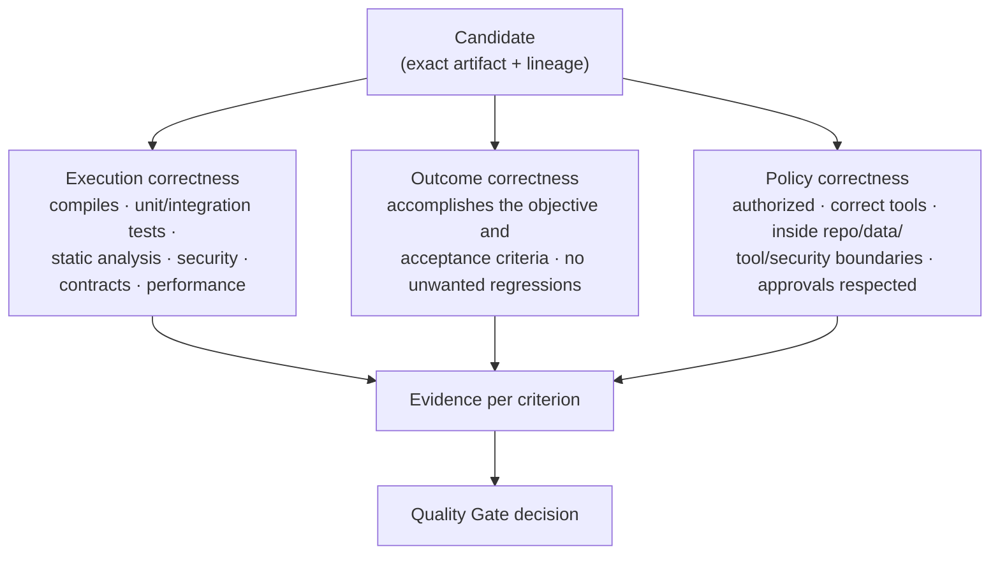
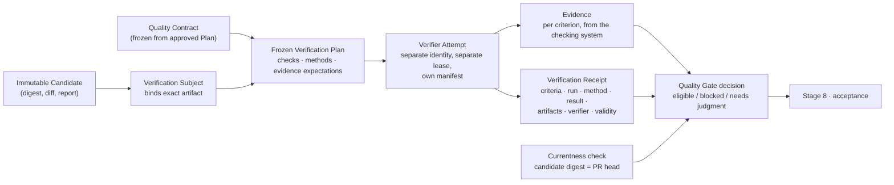
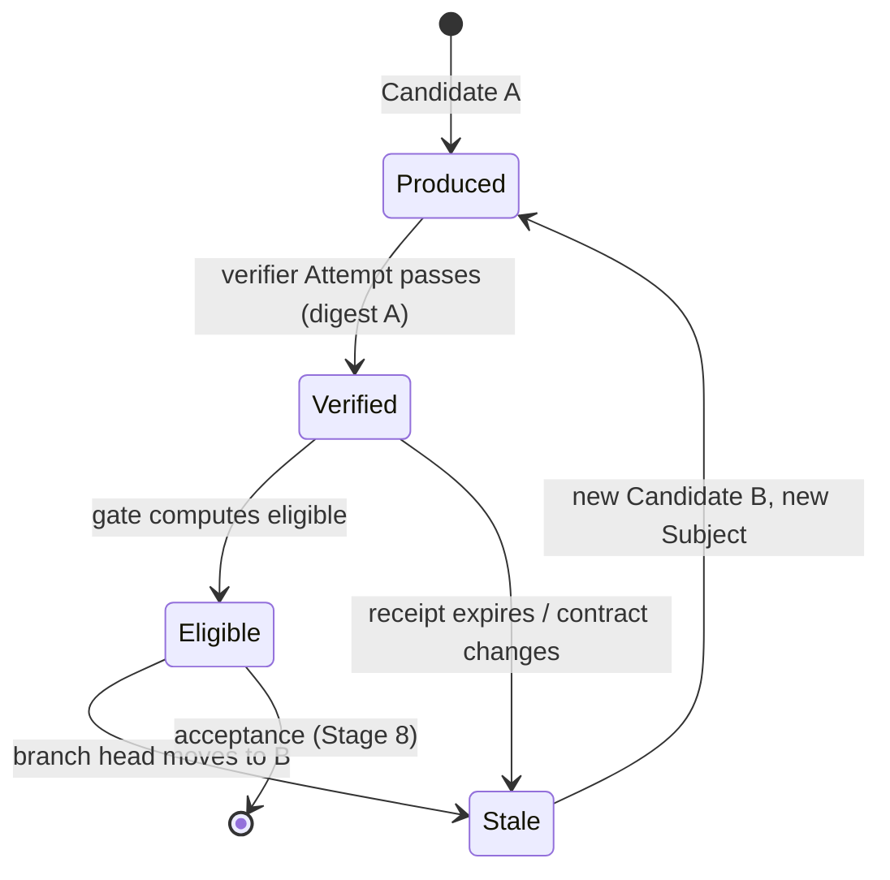

# Stage 6 · Evaluate

Stage 4 ended with a completion report and Stage 5 explained the method the agent applied. Neither proves anything. An agent saying "I'm done" is an event, not evidence. Stage 6 is where the factory stops trusting the producer and starts producing proof: independent, criterion-linked, bound to the exact artifact, and current. This page covers what is evaluated, how evaluators themselves are validated, how Mission Control implements verification as a chain of records, what the evidence bundle contains, and how the flood of quality signals is turned into a small set of decisions a human can make.

Previous: [Stage 5 · Apply Skills](./05-apply-skills.md). Next: [Stage 7 · Improve](./07-improve.md).

## The problem

*Generation is cheap. Evidence is what creates trust.* When one engineer produced one pull request a day, the pull request was a scarce, considered object, and a reviewer could read it. When agents produce dozens of Candidates an hour, the bottleneck moves from generation to trust: which of these changes is correct, which accomplished what the builder wanted, and which stayed inside the boundaries it was given? Reading them all is impossible, and trusting the agent's own summary is worse than useless, because an agent that misunderstood the task will confidently report success against the task it thought it had.

Traditional testing does not close the gap on its own. Tests answer deterministic questions: does this function return the expected value, does this API honor its contract, does the state end up where it should. They say nothing about whether the agent understood the objective, chose sensible capabilities, followed an acceptable trajectory, grounded its output in real context, or regressed after a model update that changed no code. And a green test run is a claim until someone can show which system ran which tests against which commit.

Three more failures hide inside "we evaluate." First, evaluation is treated as a one-time certification before release; an agent that passed every offline test degrades when the model, the retrieved knowledge, a tool contract, or user behavior changes. Second, teams optimize against a judge they have never validated: a model-based grader with an unknown false-negative rate quietly trains the system toward whatever the grader rewards. Third, more signals are mistaken for better decisions; a pull request carrying a hundred and fifty warnings gets all of them ignored.

Stage 6 exists so that every material Candidate leaves with evidence that is independent of its producer, mapped to the criteria the Plan froze, bound to the exact artifact, still current when a decision is made, and small enough for a human to act on.

## How it works

### Inputs and outputs

| | |
| --- | --- |
| **Enters** | The immutable Candidate from [Stage 4](./04-execute-through-harness.md) (artifact digest, diff, completion report); the frozen acceptance criteria and verification strategy from the Plan ([Stage 2](./02-plan.md)) and its Quality Contract; the execution lineage (manifest, context package, tool receipts, skill usage from [Stage 5](./05-apply-skills.md)); policy decisions recorded during execution |
| **Leaves** | Independent evidence per criterion; a Quality Gate decision (eligible / blocked / needs human judgment); an evidence bundle for the reviewer; ranked, deduplicated signals; failures, uncertainty, and missing evidence stated explicitly; observations for [Stage 7](./07-improve.md) |
| **Records created** | `VerificationSubject`, frozen `VerificationPlan`, verifier `Attempt`, `Evidence` (per criterion), verification `Receipt`, `QualityGateDecision`, `EvaluationRun` results, signal records with developer feedback |
| **Decision owner** | *Deterministic system*: what must be verified (from the contract), independence, currentness binding, gate computation, evidence integrity. *Agent*: verifier Attempts that run checks and calibrated model graders for semantic judgment, never as sole authority. *Human*: calibration of graders, eligibility recommendations that need judgment, feedback on signals. Acceptance itself is [Stage 8](./08-deliver-software.md), not this stage |

### Three levels of correctness

Evaluation asks three questions, and a Candidate must answer all three.

<!-- infographic: stage-6-three-levels -->
> **Infographic — Execution, outcome, and policy correctness.** *(Jay's graphic goes here.)* Until then, the diagram below carries the same concept.

**Execution correctness** is the mechanical layer: does it compile, do the unit and integration tests pass, does static analysis pass, do security scans and contract checks pass, does performance stay within budget. **Outcome correctness** is whether the change accomplished the builder's objective and acceptance criteria without unwanted regressions; a change can pass every test and still solve the wrong problem. **Policy correctness** is whether the work was authorized: did it use the correct tools, stay inside its repository, data, tool, and security boundaries, and respect required approvals. A perfect diff produced by reading a restricted repository fails policy correctness and is not eligible regardless of the other two.

Two rules apply across all three. Prefer deterministic verification wherever possible (compilation, tests, linters, scanners, policy engines, schema validation, provenance verification, reproducible environments) and use calibrated model graders for semantic judgment, never as sole authority. And the producing agent is never the only evaluator of its own work. The success metric of the stage is accepted outcomes, human rework, escaped defects, policy violations, reliability, latency, and cost per trusted outcome, not the amount of code generated.

The three levels map onto the two evaluation objects from [Chapter 2](../01-understand/02-the-factory-in-one-view.md): **artifact evaluation** (is the exact change correct, secure, useful, maintainable, aligned with criteria?) draws on execution and outcome correctness, and **trajectory evaluation** (did the run use permitted context, tools, authority, budgets, and recovery behavior without hiding material failure?) is policy correctness plus the outcome-relevant parts of the path.

### Evals beside tests

**Evals** are additive to traditional tests, not a replacement. Tests cover the deterministic questions; evals cover probabilistic behavior: did the agent understand the task, choose the right capabilities, follow an acceptable trajectory, ground its output, avoid regression after a model, prompt, skill, or routing change, and keep trust-and-safety properties intact. A developer-platform leader described evals as a new class of unit testing for agentic systems, and the framing is right: they are small, repeatable, versioned, and run in CI, but the thing under test is behavior, not a function.

Evals run in three **windows**, and trust needs all three because *trust isn't certified once; it's continuously measured.*

| Window | When | What it checks | Typical mechanism |
| --- | --- | --- | --- |
| Offline / CI | Before any promotion of a model, prompt, skill, route, or runtime | Capability, regression, safety, against the golden set | Evaluation runs in isolated environments with versioned fixtures |
| Inline | Against deployed agents, on live work | Quality of sampled production outputs; guardrails; per-Candidate checks | Sampled grading, deterministic gates, verifier Attempts |
| Operational | Continuously in production | Drift, toxicity, reliability, cost, production quality, user outcomes | Telemetry-fed evaluation, segmented dashboards, alerting |

This is **continuous intelligence**: evaluation starts before promotion and continues after deployment. An agent that passed every pre-release test can degrade when the model, context, tools, or user behavior change; only the inline and operational windows catch it.

### Who evaluates the evaluator

An evaluator is a component like any other and has its own defect rate. Before its verdicts carry weight, it must be validated.

Deterministic evaluators are validated with **known-positive and known-negative scenarios**: cases that must pass and cases that must fail, run on every change to the evaluator. Model graders need more: a **human-labeled calibration set**, periodic human-versus-machine comparison, and explicit measurement of **agreement, false positives, and false negatives**, broken out by task class. A grader that agrees with humans ninety-four percent of the time overall but only seventy percent on security-sensitive changes cannot be trusted on security-sensitive changes.

That is why there is no single composite score. A global metric can improve while security-sensitive tasks regress. Segment every evaluation result by task class, risk class, model, skill, Agent Definition, and release. And close the loop with production: every meaningful production failure becomes a permanent regression scenario in the evaluation set, so the same failure cannot escape twice. *Never optimize against a judge you haven't validated.*

### The golden evaluation set

The **golden evaluation set** is the first evaluation asset to build, because without a stable baseline improvement becomes anecdotal. It must be representative, not synthetic toys. Collect it with product organizations across the real classes of work: code generation, debugging, refactoring, repository understanding, testing, documentation, dependency changes, tool usage, and security-sensitive changes. Include known failures, difficult cases, adversarial scenarios, high-risk cases, and previously escaped defects. Version it like code; every pass or fail names the set version it was measured against.

The golden set is the baseline for changing anything: a model, a prompt, a skill, a route, the runtime. It is also the reference against which [Stage 7](./07-improve.md) judges whether a proposed improvement is an improvement. [Chapter 29](../04-prove/29-evaluation-engineering.md) covers construction, contamination control, and statistics.

### Independent verification: the chain of records

Mission Control implements evaluation as a chain of records rather than a script, and the chain is the clearest expression of the stage's principles.

<!-- infographic: stage-6-verification-chain -->
> **Infographic — From Candidate to Quality Gate.** *(Jay's graphic goes here.)* Until then, the diagram below carries the same concept.

The **Candidate** is exactly what execution produced. It is not correct, not verified, not accepted; a Candidate is an output, not a success declaration. The control plane wraps it in a **Verification Subject** that binds the exact artifact digest, so verification belongs to the artifact rather than to the agent's confidence. The **Verification Plan** is frozen from the Quality Contract, which was itself a machine-readable projection of the approved Plan: requirements, assertions, invariants, assurance expectations, evidence requirements, approval policy. How success will be determined was decided before execution; quality isn't inferred after generation, it is part of the execution contract.

A **separate verifier Attempt** then runs the plan: a different identity, a different lease, its own execution manifest, no shared context with the producer. Independence is part of the trust model. The verifier produces **Evidence** mapped to the original acceptance criteria and a **Receipt** recording which criteria, which run, which method, which result, which artifacts, which verifier, and how long the evidence is valid. The **Quality Gate** computes eligibility from evidence and receipt: eligible, blocked, or needs human judgment. Missing, failed, stale, expired, or unapproved evidence blocks.

The producing agent cannot change the Candidate and inherit the old evidence. A new Candidate is a new Verification Subject and a new verifier Attempt.

The Verification Plan is the factory's **verification contract**: every claim the work must demonstrate paired with the evidence that settles it and the mechanism that produces it, handed to the producer before work starts and to the verifier after it ends, and the proportion of claims with a reliable independent verifier is what sets how much autonomy the change can be given. The verifier is itself validated — run against known-good and known-bad artifacts so its false-failure and false-success rates are measured — because a gate nobody has tested is a gate that is not there; [Chapter 27](../04-prove/27-quality-and-evidence-architecture.md) defines both.

### Claims versus evidence

"Tests passed" is a claim. The test system's recorded result, tied to the exact Candidate digest, with the run identifier and the environment, is evidence. *Evidence should come from the system performing the check, not from the system being checked.* The rule generalizes: a security scanner's finding list bound to the digest is evidence; the agent's note that it "ran the scanner" is not. A model grader's verdict is evidence only when the grader is validated and its verdict is recorded with its calibration version.

The practical test for any item in the bundle is: who produced this, against what, and can I re-derive it? If the answer to the first is "the agent whose work it is," it is a claim.

### Currentness

Evidence has a lifetime and an address. Commit A was verified; the branch moves to commit B; the evidence for A is now stale for B. *Passing verification on commit A doesn't authorize merge of commit B.* Candidate, Verification Subject, evidence, checks, and pull-request head are bound together by digest, and the gate re-evaluates whenever the head moves. Verified once does not mean verified forever: a receipt can also expire on time (a dependency scan from a month ago says nothing about today's advisories) or be invalidated when the Quality Contract changes.

### The evidence bundle

What reaches a reviewer is an **evidence bundle**, assembled deterministically from the records above. It contains:

| Item | Source | Why it is there |
| --- | --- | --- |
| Objective | Mission Spec, Plan | What the change was for |
| Plan and acceptance criteria | Approved Plan revision, Quality Contract | What "done" was defined as before execution |
| Diff | Candidate | What actually changed, by digest |
| Test results | CI / test runner receipts | Execution correctness |
| Eval results | Evaluation runs, segmented | Outcome and trajectory quality |
| Security findings | Scanners, dependency analysis | Security and supply-chain risk |
| Static analysis | Analyzers | Code quality, contract adherence |
| Risk class | Risk classifier ([Stage 8](./08-deliver-software.md)) | Which review path applies |
| Tool trajectory | Harness receipts | Policy correctness; what the agent did |
| Context provenance | Frozen context package | What informed the change; freshness and authorization |
| Policy decisions | Policy engine log | What was allowed, denied, or escalated during execution |
| Cost | Budget accounting | Cost per outcome; anomalies |
| Reviewer recommendations | Signal aggregation | The smallest set of things that could change the decision |

The bundle is diagnostic and it is also the decision packet [Stage 8](./08-deliver-software.md) puts in front of a human. Nothing in it is a summary written by the producer.

### Signal aggregation

More signals do not make better decisions. When every scanner, linter, evaluator, and review bot appends to a pull request, the reviewer sees a hundred and fifty warnings and ignores all of them. Signal quality is a product problem, and the aggregation layer is where Stage 6 meets human attention.

The pipeline: **deduplicate** (five tools flagging the same line is one finding), **aggregate and correlate** (a failing test and a static-analysis warning on the same function are one issue), assign **severity** and **confidence**, attach **ownership context** (whose code, whose module), apply the **risk classification**, and **explain why it matters** in the terms of this change. Then surface the **smallest set of findings that could change the decision**. Everything else stays available but folded.

Developer feedback closes the loop. On each surfaced signal, the reviewer can mark it useful, wrong, or correct-but-irrelevant; that feedback flows into [Stage 7](./07-improve.md) and tunes both the aggregator and the evaluators that produced the signal. The goal is *maximum decision quality per unit of human attention, not maximum signal volume.*

### Observability, lineage, and drift attribution

Observability and evaluation are different questions. Observability tells you what happened; evaluation tells you whether it was good enough. *Without observability, evaluation isn't debuggable. Without evaluation, observability is just telemetry.* Metrics and dashboards are diagnostic, never authority; a dashboard score never accepts a WorkOrder.

The link between them is the **lineage chain**: builder → intent → plan → task → Agent Definition → model and configuration → context → tool calls → artifact → evaluation → review and approval → deployment → outcome. For every run, record the model and its configuration, the retrieved context, the tools called, state transitions, time, cost, tokens, retries, policies fired, and outcome. This is what makes an evaluation failure explainable, and it is what makes drift attributable.

**Drift** has more dimensions than model drift. The model can change; the retrieved knowledge source can change; a tool contract can change; a skill version can change; the execution environment can change. Continuous evaluation is only useful if you can attribute what changed, and lineage (versioned Agent Definitions, model configuration, skill versions, context provenance, tool traces) is what identifies which component moved. When the operational window shows a quality decline for a task class, the first step is a diff of lineage between the healthy and unhealthy cohorts, not a prompt rewrite. [Chapter 35](../05-operate/35-observability-telemetry-and-forensics.md) details the telemetry.

## How to build it

Build the golden evaluation set first, with product organizations, and version it. Until it exists, every other evaluation investment lacks a baseline.

Then build the verification chain as records with a state machine, in this order:

1. Make the Candidate immutable: digest the artifact and the completion report at the moment the producer Attempt ends.
2. Compile the Verification Plan from the Quality Contract at Plan approval time, not at verification time, and freeze it.
3. Dispatch verifier Attempts under a separate identity and lease with no access to the producer's context; treat the verifier as a worker whose grant is "read the Candidate, run the checks, write evidence."
4. Record Evidence per criterion, and a Receipt per verifier run, with digest, method, result, verifier identity, and validity window.
5. Compute the Quality Gate deterministically from Evidence and Receipts; fail closed on missing, failed, stale, expired, or unapproved evidence.
6. Bind currentness: on any head movement, contract change, or receipt expiry, mark evidence stale and require a new Subject.

Validate evaluators before relying on them: known-positive and known-negative suites for deterministic checks; a human-labeled calibration set, agreement, false-positive, and false-negative rates by task class for model graders; and a rule that no model grader is sole authority for any criterion. Segment all results; never publish a single composite score.

Instrument the three windows separately. Offline runs live in CI against versioned fixtures and gate promotion. Inline checks run on every Candidate (deterministic) and on a sample (graded). Operational evaluation reads telemetry and alerts on segmented regressions. Turn every production failure into a regression scenario in the golden set as part of incident closure.

Build aggregation as a product: a signal schema with source, location, severity, confidence, owner, risk relevance, and explanation; deduplication and correlation rules; a ranking that surfaces the decision-changing set; and a feedback control on every surfaced signal whose responses are stored as learning signals.

Record lineage on every run with the fields above, and make "diff the lineage of two cohorts" a one-click operation for drift investigations.

## Failure modes

**The producer grades itself.** The same Attempt that wrote the change reports that tests pass. Detect it as evidence whose source identity equals the producer identity. Fix it with separate verifier Attempts and the rule that evidence comes from the checking system.

**Claims in the bundle.** Free-text summaries of "what I verified" stand in for receipts. Detect it as evidence records without a digest or run identifier. Fix it by requiring every evidence item to name its source system, target digest, and method.

**Stale evidence authorizes merge.** The branch moved after verification and the gate still shows green. Detect it as a pull-request head digest that differs from the Verification Subject digest. Fix it with currentness binding and automatic invalidation.

**Unvalidated judge.** A model grader with unknown false-negative rate gates promotion, and the system learns to please it. Detect it as rising eval scores with flat or rising human edit rates. Fix it with calibration sets, agreement measurement, and no sole-authority graders.

**The composite score.** One number goes up while security-sensitive tasks regress. Detect it as an unsegmented dashboard. Fix it by segmenting by task class, risk, model, skill, Agent Definition, and release.

**Certification once.** Evaluation stops at release. Detect it as an absence of inline and operational evaluation for deployed agents. Fix it with the three windows.

**Signal flood.** A hundred and fifty findings per pull request, all ignored. Detect it as a reviewer response rate near zero. Fix it with deduplication, correlation, ranking, and the smallest decision-changing set.

**Unattributable drift.** Quality declines and nobody can say whether the model, the retrieval source, a tool, or a skill moved. Detect it as incidents that end in a prompt rewrite. Fix it with lineage recorded per run and cohort diffs.

**Metrics become authority.** A dashboard threshold silently starts accepting WorkOrders. Detect it as acceptances without a human or policy decision record. Fix it by keeping observability diagnostic and routing every acceptance through [Stage 8](./08-deliver-software.md).

**Synthetic golden set.** Toy scenarios pass; real repositories fail. Detect it as a wide gap between offline pass rate and production acceptance. Fix it by collecting the set from product organizations and seeding it with escaped defects.

## In Mission Control

At study commit [`d902fae`](https://github.com/jaydubya818/MissionControl/tree/d902fae7032c0696b531c44ae88829c652516fc6), Mission Control has independent Verification Subjects and frozen Verification Plans, verifier Attempts, criterion-linked evidence, verification receipts that bind criteria, runs, methods, results, artifacts, verifiers, validity, waiver decisions, and invalidation history, exact-currentness checks against the pull-request head, Quality Gate decisions, context evaluations, deterministic learning signals, and dataset and experiment records with baseline/candidate comparison. WorkOrder governance blocks acceptance on missing, failed, stale, expired, or unapproved evidence. GitHub pull-request checks retain source and head-SHA lineage. The chain of records drawn above is **implemented** in that form.

What is **partial**: an older quality-control execution path uses mock assurance adapters and synthetic evidence packs, and its release-gate integration runs in shadow mode, consuming signals without enforcing anything; the studied evidence does not establish a single end-to-end evaluation harness that reconstructs exact fixtures and environments, calibrates model graders, replays traces, computes paired statistical comparisons, and gates promotion across a representative production dataset. Grader calibration and agreement measurement, contamination controls, repeated-trial analysis, and a full adversarial-evaluation program are not yet specified, and production catalogs lacked qualified execution routes at the study commit, so repository mechanisms should not be read as an operating evaluation service.

The intended direction is **future**: compile versioned Eval Tasks and fixtures into isolated Evaluation Runs, execute baseline and candidate cohorts, retain complete run records, and expose slice regressions, uncertainty, grader disagreement, missing artifacts, and the exact decision required. Jay's own framing of the boundary holds throughout: metrics can inform authority; they should not quietly become authority.

## Retain this

- Generation is cheap; evidence is what creates trust. The stage exists to replace the producer's claim with independent, criterion-linked, digest-bound evidence.
- Three levels: execution correctness, outcome correctness, policy correctness. Prefer deterministic checks; use calibrated graders for judgment, never as sole authority; the producer never evaluates alone.
- Evals are additive to tests: tests answer deterministic questions, evals cover probabilistic behavior, and they run in three windows: offline, inline, operational. Trust is continuously measured, not certified once.
- Validate the evaluator before relying on it: known positives and negatives, human-labeled calibration, agreement and false-positive and false-negative rates by task class, segmentation, and production failures as permanent regression scenarios. Never optimize against a judge you haven't validated.
- Build the golden evaluation set first; without a stable baseline, improvement is anecdotal.
- The verification chain: Candidate → Verification Subject → frozen Verification Plan → separate verifier Attempt → Evidence and Receipt → Quality Gate. "Tests passed" is a claim; the checking system's result bound to the exact digest is evidence, and verification on commit A never authorizes merge of commit B.
- Surface the smallest set of signals that could change the decision; capture reviewer feedback on each. Maximum decision quality per unit of human attention.

## Go deeper

- Previous stage: [Stage 5 · Apply Skills](./05-apply-skills.md). Next stage: [Stage 7 · Improve](./07-improve.md). Orientation: [Chapter 2](../01-understand/02-the-factory-in-one-view.md); principles: [Chapter 3](../01-understand/03-first-principles-trust-evidence-and-authority.md).
- Deep chapters: [Chapter 27, Quality and evidence architecture](../04-prove/27-quality-and-evidence-architecture.md); [Chapter 28, Testing strategy for agentic change](../04-prove/28-testing-strategy-for-agentic-change.md); [Chapter 29, Evaluation engineering](../04-prove/29-evaluation-engineering.md) for the golden set, grader calibration, and statistics; [Chapter 31, Quality contracts, proof packages, and certificates](../04-prove/31-quality-contracts-proof-packages-and-certificates.md) for the Quality Contract and receipts; [Chapter 35, Observability, telemetry, and forensics](../05-operate/35-observability-telemetry-and-forensics.md) for lineage and drift; [Chapter 39](../06-improve/39-production-feedback-review-and-the-agentic-merge-queue.md) for review-agent signals and stale-base detection.
- Case study: [Verification-first software factory](../appendix/mission-control/02-verification-first-software-factory.md). Glossary: [Evaluation System, Evidence, Verification Subject, Quality Gate, Currentness](../appendix/glossary.md).
- Sources: Jay West, factory architecture notes and Mission Control walkthrough (three levels, evals versus tests, evaluator validation, golden set, verification chain, claims versus evidence, currentness, signal aggregation, drift); a developer-platform leader's three themes (signal quality and continuous intelligence); [Anthropic, Trustworthy Agents in Practice](https://www.anthropic.com/research/trustworthy-agents); [SLSA Provenance 1.2](https://slsa.dev/spec/v1.2/provenance).
