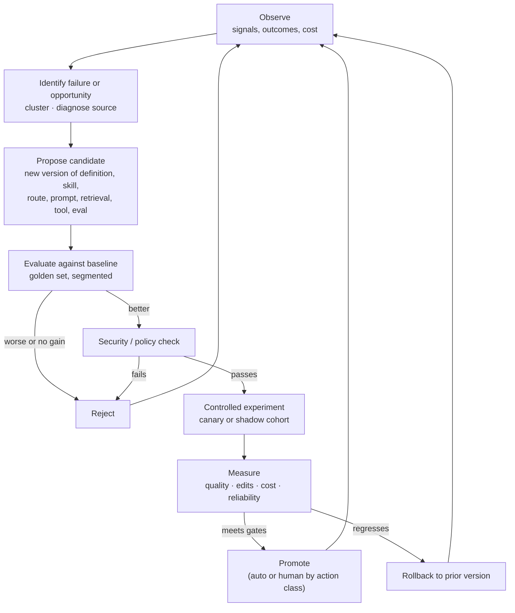
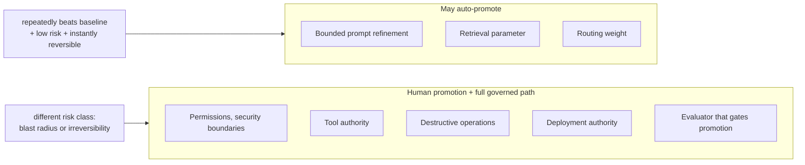
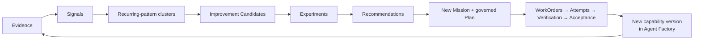

# Stage 7 · Improve

Stages 1 through 6 produce trustworthy change once. Stage 7 is what makes the factory produce it better the second time: it turns evaluation results, human corrections, production outcomes, and cost into governed changes to the factory itself, so that the next Plan, Agent Definition, skill, route, or evaluator is measurably stronger than the last. This page explains which signals feed the loop, how the source of a failure is diagnosed, how a proposed improvement earns promotion, how much autonomy the loop is allowed per kind of change, and how Mission Control routes improvements back through the same governed path as any other work.

Previous: [Stage 6 · Evaluate](./06-evaluate.md). Next: [Stage 8 · Deliver Software](./08-deliver-software.md).

## The problem

An agentic platform that does not learn is a very expensive way to make the same mistake at scale. Every run produces information: the reviewer rewrote half the diff; the agent called a tool it did not need four times; the retrieved architecture document was two years stale; the cheaper model needed three attempts where the stronger one needed one; the change passed every check and still caused a rollback. Most organizations throw that information away, or collect it in a dashboard nobody acts on, or, worst, let it feed straight into the running system with no baseline, no experiment, and no way back.

Two opposite failures bracket the stage. The first is **no learning**: corrections stay in pull-request comments, the same skill produces the same defect for months, and senior engineers become a permanent rework layer. The second is **ungoverned learning**: a system that rewrites its own prompts on thumbs-up signals, promotes routing changes because a score moved, and cannot say afterward which version learned what from which data. The second is more dangerous because it is faster. Sophisticated optimization against noisy or poorly attributed feedback learns the wrong thing faster.

Between them is a specific engineering discipline: separate **learning** (which can be highly autonomous) from **promotion** (which must be governed), diagnose before proposing, compare every proposal against a stable baseline, and scale the loop's autonomy to how reversible its changes are. *Learning can be autonomous. Promotion should be governed.*

## How it works

### Inputs and outputs

| | |
| --- | --- |
| **Enters** | Evidence and evaluation results from [Stage 6](./06-evaluate.md); reviewer decisions and edits from [Stage 8](./08-deliver-software.md); production outcomes, defects, rollbacks, and drift from operational evaluation; cost and budget accounting from [Stage 4](./04-execute-through-harness.md); skill usage and tool receipts from [Stage 5](./05-apply-skills.md); builder feedback; incident classifications |
| **Leaves** | Versioned Improvement Candidates; experiment results against the baseline; promotion, rejection, or rollback records; new versions of Agent Definitions, skills, routes, prompts, retrieval configuration, tools, or evaluators entering the Agent Factory registry; new regression scenarios in the golden set; new Missions for changes that need the full governed path |
| **Records created** | `ExecutionOutcome`, `DatasetVersion`, `FailureCluster`, `ImprovementProposal` / Improvement Candidate, `EvaluationRun` (baseline vs candidate), `PromotionDecision`, `RollbackRecord` |
| **Decision owner** | *Agent / automation*: observe, cluster, diagnose, propose, run experiments. *Deterministic system*: baseline comparison, regression and security gates, rollout mechanics, rollback. *Human*: promotion of anything above the auto-promote class; approval of the Plan when an improvement returns as a Mission; setting the autonomy policy per action class |

### Feedback signals

Learning starts with connecting execution behavior to outcomes, not with a thumbs-up button. The signals worth collecting:

| Signal | What it tells you | Where it comes from |
| --- | --- | --- |
| Accepted / rejected outputs | Whether the work was good enough to progress | Acceptance decisions ([Stage 8](./08-deliver-software.md)) |
| Human edit size | How much of the output a human had to change before accepting it | Diff between Candidate and merged change |
| Reviewer feedback | Why something was changed or rejected; signal usefulness ratings | Review comments, decision packets, signal feedback |
| Evaluation failures | Which criteria failed, in which segment | [Stage 6](./06-evaluate.md) results |
| Tool failures | Tools erroring, timing out, returning malformed results | Harness receipts |
| Unnecessary tool calls | Steps that consumed budget without contributing to the outcome | Trajectory analysis against the outcome |
| Expensive trajectories | Runs whose cost per outcome is an outlier for their task class | Budget accounting |
| Production defects and rollbacks | Escaped failures | Incident and deployment records |
| Model performance | Quality, latency, reliability per route and task class | Routing telemetry, operational evals |
| Retrieval quality | Which retrieved context actually contributed to the outcome, which was noise or stale | Context provenance joined to outcome |
| Builder feedback | What builders say the system got wrong or right | Builder surfaces |

Two of these deserve emphasis because teams usually skip them. **Human edit size** is the most trustworthy quality signal the factory has; a change accepted after a seventy-percent rewrite is a failure that a binary "accepted" would hide. And **which context contributed** is what makes retrieval improvable at all: without it, a stale document that misled the agent looks identical to a relevant one.

### Diagnosing the source

A failure signal is not yet actionable. The loop has to attribute it to a component, because the fix for each is different:

| Source | Symptom pattern | Typical fix |
| --- | --- | --- |
| Agent Definition | Wrong task class handled, instructions conflict with policy, stop conditions miss | New definition version |
| Skill | Method produces recurring defect on one task class across models | Skill revision; move stable steps to automation |
| Model route | Same skill and context, quality differs by model; retries cluster on one route | Routing weight change; eligibility change |
| Prompt | Instruction-level ambiguity visible in trajectories | Bounded prompt refinement |
| Context retrieval | Stale or irrelevant context contributed; authorized context missing | Source freshness, reranking, permission fix, ingestion change |
| Tool behavior | Tool failures, malformed results, contract drift | Tool contract fix; gateway validation |
| Evaluation coverage | Defect escaped despite green evidence | New scenario in the golden set; new or recalibrated evaluator |

Diagnosis uses the lineage chain from [Stage 6](./06-evaluate.md): cluster failures by task class, then diff the lineage of failing and healthy cohorts to find the component that differs. This is what turns feedback into engineering data rather than sentiment.

### The recursive loop

<!-- infographic: stage-7-recursive-loop -->
> **Infographic — The governed improvement loop.** *(Jay's graphic goes here.)* Until then, the diagram below carries the same concept.

The loop runs continuously and most of it can be automated. **Observe** gathers the signals. **Identify** clusters recurring patterns and diagnoses the source. **Propose** produces a candidate: a better Agent Definition, skill, model route, prompt, retrieval configuration, tool fix, a missing evaluator, or a piece of deterministic automation that replaces reasoning. **Evaluate against baseline** runs the candidate on the golden set beside the current version, segmented so a gain in one class cannot hide a loss in another. **Security and policy check** confirms the candidate does not widen authority, weaken a control, or touch a boundary it may not. **Controlled experiment** exposes it to a bounded slice of real work. **Measure** compares quality, human edits, cost, and reliability with the gates set in advance. **Promote, reject, or rollback** closes the iteration, and the previous version stays recoverable.

An analogy: a hospital's morbidity-and-mortality review. Every case is examined, patterns are found, protocol changes are proposed, and residents can run the analysis, but a protocol changes only after evidence, a trial, and sign-off by the people accountable for outcomes, and the old protocol stays on the shelf.

Discovery is where autonomy pays off: analyzing failures, edits, rejections, expensive trajectories, and outcomes is exactly the kind of work an agent does well and tirelessly. *Autonomous discovery, not autonomous authority.*

### Asymmetric autonomy by action class

How far the loop may go on its own is not one setting for the system. It is a policy per **action class**, decided by one question: *what happens if this is wrong, and how easily can we reverse it?* Not "how confident is the model?"

<!-- infographic: stage-7-autonomy-by-reversibility -->
> **Infographic — Autonomy scales with reversibility and blast radius.** *(Jay's graphic goes here.)* Until then, the diagram below carries the same concept.

A bounded prompt refinement, a retrieval parameter, or a routing weight may auto-promote if it repeatedly beats the baseline, is low-risk, and is instantly reversible. Anything that touches permissions, security boundaries, tool authority, destructive operations, or deployment authority is a different risk class and goes through human promotion, and usually through the full governed path as a Mission. So does any change to an evaluator that itself gates promotion, because a system that can rewrite its own judge can reward-hack itself.

The same asymmetry applies to the previous version: an auto-promoted change must be a flag flip away from rollback, and the rollback must not itself need approval.

### Improvements return through the governed path

Mission Control's implementation makes the boundary concrete. Evidence produces **signals**; signals are clustered into **recurring-pattern clusters**; clusters yield **Improvement Candidates**; candidates go through **experiments** and become **recommendations**: a better skill, route, prompt, verifier, workflow, or policy. A recommendation that needs authority does not modify the factory directly. It returns as a **new Mission** with a governed Plan, approved by a human, executed through WorkOrders, verified independently, and accepted, exactly like customer software. Factory improvements follow the same specification, evaluation, promotion, versioning, and rollback discipline as everything else the factory builds.

The recursive loop as Mission Control phrases it: **Research → Verify → Recommend → Approve → Implement → Validate → Measure → Iterate.** Research and Verify are the observe-and-diagnose half; Recommend produces the candidate; Approve is the human authority boundary; Implement, Validate, and Measure are Stages 4, 6, and the operational window; Iterate returns to Research.

### Compounding engineering

The most valuable output of the loop is not a tuned parameter. It is a **skill**. When the same correction shows up across runs (reviewers keep adding the same test pattern, keep rejecting the same migration approach, keep telling the agent about the same repository convention), that correction is a method the organization already knows and the factory does not. **Compounding engineering** is the habit of capturing it: the correction becomes an example or an instruction in a skill version, the skill enters the registry, and every builder benefits from what one reviewer noticed. This is how [Stage 5](./05-apply-skills.md)'s maturity lifecycle gets its fuel: corrections become skills, stable skills become automation, and the reasoning budget shrinks to where reasoning creates value. [Chapter 33](../06-improve/33-governed-learning-and-compounding-engineering.md) develops the correction-harvesting pipeline.

### The reward-model boundary

Production feedback and evaluation signals (acceptance, edits, preferences, evaluation outcomes, production behavior) can be used to improve routing, prompts, skills, and evaluators, and that is where the strongest results in practice come from. Preference pairs, reward models, fine-tuning, reward hacking, and distribution shift are relevant to the factory's designers, but the factory's upstream job comes first: generating **trustworthy learning signals** from real workflows, with attribution intact. A reward model trained on unattributed thumbs-up data, or on acceptances that hid seventy-percent rewrites, optimizes for the wrong thing with great efficiency. Specialists in preference or reward learning should receive governed dataset versions and experiment manifests, never raw traces; the dataset is a versioned artifact with provenance, like everything else.

### Metrics that drive improvement

The loop needs targets, and the wrong ones (lines of code, prompts, agent count, pull-request count, tokens) reward activity. The ones that drive real improvement:

- **Cost per trusted outcome**: total model, CI, human review, and rework cost divided by accepted, production-verified outcomes. A cheaper model that needs three attempts and forty minutes of senior rework is more expensive than one successful run on a stronger model; this metric is the only way to see it.
- **Human edit rate**: the fraction of output changed before acceptance, by task class and skill version.
- **Defect escape**: failures that reached production despite green evidence; each one is an evaluation-coverage gap.
- **Retry rate**: attempts per accepted outcome, segmented by route, skill, and tool; rising retries with flat acceptance usually means a route or tool regressed.

Beside them: accepted-task success, rollback rate, false-positive review rate, policy violations, and the platform's completion rate, reliability, latency, and tool failure rate. Budget data is feedback: a skill costing five times another for the same outcome should change routing and prioritize improvement. Economics should influence architecture continuously, not arrive as a surprise on the monthly bill. [Chapter 8](../02-design/08-economics-metrics-and-human-attention.md) has the full metric set.

### What not to build first

Resist building sophisticated autonomous learning before a trustworthy baseline exists. The order that works: a golden evaluation set and cost baseline; lineage recorded on every run; the signals above collected and attributed; manual diagnosis and promotion for the first improvements; then automation of observation, clustering, and proposal; then auto-promotion for the narrowest, most reversible action classes with rollback proven. Highly dynamic multi-agent swarms, machine-learned routing, a universal memory layer, and hundreds of generic skills are hypotheses until production evidence exists. Recursive self-improvement before a trustworthy baseline is the fastest way to build a system that confidently learns the wrong thing.

## How to build it

Establish the baseline: a versioned golden set ([Stage 6](./06-evaluate.md)), a cost baseline per task class, and lineage on every run. Nothing else in the loop is measurable without them.

Build the signal pipeline as records, not dashboards:

1. Emit an `ExecutionOutcome` per Attempt joining acceptance, edit size, evaluation results, tool receipts, cost, and context provenance.
2. Derive segmented signals nightly; store them as `DatasetVersion`s with provenance.
3. Cluster recurring failures into `FailureCluster`s by task class, with the lineage diff that points at the source component.
4. Generate `ImprovementProposal`s from clusters, each naming the target component, the proposed new version, the expected effect, and its action class.
5. Run baseline-versus-candidate `EvaluationRun`s on the golden set, segmented; reject on any critical security or policy regression, on quality-floor breaches in any segment, or on cost or latency above bounds.
6. Canary the survivor on a bounded cohort with a fixed observation window and pre-declared gates.
7. Record a `PromotionDecision` (auto or human by action class) and keep the prior version and a `RollbackRecord` path.

Define the autonomy policy per action class in configuration, not in code, and review it with security. Make rollback of any auto-promoted change a flag flip requiring no approval. Route any proposal above the auto class into a new Mission automatically, with the proposal as its intent and the experiment results attached as context.

Build correction harvesting: when reviewer edits on a task class recur, open a proposal to add the pattern to the relevant skill's examples or instructions; when a skill's steps stop varying, open a proposal to replace them with deterministic code.

Feed the golden set from production: every escaped defect and every incident becomes a scenario as part of closure.

Publish the four driving metrics segmented by task class, skill version, route, and team, and review them on a fixed cadence with the owners who can act on them.

## Failure modes

**Ungoverned self-modification.** The running agent edits its own prompt on live feedback. Detect it as behavior changes without a version or promotion record. Fix it by making every change a versioned candidate that passes the loop.

**Learning from thumbs-up.** Binary satisfaction drives promotion while edit size is uncollected. Detect it as rising "acceptance" with rising rework. Fix it with edit size and outcome-linked signals.

**Optimizing against the unvalidated judge.** Candidates are promoted because the grader's score rose. Detect it as eval scores diverging from human edit rate. Fix it with grader calibration and human promotion for evaluator changes.

**Prompt rewrite as diagnosis.** Every failure becomes a prompt tweak because nobody attributed the source. Detect it as improvement history dominated by prompt changes with no lasting effect. Fix it with lineage diffs and the source table.

**One autonomy level.** Either nothing auto-promotes and improvements queue for months, or everything does and a routing "improvement" widens a permission. Detect it as either a stale proposal backlog or a promotion touching authority without a human record. Fix it with per-action-class policy.

**Improvement mutates the active Attempt.** A promoted skill version changes behavior mid-run. Detect it as Attempts whose manifest version differs from the version that executed. Fix it by applying new versions only to new Attempts.

**No rollback.** A regression is discovered and the prior version is gone. Detect it as promotions without a `RollbackRecord` path. Fix it by retaining prior versions and proving rollback in the canary.

**Composite improvement.** A global score rises while a security-sensitive segment regresses. Detect it as unsegmented promotion gates. Fix it with segment floors.

**Corrections that never compound.** The same reviewer comment appears for a year. Detect it as recurring edit patterns with no skill change. Fix it with correction harvesting.

**Learning built before the baseline.** A sophisticated optimizer with no golden set and no lineage. Detect it as improvements that cannot be measured. Fix it by building in the order above.

## In Mission Control

Two study commits are relevant. GitHub `main` at [`b31e275`](https://github.com/jaydubya818/MissionControl/tree/b31e27564deb1c03c167e61b5ee094567c2ba7b1) contains Loop Engineering, graph workflows, context evaluations, meta-loop suggestions, verifier records, workflow-failure signal ingestion, and human conversion of accepted suggestions into governed WorkOrders and Tasks; the graph workflow has browser evidence for explicit dispatch, DAG visibility, failure containment, and terminal human approval boundaries. Study commit [`9d5f8e3`](https://github.com/jaydubya818/MissionControl/tree/9d5f8e36aff45a001a8848cc0516b3dc800e29b8) adds Phase 0 controls for governed continuous learning and proves, in an isolated canary, atomic ownership, pause and drain modes, budget admission, heartbeat, stale recovery, reasoned retry, cancellation, quarantine, independent verification, and operator-visible Task semantics; continuous scheduling stayed off and the broader plan remains proposed.

At [`d902fae`](https://github.com/jaydubya818/MissionControl/tree/d902fae7032c0696b531c44ae88829c652516fc6), Mission Control additionally has deterministic learning signals, failure clusters, Improvement Candidates, datasets, experiments, canaries, human promotion boundaries, recursive-improvement boundaries, trust changes, and versioned configuration, and it identifies prompts, skills, tools, context, routing, evaluators, and deterministic controls as improvement targets. The record shape and the human authority boundary drawn above are **implemented**.

**Partial**: the return path from recommendation to new Mission exists as doctrine and as human conversion of suggestions into WorkOrders, not as an automated pipeline. **Future**: a production correction-harvesting pipeline, anti-pattern extraction, automatic suggestion of deterministic replacements, cross-team correction recurrence, a complete optimization service, holdout protection, automated regression attribution, and promotion and rollback across the capability registry. Mission Control has a governed improvement substrate, not a self-operating learning factory, and Jay's own boundary is the design rule: learning can be autonomous; promotion remains governed.

## Retain this

- Separate learning from promotion: discovery, clustering, diagnosis, proposal, and experimentation can be autonomous; promotion is governed, and the previous version stays recoverable.
- Collect outcome-linked signals, especially human edit size, unnecessary tool calls, and which context contributed; a thumbs-up is not a learning signal.
- Diagnose the source before proposing: Agent Definition, skill, route, prompt, retrieval, tool, or evaluation coverage, using lineage diffs between cohorts.
- The loop: observe → identify → propose → evaluate against baseline → security and policy check → controlled experiment → measure → promote, reject, or rollback.
- Autonomy is set per action class by "what happens if this is wrong, and how easily can we reverse it?", never by model confidence; changes to authority, security boundaries, destructive operations, deployment, or gating evaluators always take the human path.
- Improvements that need authority return as a new Mission through the same governed Plan as any other work: Research → Verify → Recommend → Approve → Implement → Validate → Measure → Iterate.
- Compounding engineering: recurring corrections become skills; stable skills become automation.
- Trustworthy, attributed learning signals come before any reward modeling; noisy feedback learns the wrong thing faster.
- Drive the loop with cost per trusted outcome, human edit rate, defect escape, and retry rate, always segmented.
- Build the baseline before the learner; don't generalize before you've earned the abstraction.

## Go deeper

- Previous stage: [Stage 6 · Evaluate](./06-evaluate.md). Next stage: [Stage 8 · Deliver Software](./08-deliver-software.md). Orientation: [Chapter 2](../01-understand/02-the-factory-in-one-view.md).
- Deep chapters: [Chapter 33, Governed learning and compounding engineering](../06-improve/33-governed-learning-and-compounding-engineering.md) for the learning records, promotion gates, and correction harvesting; [Chapter 32, Production feedback, review, and the agentic merge queue](../06-improve/32-production-feedback-review-and-the-agentic-merge-queue.md) for feedback intake; [Chapter 8, Economics, metrics, and human attention](../02-design/08-economics-metrics-and-human-attention.md) for the metric set; [Chapter 23, Evaluation engineering](../04-prove/23-evaluation-engineering.md) for baseline comparison and statistics; [Chapter 10, The Agent Factory](../03-build/10-the-agent-factory.md) for versioning and promotion of capabilities; [Chapter 34](../06-improve/34-mission-control-as-a-living-case-study.md) for the case study.
- Glossary: [Feedback System, Self-improvement, Improvement Proposal, Promotion Decision](../appendix/glossary.md).
- Sources: Jay West, factory architecture notes and Mission Control walkthrough (feedback signals, diagnosis, the recursive loop, asymmetric autonomy, reward-model boundary, platform metrics, what not to build first, the Research-to-Iterate loop); [Anthropic, Building Effective Agents](https://www.anthropic.com/engineering/building-effective-agents); [NIST AI RMF](https://www.nist.gov/itl/ai-risk-management-framework).
