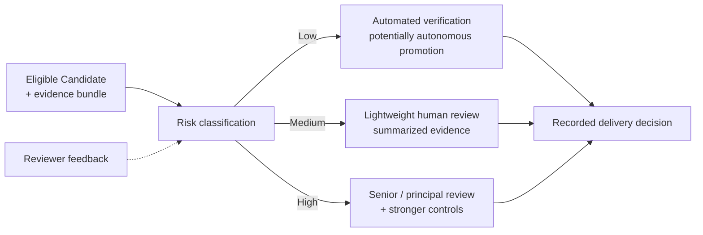
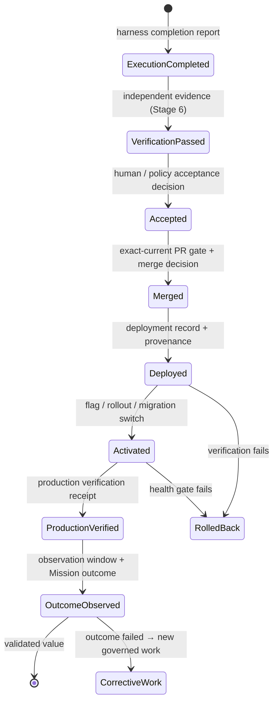
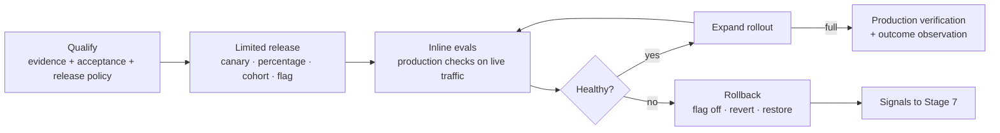

# Stage 8 · Deliver Software

Stage 6 produced evidence and Stage 7 learned from it. Stage 8 is where someone with authority decides whether the change advances, and where the factory carries it from an eligible Candidate through merge, deployment, activation, and production verification without losing evidence or inventing authority along the way. This page covers how risk is classified, how review depth follows risk instead of habit, what a human actually needs in front of them to decide, why acceptance and verification are separate transitions, how the pull-request gate holds, why "code complete is not factory complete," how the factory integrates with the delivery systems the organization already runs, and what happens when governance blocks legitimate work.

Previous: [Stage 7 · Improve](./07-improve.md). The stream returns to [Stage 1 · Builder Intent](./01-builder-intent.md).

## The problem

*Scale trust, not human review.* When agents multiply the number of changes, the instinct is to multiply review: every pull request gets a senior engineer, every action gets an approval click. This fails twice. Human review cannot scale linearly with generated code, so the queue grows until reviewers skim, and skimming under load is rubber-stamping with a signature attached. And review-everything treats a documentation typo and an authentication change identically, which is neither safe nor efficient. Review depth should be proportional to risk, not to the fact that AI generated the change.

The opposite instinct, letting confidence decide, is worse. A model's confidence is a property of its output, not of the world; a wrong change delivered confidently is still wrong. Authority to deliver has to be **authorized, not inferred**: from evidence, from the risk class, and from a human or policy decision recorded as such.

Delivery also has more states than teams draw. "Merged" gets read as "done." But merge is followed by deployment, deployment by activation (a flag, a rollout percentage, a migration switch), and activation by the only thing that matters, production verification against the outcome the Mission asked for. Collapsing these into one state is **optimistic state propagation**: a green check on a pull request is displayed as delivered value, and a technically healthy release with a failed customer outcome goes unnoticed.

Finally, factories fail by building a parallel delivery universe. The organization already has source control, CI, artifact registries, deployment pipelines, and progressive-delivery tooling. A factory that bypasses them loses their evidence, their audit, and the trust of the engineers who run them.

## How it works

### Inputs and outputs

| | |
| --- | --- |
| **Enters** | An eligible Candidate with its Quality Gate decision and evidence bundle from [Stage 6](./06-evaluate.md); the approved Plan's acceptance criteria and approval policy ([Stage 2](./02-plan.md)); the exact-current pull request; release policy; provenance from the execution manifest ([Stage 4](./04-execute-through-harness.md)) |
| **Leaves** | A recorded delivery decision; a merged change; a Release record; deployment and activation events; production verification receipts; the observed outcome; rollback readiness; corrective work when the outcome fails; production signals into [Stage 7](./07-improve.md) |
| **Records created** | `RiskClassification`, `DecisionPacket`, `AcceptanceDecision`, `MergeRecord`, `Release`, `Deployment`, `Activation`, `ProductionVerificationReceipt`, `ProductionOutcome`, `RollbackRecord`, `PolicyException` (waiver) |
| **Decision owner** | *Human*: acceptance, merge, release, and every consequential risk decision; approval of waivers. *Deterministic system*: risk classification, currentness at the gate, policy gates, rollout mechanics, health gates, automatic rollback and demotion. *Agent*: none of the authority; may prepare the packet, open the pull request, and execute delegated mechanics under policy |

### Risk classification

Every Candidate is classified before anyone decides anything about it, and the classification is deterministic and recorded. The dimensions:

| Dimension | Question |
| --- | --- |
| Blast radius | How many users, services, repositories, or tenants can this affect? |
| Reversibility | Can it be undone with a flag flip or revert, or does it migrate data, send messages, or change external state? |
| Security sensitivity | Does it touch authentication, authorization, secrets, cryptography, or trust boundaries? |
| Data sensitivity | What classification of data does it read or write (public, internal, confidential, restricted)? |
| Dependency impact | Does it change shared libraries, contracts, or versions other teams consume? |
| Architecture impact | Does it alter boundaries, patterns, or invariants the Project Constitution protects? |
| Production criticality | Is the affected path revenue-, safety-, or availability-critical? |
| Novelty | Is this a known pattern with history, or the first of its kind? |
| Verification strength | How complete and independent is the evidence? Strong evidence lowers effective risk |

The classifier aggregates the evidence bundle (tests, static analysis, security, dependency risk, architectural impact, evaluation results, ownership context, historical failures) into a **risk class**, and the class chooses the review path. Reviewer feedback on the classification (too high, too low, missed a dimension) feeds [Stage 7](./07-improve.md) so the classifier improves.

### Risk-tiered review

<!-- infographic: stage-8-risk-tiers -->
> **Infographic — Review depth proportional to risk.** *(Jay's graphic goes here.)* Until then, the diagram below carries the same concept.

| Tier | Examples | Path |
| --- | --- | --- |
| Low | Documentation, mechanical configuration, deterministic and reversible changes with strong evidence | Automated verification suffices; promotion may be autonomous under policy, with the decision still recorded |
| Medium | A known dependency update, a bounded feature inside existing boundaries | Lightweight human review with the evidence summarized to the decision-changing set |
| High | Architecture changes, authentication and authorization, sensitive data, large blast radius, novel patterns | Senior or principal review plus stronger controls: multi-party approval, staged rollout, mandatory rollback plan, security sign-off |

The tiers move trust to where evidence and reversibility justify it. Low-risk work stops consuming senior attention; high-risk work gets more of it than a flat process would ever give. Autonomy for the low tier is a policy grant, not an inference; the factory's autonomy ceiling ([Chapter 3](../01-understand/03-first-principles-trust-evidence-and-authority.md)) still applies, and any tier can be demoted automatically when evidence weakens. [Chapter 7](../02-design/07-governance-policy-and-risk-proportional-approval.md) defines the policy model.

Read as a statement of what may proceed unattended, the tiers become **risk-based autonomy**: documentation auto-merges, tests auto-merge after verification, internal changes get automated review with sampled human review, customer-facing changes need human approval, and auth, security, and data changes need specialised verification plus mandatory approval — five rows that [Chapter 7](../02-design/07-governance-policy-and-risk-proportional-approval.md) reconciles with the bands above. The mechanism that keeps the human at the bottom of that table rather than the top is **review compression** — deterministic checks, then specialised verifiers, then agent reviewers, then risk classification, then human judgment only where nothing cheaper could decide — which [Chapter 32](../06-improve/32-production-feedback-review-and-the-agentic-merge-queue.md) builds out.

### Human-in-the-loop done right

Human-in-the-loop does not mean approval after every action. It means risk-based authority: high autonomy for low-risk, deterministic, reversible work; an evidence and approval bar that rises with blast radius, uncertainty, and irreversibility. *Autonomy should scale with reversibility, not confidence.*

What the human receives matters as much as when. A reviewer given only an approve button is being asked to compensate for missing automation, and will either rubber-stamp or block everything. Give them a **decision packet**: the Plan and the acceptance criteria it froze; the diff; the risk class and the dimensions that drove it; test results; evaluation results; the policy decisions made during execution (what was allowed, denied, escalated); the evidence bundle with the smallest decision-changing set on top; and the exact decision required (accept, reject, request revision, escalate). The packet is assembled from records, not written by the producing agent.

The human should not be the mechanism that catches what evaluation should have caught. When reviewers keep finding the same class of problem, the fix is a new evaluator or a skill change through [Stage 7](./07-improve.md), not a bigger review.

### Acceptance is not verification

Two questions look alike and must stay apart. **Verification** asks: did the artifact satisfy the machine-checkable contract? That is [Stage 6](./06-evaluate.md), and its answer is evidence. **Acceptance** asks: are we authorizing progression? That is a decision, made by a human or by policy for the low tier, and recorded with its owner. *Correctness and authority are separate concerns.* A verified change can be rejected (wrong time, product decision, higher priority conflict) and an accepted change is not thereby more correct. Neither the producing agent nor the verifier accepts anything.

### The exact-current pull-request gate

The pull request is the review artifact, and the gate in front of merge is **exact-current**: the pull-request head, the Candidate digest, the Verification Subject, and the evidence all name the same commit. If the head moves, the gate closes until a new Candidate is verified. If a receipt expires, the gate closes. If the Plan is revised, the gate closes. This is the currentness rule from Stage 6 applied at the moment it matters most: passing verification on commit A does not authorize merging commit B. Merge itself remains a human decision separate from acceptance in the V1 doctrine, so that "accepted for progression" and "landed on main" are two records with two owners.

### The state chain: code complete is not factory complete

<!-- infographic: stage-8-state-chain -->
> **Infographic — Every transition has its own evidence and authority.** *(Jay's graphic goes here.)* Until then, the diagram below carries the same concept.

*Execution completed ≠ verification passed ≠ acceptance ≠ merge ≠ production verified.* Each transition needs its own evidence and its own authority. After merge the chain continues through **deployment** (the artifact reaches an environment, with provenance linking it to the merged commit), **activation** (the change actually takes effect: a feature flag, a rollout percentage, a data migration switch), and **production verification** (the change does in production what the Mission said it should, measured against the acceptance criteria and the observation window the Plan set). Only after the outcome is observed is the Mission's value validated. If the outcome fails, the factory opens corrective work as new governed work; it does not edit the original Mission. *Code complete is not factory complete.*

An analogy: a shipping container is loaded (execution), inspected (verification), released by customs (acceptance), put on the ship (merge), landed at the destination port (deployment), delivered to the warehouse (activation), and only then does the buyer count the goods (production verification). Every step has a separate document, and nobody pays on the loading receipt.

### Integrate with the delivery systems you already have

The factory does not replace source control, CI/CD, artifact registries, security scanning, or deployment tooling. It orchestrates and augments them. Generated changes flow through the enterprise software supply chain; the factory makes that chain intelligent: CI results become verification evidence bound to the digest; findings are aggregated and summarized; the risk class selects the review path; production results flow back into learning. *The factory shouldn't replace CI/CD. It should make CI/CD agent-aware and outcome-aware.* Deployment execution may be delegated to GitHub Actions, Argo CD, or whatever the organization runs; the factory retains the decision, the policy, the evidence, the approval, the lineage, and reconciliation of what the provider reports back into an explicit Release record.

The consequence for pipelines is that the next generation of CI/CD is **continuous evidence**: every stage emits receipts the factory can bind to the artifact and criteria, rather than a pass/fail that evaporates.

### Progressive delivery

<!-- infographic: stage-8-progressive-delivery -->
> **Infographic — Qualify, release a little, evaluate inline, expand or roll back.** *(Jay's graphic goes here.)* Until then, the diagram below carries the same concept.

Speed comes from making changes observable and reversible, not from eliminating controls. A qualified change goes to a limited release (a canary, a percentage, a cohort, a flag), inline evaluations run against real traffic, a health gate decides, and the rollout expands or rolls back. Feature flags, canaries, health gates, kill switches, rollback, and post-deployment observation are part of the delivery contract, not optional extras, and rollback must not need an approval it cannot get at three in the morning. [Chapter 25](../04-prove/25-cicd-progressive-delivery-and-production-verification.md) covers rollout order, consumer compatibility, and reconciliation.

### Prototype-to-production continuity

A developer-platform leader's first theme is that builders should go from idea to a working ephemeral environment in minutes, and that the prototype should already sit on the same identity, policy, secure tools, collaboration, evaluation, observability, and deployment interfaces production needs. Then productionizing is raising the evidence and operational bar, not rebuilding. If a product manager can prototype in fifteen minutes but engineers need two weeks to reconstruct everything, the bottleneck has only moved. *The prototype shouldn't need to be rewritten to become trustworthy.* For Stage 8 this means the delivery path is the same path from the first commit: the prototype's environment is a factory environment, its changes are Candidates, and reaching production is a matter of passing higher gates rather than starting over. The safest paved road also has to be the fastest paved road, or builders will route around it.

### Production evaluation and drift feed the loop

Delivery does not end the lifecycle. Production evaluations (the operational window from [Stage 6](./06-evaluate.md)) and drift monitoring watch quality, reliability, cost, and user outcomes after activation, and their findings, together with defects, rollbacks, and outcome results, feed [Stage 7](./07-improve.md). A production failure should make the platform harder to fail the same way twice: it becomes a regression scenario, a stronger evaluator, a better policy, a tool restriction, an improved signal, or an architecture fix. The V1 doctrine binds production defects, incidents, and rollbacks to governed issues on an exact repository and commit, so corrective work has provenance from the start.

### The exception-first Command Center

*The scarce resource isn't agents. It's human attention.* The operator surface for Stage 8 is not a dashboard of everything; it is exception-first. It surfaces what is blocked, what failed verification, what exceeded budget, what changed from the approved Plan, what has stale evidence, what is ready for acceptance, and what consequential decision needs a human, and it hides everything proceeding normally. Each item carries its decision packet and the exact action required. The Command Center is how one person governs tens or hundreds of workers without holding state in their head. [Chapter 29](../05-operate/29-resilience-incidents-and-the-control-tower.md) describes the control tower.

### When governance blocks legitimate work

Policies are wrong sometimes, and a factory without an exception path either gets bypassed or stalls. The mechanism is an explicit **policy exception**: a time-boxed, auditable waiver with an owner, a reason, a scope, an expiration, and the evidence that justified it, approved by someone with authority over the risk it accepts. Exceptions are product data: the same waiver requested repeatedly means a bad policy or a missing platform capability, and that signal goes to [Stage 7](./07-improve.md). Exceptions cannot depend on who knows which manager; governance can't become a relationship business.

## How to build it

Implement risk classification as a deterministic service that reads the evidence bundle and repository metadata and writes a `RiskClassification` with each dimension's value and the resulting class. Version its rules; expose the reasoning to reviewers; collect their corrections.

Encode the tiered review policy in configuration: for each class, the required approvers (none, one, senior, multi-party), required evidence, required controls (rollback plan, staged rollout, security sign-off), and whether autonomous promotion is permitted. Bind the factory's autonomy ceiling so that no class exceeds it.

Build the decision packet as a rendered view over records: Plan revision, criteria, diff, risk class, tests, evaluations, policy decisions, bundle, and the exact decision required. Store the `AcceptanceDecision` with owner, time, packet version, and rationale.

Make the merge gate exact-current: compare pull-request head, Candidate digest, Verification Subject, and receipt validity on every evaluation; close on any mismatch, expiry, or Plan revision. Keep merge as its own decision and record.

Model the post-merge chain as first-class records: `Release`, `Deployment`, `Activation`, `ProductionVerificationReceipt`, `ProductionOutcome`. Reconcile provider events (CI, deployment tooling) into them rather than trusting a webhook payload as the state; attach provenance from the execution manifest to the artifact.

Integrate, don't replace: ingest CI checks as evidence bound to the head SHA; publish through a dedicated publication identity separate from the execution identity; delegate deployment execution to existing tooling behind a policy gate; feed aggregated findings back to the pull request as a single summarized signal set.

Implement progressive delivery with pre-declared health gates and observation windows per risk class, an automatic rollback path that requires no approval, and a kill switch reachable from the Command Center.

Build the Command Center as an exception queue: blocked, failed verification, over budget, plan drift, stale evidence, ready for acceptance, decision needed. Measure attention load and time-to-decision.

Implement waivers as records with owner, reason, scope, expiration, and evidence, enforced by the policy engine, and report waiver recurrence by policy.

## Failure modes

**Review scales with volume.** Every change gets a senior reviewer; the queue grows; reviewers skim. Detect it as review latency rising with generated volume and false-positive review rate near zero. Fix it with risk tiers.

**Confidence as authority.** A high model score or a green dashboard promotes a change. Detect it as acceptances without an owner or policy record. Fix it with recorded decisions and the exact-current gate.

**Approve button only.** Reviewers receive a diff and a button. Detect it as approvals faster than the diff could be read. Fix it with the decision packet.

**Merged means done.** Deployment, activation, and production verification are not modeled. Detect it as dashboards with fewer states than the chain. Fix it with the post-merge records.

**Stale head merges.** The pull request moved after verification and merged anyway. Detect it as merge commits whose digest differs from the verified Candidate. Fix it with currentness at the gate.

**Parallel delivery universe.** The factory deploys around CI/CD. Detect it as production changes with no CI evidence or supply-chain provenance. Fix it by integrating and making CI evidence-emitting.

**Rollback needs approval.** A failing canary waits for a human at night. Detect it as rollback latency measured in hours. Fix it with pre-authorized automatic rollback.

**Prototype rebuilt for production.** The fast path has none of the guardrails, so production is a rewrite. Detect it as a large gap between time-to-prototype and time-to-trusted-production. Fix it by putting prototypes on factory rails from the first minute.

**Dashboard of everything.** Operators watch hundreds of healthy runs and miss the one that needs a decision. Detect it as decisions discovered late. Fix it with the exception-first Command Center.

**Governance as a relationship.** Exceptions are granted by whoever knows whom. Detect it as waivers with no record or expiration. Fix it with auditable, time-boxed waivers and recurrence reporting.

**Corrective work edits the Mission.** A failed outcome is fixed by mutating the original Plan. Detect it as Plan revisions after production. Fix it by opening new governed work with provenance to the failure.

## In Mission Control

Assessment pinned to `main` commit [`b31e275`](https://github.com/jaydubya818/MissionControl/tree/b31e27564deb1c03c167e61b5ee094567c2ba7b1) and study branch [`9d5f8e3`](https://github.com/jaydubya818/MissionControl/tree/9d5f8e36aff45a001a8848cc0516b3dc800e29b8), with the doctrine at [`d902fae`](https://github.com/jaydubya818/MissionControl/tree/d902fae7032c0696b531c44ae88829c652516fc6).

**Implemented.** Human decision rights, risk-proportional approvals, exception-first operator doctrine, and decision packets exist at `d902fae`. Deployment records, release gates, approval and evidence linkage, GitHub pull-request and check ingestion, head-SHA currentness checks, alerts, health queries, run events, and an evidence-retention policy exist. V1 doctrine keeps merge human-owned and separate from acceptance, and selects governed GitHub Issues bound to an exact repository and commit as the source for production defects, incidents, and rollbacks. The architecture distinguishes execution, validation, publication, merge, deployment, and acceptance, defines observation windows, rollback concepts, and validated customer value as records, and allows deployment execution to be delegated while governance stays in the factory. The autonomy model is layered: factory, Mission, WorkOrder, policy, and trust assessment each impose a ceiling; effective authority is the lowest; the Trust Score is an eligibility signal in bands, never an authorization grant.

**Partial.** The proven golden path ends at a review-ready pull request. PR #61 proves one real GitHub App pull request with passing CI; PR #64 (study branch) strengthens the publication boundary with frozen manifests, structured completion, path scope, and durable leases, but remains open and the browser-only proof is incomplete. Release-gate evaluation runs in shadow mode and enforces nothing. Some Factory Health metrics are inferred from Task, run, approval, and verifier proxies rather than from accepted WorkOrders and production outcomes. Deployment execution and customer-outcome confirmation are partial.

**Future.** Reconciling provider events into an explicit Release record; attaching production verification receipts; monitoring the configured failure window; confirming the Mission's expected customer outcome; opening governed corrective work on failure without editing the original Mission; showing operators affected consumers, migration phase, evidence freshness, rollout order, rollback plan, and blocked conditions per release candidate; build-once artifact promotion and complete deployment-provider reconciliation; and a Factory SRE view of SLOs, error budgets, queue age, stale leases, evidence freshness, and reliability-driven autonomy reductions. A general policy-exception workflow with recurrence reporting is doctrine, not demonstrated capability. "The factory manages the entire lifecycle" remains an architectural definition, not a claim that Mission Control automates every stage today.

## Retain this

- The delivery decision is authorized, not inferred: a human or an explicit policy grant, recorded with its owner, never a score.
- Classify risk deterministically on blast radius, reversibility, security and data sensitivity, dependency and architecture impact, production criticality, novelty, and verification strength; let the class choose the review path. Scale trust, not human review.
- Low risk: automated verification and possibly autonomous promotion. Medium: lightweight human review with summarized evidence. High: senior review and stronger controls. Review depth follows risk, not the fact that AI wrote it.
- Give reviewers a decision packet, not an approve button; autonomy scales with reversibility, not confidence; the human should not compensate for missing automation.
- Verification asks whether the artifact met the contract; acceptance asks whether we authorize progression. Correctness and authority are separate concerns.
- The pull-request gate is exact-current: head, Candidate digest, evidence, and receipts name the same commit, or the gate closes.
- Execution completed ≠ verification passed ≠ acceptance ≠ merge ≠ production verified; then merge → deployment → activation → production verification. Code complete is not factory complete.
- Don't build a parallel delivery universe; make existing CI/CD agent-aware and outcome-aware, and turn pipelines into continuous evidence.
- Progressive delivery: qualify → limited release → inline evals → healthy? expand : rollback. Speed comes from observability and reversibility, not from removing controls.
- Prototypes sit on production rails from the first minute; productionizing raises the bar rather than rebuilding.
- The scarce resource is human attention: an exception-first Command Center, and time-boxed, auditable waivers whose recurrence is product data.

## Go deeper

- Previous stage: [Stage 7 · Improve](./07-improve.md). The stream begins again at [Stage 1 · Builder Intent](./01-builder-intent.md). Orientation: [Chapter 2](../01-understand/02-the-factory-in-one-view.md); autonomy levels and trust: [Chapter 3](../01-understand/03-first-principles-trust-evidence-and-authority.md).
- Deep chapters: [Chapter 7, Governance, policy, and risk-proportional approval](../02-design/07-governance-policy-and-risk-proportional-approval.md); [Chapter 4, The human–agent operating model](../02-design/04-the-human-agent-operating-model.md) for decision rights; [Chapter 25, CI/CD, progressive delivery, and production verification](../04-prove/25-cicd-progressive-delivery-and-production-verification.md); [Chapter 24](../04-prove/24-quality-contracts-proof-packages-and-certificates.md) for the proof package a reviewer receives; [Chapter 26, Security](../04-prove/26-security.md) for supply chain and publication identity; [Chapter 29, Resilience, incidents, and the control tower](../05-operate/29-resilience-incidents-and-the-control-tower.md) for the Command Center; [Chapter 32](../06-improve/32-production-feedback-review-and-the-agentic-merge-queue.md) for the agentic merge queue; [Chapter 8](../02-design/08-economics-metrics-and-human-attention.md) for attention economics.
- Glossary: [Acceptance Decision, Release, Production Verification, Risk Class, Policy Exception](../appendix/glossary.md).
- Sources: Jay West, factory architecture notes and Mission Control walkthrough (risk-tiered review, human-in-the-loop, acceptance versus verification, currentness, the state chain, CI/CD integration, progressive delivery, the Command Center, policy exceptions); a developer-platform leader's three themes (prototype-to-production continuity, risk-based review); [NIST SSDF](https://csrc.nist.gov/projects/ssdf/); [SLSA Provenance 1.2](https://slsa.dev/spec/v1.2/provenance); [OWASP Top 10 for Agentic Applications 2026](https://genai.owasp.org/initiatives/agentic-security-initiative/).
