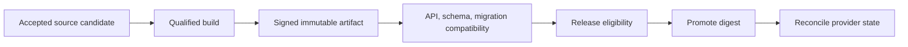

# CI/CD, Artifacts, Migrations, and API Compatibility

## Quick Read

- **Purpose:** Connect governed agent work to reproducible builds, immutable artifacts, compatibility controls, and delivery systems.
- **Best for:** Platform, release, quality, security, and application architects.
- **Prerequisites:** [Software Supply Chain Security](../08-security-and-governance/03-software-supply-chain-security-provenance-and-attestation.md) and [Testing Strategy](01-software-testing-strategy-for-agentic-change.md).
- **Reading time:** 15 minutes.
- **You will learn:** How to separate source acceptance, build provenance, artifact promotion, schema change, and API compatibility.
- **Keep three ideas:** build once and promote by digest; database changes are distributed-system changes; and CI execution is not delivery authority.

## 1. The problem

A validated source commit is not a deployable artifact. Builds may fetch mutable dependencies, use unqualified runners, embed secrets, or produce different outputs. Database and API changes can break consumers even when the changed repository passes. Agents that can edit pipelines or migrations may also alter the mechanism that judges their work.

## 2. Why the problem exists

CI/CD spans source control, runners, package stores, registries, signing, environments, deployment systems, databases, and consumers. Each system has independent state and permissions. Compatibility often depends on release order and data already in production. Rebuilding per environment breaks artifact identity; treating migration rollback as ordinary code rollback ignores irreversible data effects.

## 3. Enduring Principle

### Separate governance from execution

The factory authorizes a build or release candidate, defines required evidence, and reconciles results. CI systems execute build and test jobs. Deployment systems apply an approved artifact. No external provider callback should advance authoritative state without identity, subject digest, policy, and reconciliation.

### Build once, promote immutably

The artifact record binds source commit, dependency lock, builder identity, environment digest, commands, SBOM, provenance, signatures, test receipts, and output digest. The same digest moves through environments. Configuration changes remain separately versioned and attributable.

### Treat migrations as compatibility windows

Safe database change commonly uses expand, migrate, validate, cut over, and contract phases. Plans identify writers, readers, backfill, dual operation, constraints, load, monitoring, stop conditions, restore, and owner. Destructive contraction waits until all consumers have moved and evidence proves the old shape is unused.

### Verify API and event compatibility

Version schemas and identify producers, consumers, optionality, defaults, ordering, idempotency, and retention. Use contract and integration tests against representative consumer versions. A syntactically backward-compatible schema can still change semantics.

### Protect the assurance system

Changes to tests, CI definitions, policy, provenance, signing, or deployment require independent review and higher assurance. The implementer cannot weaken the gate and use the weakened gate as proof.

## 4. Tradeoffs and alternatives

Hermetic builds improve reproducibility and may be expensive for legacy stacks. Rebuilding per environment simplifies platform conventions but weakens subject identity. Consumer-driven contracts reveal real expectations and can encode accidental behavior. Migration rollback may be less safe than forward correction; choose based on data semantics and restore evidence.

## 5. Current Mission Control Implementation

The current guide distinguishes execution, validation, publication, merge, deployment, and acceptance; it also covers provenance, attestations, SBOMs, exact commits, and release gates. Deployment execution may be delegated while governance remains in the factory.

The curriculum does not yet teach artifact-registry operation, build-once promotion, database migration phases, consumer compatibility, pipeline-change protection, or complete deployment-provider reconciliation in sufficient depth. The present golden path stops before these claims are proven.

## 6. Future Vision

Every release candidate should resolve to an immutable artifact and compatibility graph. The operator should see affected consumers, migration phase, evidence freshness, rollout order, rollback or restore plan, and blocked conditions. Provider events should reconcile against the intended release rather than act as unquestioned truth.

## 7. Versioned references

- [Release, Production Feedback, and Factory SRE](../07-quality-engineering/02-release-production-feedback-and-factory-sre.md)
- [SLSA specification](https://slsa.dev/spec/), accessed 2026-08-30
- [DORA database change management](https://dora.dev/capabilities/database-change-management/), accessed 2026-08-30
- [NIST SSDF](https://csrc.nist.gov/projects/ssdf), accessed 2026-08-30

## 8. Notes and lessons learned

The delivery subject should become more precise as it moves forward: source commit, build recipe, artifact digest, deployment, active configuration, and observed outcome. Reusing “version” for all of them hides failure boundaries.

## 9. Interview and discussion questions

1. Why should the same artifact digest move through environments?
2. When is forward correction safer than rollback?
3. How do you prevent an agent from weakening its own CI gate?
4. What makes an API change semantically incompatible?
5. Which provider events require reconciliation?

## 10. Whiteboard exercise

Design delivery for a service and three consumers during a schema migration. Add an outdated consumer, failed backfill, mutable dependency, and duplicate deployment webhook. Mark every authoritative record and recovery decision.

## 11. Hands-on lab

Build a disposable service into an immutable artifact, record provenance and an SBOM, then simulate promotion. Add an expand-and-contract schema change with one old consumer. Demonstrate that contraction remains blocked until compatibility evidence is fresh.
